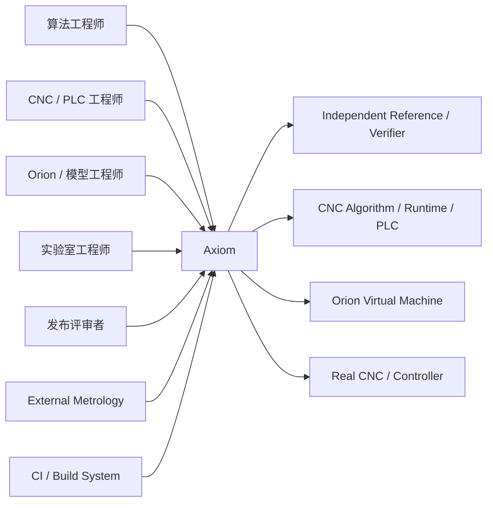
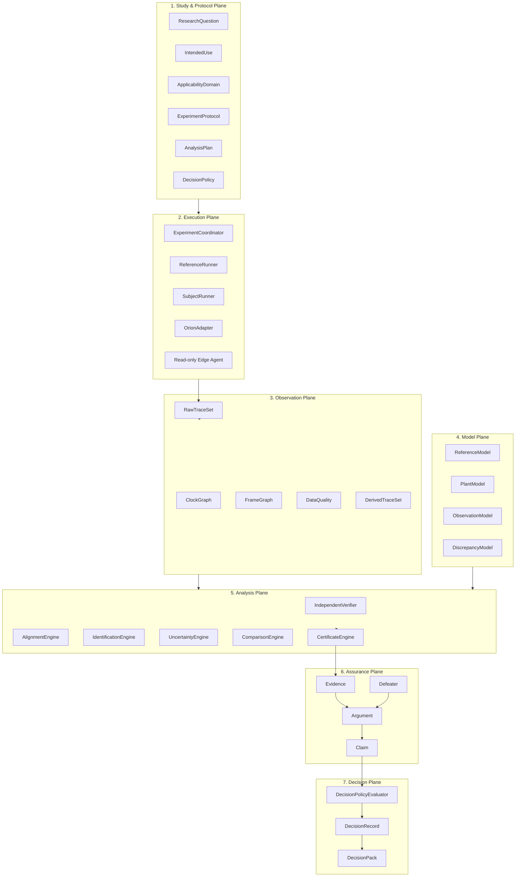
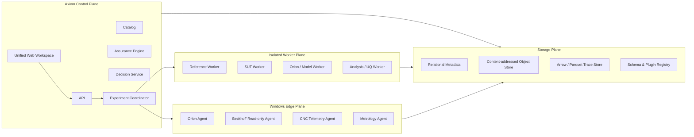
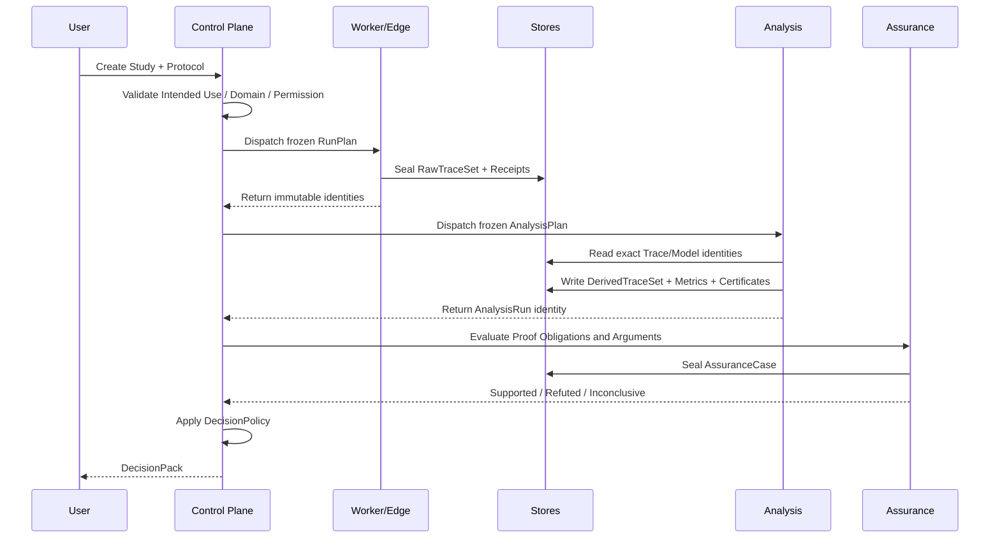

# Axiom v1.0 高层架构设计

> 文档类型：Architecture Description  
> 状态：Draft / Proposed  
> 架构风格：可信度驱动的实验架构；模块化单体控制面 + 隔离 Worker + 只读 Edge Agent  
> 上位理论：[Axiom 数学基础 v1.0](Axiom%20数学基础%20v1.0.md)  
> 项目路线：[Axiom v1.0 项目规划](Axiom%20v1.0%20项目规划.md)  
> 更新日期：2026-08-19

## 1. 架构目标

Axiom v1 的架构不是为了容纳最多功能，而是为了保证：

1. 实验问题、执行、观测、分析、论证和决策彼此分离；
2. 数学 Reference、SUT、Orion 和真实设备可使用同一实验协议；
3. Raw Trace 永不被派生处理覆盖；
4. 每次变换都有内容身份、适用域和误差证书；
5. Claim 不能绕过 Argument、Evidence 和 Defeater；
6. 领域能力可扩展，但 Core 不吸收 CNC、五轴、设备或学习模型语义；
7. Axiom 主进程和生产 Adapter 不具备设备写入能力；
8. 当前实现可以逐步迁移，不要求一次性推倒重写。

优先级为：

```text
科学有效性
> 可复现性
> 可审计性
> 安全与权限边界
> 可扩展性
> 性能
> UI 丰富度
```

## 2. 架构描述方法

本文件按 ISO/IEC/IEEE 42010:2022 的思想，围绕 Stakeholder、Concern 和 Viewpoint 组织，不把一张总图当成完整架构。

采用以下视图：

1. Context View：Axiom 与人、算法、Orion、CNC 和计量系统的关系；
2. Functional View：Study 到 Decision 的稳定职责；
3. Information View：Trace、Model、Certificate、Claim 和 Provenance；
4. Runtime View：控制面、Worker、Edge Agent 和存储；
5. Trustworthiness View：权限、只读、内容身份、隔离和 fail-closed；
6. Evolution View：插件、schema、迁移和兼容边界；
7. Development View：代码模块和允许的依赖方向。

参考：ISO/IEC/IEEE 42010:2022。  
https://www.iso.org/standard/74393.html

## 3. 架构驱动因素

### 3.1 功能驱动

- 定义和复用 ExperimentProtocol；
- 执行或导入多种 Subject；
- 获取多个时钟、Frame 和数据通道；
- 生成 Raw/Derived Trace；
- 执行数学验证、系统辨识、UQ 和 A/B 比较；
- 构建 Assurance Case；
- 生成 Decision Pack；
- 支持 v0.22 历史证据只读导入。

### 3.2 质量驱动

| 质量属性 | 核心要求 |
|---|---|
| Correctness | 领域结论必须来自版本化定义和独立 Verifier |
| Reproducibility | 同一冻结输入和环境可重放 |
| Traceability | 每个结论可回溯到原始 Trace、变换、模型和版本 |
| Integrity | 内容身份在保存、传输和派生过程中可验证 |
| Safety Boundary | 生产路径无设备 Write/Call，权限 fail-closed |
| Extensibility | 新领域和 Adapter 不修改 Core 调度语义 |
| Operability | 非核心开发者能够完成 Study 主流程 |
| Performance | 大 Trace 不经 JSON 全量复制；分析可流式和并行 |
| Evolvability | schema、Plugin 和旧证据有明确兼容策略 |

### 3.3 关键约束

- Windows 是第一批设备 Edge 环境；
- Python 适合分析、协议和 Assurance；
- .NET 适合 Windows、OPC UA 和厂商 SDK；
- C++ 适合高性能算法和 Reference Adapter；
- 当前仓库已有 v0.22 对象、API 和证据，必须可审计保留；
- 不引入无必要的分布式系统复杂度。

## 4. Context View



### 4.1 系统边界

Axiom 负责：

- 实验定义和编排；
- 只读获取或导入结果；
- 保存和派生 Trace；
- 分析、证书和论证；
- 决策材料。

Axiom 不负责：

- 机床安全回路；
- 紧停执行；
- 自动设备写入；
- 生产 PLC 部署；
- 生产 CNC 实时调度；
- 最终人身和设备安全责任。

## 5. Functional View

### 5.1 七个稳定平面



这些平面是责任边界，不要求实现成七个服务。

### 5.2 九个 Bounded Context

| Context | 稳定职责 | 明确禁止 |
|---|---|---|
| Study | 问题、用途、适用域和假设 | 执行 Subject |
| Protocol | Scenario、Arm、重复、随机化和停止规则 | 评价结果 |
| Execution | 冻结并执行 RunPlan | 宣布通过 |
| Observation | 保存 Raw Trace、Clock、Frame 和质量 | 修改原始数据 |
| Transformation | 对齐、滤波、重采样和坐标变换 | 静默处理或丢弃 |
| Model | Reference、Plant、Observation、Discrepancy | 最终批准 |
| Analysis | Metric、Verification、Identification、UQ、Comparison | 设备控制 |
| Assurance | Claim、Argument、Evidence、Defeater | 重算原始数据 |
| Decision | Promote、Reject、MoreEvidenceRequired | 自行生成证据 |

## 6. Information View

### 6.1 聚合关系

```text
Study
├── ResearchQuestion
├── IntendedUse
├── ApplicabilityDomain
├── Hypothesis[]
├── ExperimentProtocolRef
├── AnalysisPlanRef
└── DecisionPolicyRef

ExperimentProtocol
├── Scenario[]
├── Factor[]
├── Arm[]
├── RepetitionPolicy
├── RandomizationPolicy
├── StoppingRule
├── MeasurementPlan
└── AcquisitionPlan

RunPlan
├── StudyRef
├── ScenarioRef
├── ArmRef
├── SubjectRef
├── ParameterSetRef
├── EnvironmentRef
├── MachineProfileRef
├── AcquisitionProfileRef
└── ExpectedOutputs

Run
├── RunPlanRef
├── ExecutionReceipt
├── EnvironmentSnapshot
├── RawTraceSetRef
├── Failure[]
└── Provenance

AnalysisRun
├── AnalysisPlanRef
├── InputTraceRefs
├── ModelRefs
├── DerivedTraceRefs
├── MetricResults
├── Diagnostics
├── CredibilityCertificates
└── Provenance

AssuranceCase
├── Claim[]
├── Argument[]
├── EvidenceRef[]
├── Assumption[]
├── Context[]
├── Defeater[]
└── DecisionRecordRef
```

### 6.2 Trace 数据模型

```text
TraceSet
├── SignalTrace[]
├── EventTrace[]
├── ModeTrace[]
├── TrajectoryTrace[]
├── MeasurementTrace[]
├── ClockGraph
├── FrameGraph
├── QualityFlags[]
├── SourceReceipt
└── ContentIdentity
```

#### SignalTrace

```text
channelId
valueType
unit
sampleIndex
deviceTime
sourceTime
hostTime
values
quality
reconstructionSemantics
```

#### EventTrace

```text
eventType
eventIdentity
timeDomain
timestamp
payload
causalParent
quality
```

#### ModeTrace

```text
modeType
intervalStart
intervalEnd
modeValue
transitionReason
```

### 6.3 Raw 与 Derived

`RawTraceSet` 由采集源或导入器直接封存，任何变换都产生 `DerivedTraceSet`：

```text
DerivedTraceSet
├── sourceTraceSetRefs[]
├── transformationId
├── transformationVersion
├── parameters
├── preservedSemantics[]
├── discardedSemantics[]
├── errorCertificateRef
└── newContentIdentity
```

### 6.4 内容身份和 Provenance

内容寻址对象使用规范化序列化后 SHA-256。大 Trace 的内容身份由：

```text
schema identity
metadata identity
ordered chunk identities
index identity
```

组合生成，避免为一次元数据查询读取全部 Trace。

Provenance 语义借用 W3C PROV 的稳定关系：

```text
Entity
Activity
Agent
used
wasGeneratedBy
wasDerivedFrom
wasAssociatedWith
```

参考：W3C PROV-DM。  
https://www.w3.org/TR/prov-dm/

## 7. Core Contracts

### 7.1 Study Contract

Study 只描述要回答的问题，不携带领域运算实现。

```text
Study = {
  studyId,
  researchQuestion,
  intendedUse,
  applicabilityDomainRef,
  hypothesisRefs,
  protocolRef,
  analysisPlanRef,
  decisionPolicyRef
}
```

### 7.2 RunPlan Contract

RunPlan 冻结一次执行所需的全部引用。运行时不得隐式替换：

- Subject 版本；
- ParameterSet；
- MachineProfile；
- Environment；
- AcquisitionProfile；
- Input Artifact/Trace；
- Adapter 版本。

### 7.3 AnalysisPlan Contract

AnalysisPlan 必须在读取 Validation 结果前冻结：

```text
metricDefinitions
proofObligations
comparators
alignmentPolicies
uncertaintyMethods
statisticalMethods
minimumPracticalEffects
multipleComparisonPolicy
missingDataPolicy
outlierPolicy
decisionInputs
```

### 7.4 Certificate Contract

Certificate 对应数学基础中的：

\[
(D,R,d,\varepsilon,\alpha,A,M,P)
\]

系统必须能够检查：

- 表示层是否可组合；
- Metric/Distance 是否一致；
- Applicability Domain 是否有交集；
- 假设是否被满足；
- 风险预算是否超限；
- 上游身份是否匹配。

### 7.5 Assurance Contract

```text
Claim
  references Argument
Argument
  references Evidence, Assumptions, Contexts, Defeaters
Evidence
  references immutable analysis/model/trace objects
DecisionRecord
  references exact Claim and evidence snapshot
```

系统不提供 `MetricResult → Supported Claim` 的直接快捷路径。

## 8. Development View

### 8.1 推荐目录

```text
src/axiom/
  core/
    identity/
    provenance/
    study/
    protocol/
    run/
    catalog/

  traces/
    signal/
    event/
    mode/
    trajectory/
    measurement/
    clock/
    frame/
    storage/

  models/
    reference/
    plant/
    observation/
    discrepancy/
    identification/

  analysis/
    verification/
    metrics/
    comparison/
    alignment/
    uncertainty/
    temporal/
    certificates/

  assurance/
    claim/
    argument/
    evidence/
    defeater/
    decision/

  domains/
    ordered_point/
    cnc_trajectory/
    five_axis/
    cnc_hybrid/
    machine_test/

  adapters/
    subjects/
    orion/
    beckhoff/
    cnc/
    metrology/
    fmi/

  platform/
    api/
    cli/
    coordinator/
    workers/
    composition/

  experimental/
    learning/
    optimization/
    controlled_runtime/
```

### 8.2 允许的依赖方向

```text
platform → application services → core contracts
adapters → core contracts + external SDK
analysis → core + traces + model contracts
assurance → core identities + analysis outputs
profiles/domains → core extension contracts
core → Python standard library / minimal schema library
```

禁止：

```text
core → five_axis
core → machine
core → physical
core → intelligence
core → control
core → FastAPI / React / OPC UA / vendor SDK
```

### 8.3 CompositionRoot

所有内置 DomainPackage、Runner、Adapter、AnalysisPlugin 和 Store 都在显式 `CompositionRoot` 注册。

禁止依赖：

- 导入顶层 `axiom` 后自动导入所有子模块；
- 模块 import 时修改全局注册表；
- 未声明版本的运行时发现；
- 根据 Artifact 字段形状自动选择 Domain。

开发模式可提供静态插件清单；动态第三方插件必须在后续 ADR 中单独批准。

## 9. Extension View

当前 `DomainPack` 同时承载 Artifact、Runner、Metric、Claim 和失败映射，v1 将其拆成四类稳定扩展。

### 9.1 DomainPackage

负责：

```text
schemas
semantic validators
metric definitions
temporal properties
proof obligation templates
argument templates
benchmark generators
visualization descriptors
```

不负责执行任意外部代码。

### 9.2 SubjectAdapter

负责：

```text
subject capability declaration
input binding
parameter binding
execution isolation
output capture
failure mapping
```

### 9.3 AcquisitionAdapter

负责：

```text
read capabilities
clock sources
frame sources
sampling contract
quality flags
read-only attestation
raw trace sealing
```

### 9.4 ModelAdapter

负责：

```text
model family
state/input/output contract
calibration interface
simulation interface
applicability declaration
parameter identity
```

### 9.5 Plugin Manifest

```json
{
  "pluginId": "axiom.domain.cnc-trajectory@1",
  "pluginVersion": "1.0.0",
  "coreContract": "axiom.core@2",
  "schemas": [],
  "capabilities": [],
  "runners": [],
  "metrics": [],
  "proofObligations": [],
  "argumentTemplates": [],
  "executionTrust": "installed-trusted",
  "deviceWriteCapability": false
}
```

Manifest 必须可在不执行插件代码的情况下完成静态预检。

## 10. Runtime View

### 10.1 部署风格

Axiom v1 不拆成大量微服务。推荐：

> **模块化单体控制面 + 隔离 Worker Plane + Windows Edge Plane + 内容寻址存储。**



### 10.2 Control Plane

控制面负责：

- Study/Protocol/RunPlan 生命周期；
- 调度和状态；
- Catalog；
- Proof Obligation 聚合；
- Assurance Case；
- Decision Pack；
- 权限与审计。

它不运行高风险数值代码和设备 SDK。

### 10.3 Worker Plane

Worker 按能力和信任等级隔离：

```text
Reference Worker
Subject Worker
Model Worker
Analysis Worker
Legacy Import Worker
```

每个 Worker 输出：

```text
ExecutionReceipt
EnvironmentSnapshot
Output identities
Logs
Structured failures
Resource usage
```

Worker 不能直接发布 Claim 或 Decision。

### 10.4 Edge Plane

Edge Agent 部署在 Windows 或设备邻近环境，负责：

- 厂商 SDK/OPC UA 适配；
- 只读权限预检；
- 采集和样本完整性；
- 本地封存 Raw Trace；
- 断网后恢复上传；
- 环境和权限证明。

Edge Agent 不负责：

- 写 PLC/CNC 参数；
- 激活配置；
- 执行自动 Stop；
- 生成最终现实 Claim。

## 11. Storage View

### 11.1 存储分层

| 存储 | 内容 |
|---|---|
| Relational Metadata | Study、Run、状态、引用和查询索引 |
| Content-addressed Object Store | JSON 模型、证书、Evidence Bundle、日志 |
| Arrow/Parquet Trace Store | 大规模列式时序 Trace |
| Schema/Plugin Registry | schema、Manifest 和兼容矩阵 |

### 11.2 不将大 Trace 嵌入 JSON

JSON 只保存：

- identity；
- schema；
- channel metadata；
- chunk index；
- content hashes；
- references。

数值样本使用 Arrow/Parquet 或等价列式格式，以支持：

- 通道裁剪；
- 时间范围读取；
- 零拷贝或少拷贝分析；
- 多语言访问；
- 分块哈希；
- 长 Trace 流式处理。

## 12. End-to-End Flow



## 13. State Models

### 13.1 Run 状态

```text
Draft
→ Validated
→ Scheduled
→ Running
→ Succeeded | Failed | Cancelled
→ Sealed
```

`Succeeded` 只表示执行成功，不表示 Case 或 Claim 通过。

### 13.2 Analysis 状态

```text
Draft
→ InputsResolved
→ Running
→ Completed | Failed
→ CertificatesChecked
→ Sealed
```

### 13.3 Assurance 状态

```text
Open
→ EvidenceResolved
→ DefeatersEvaluated
→ Supported | Refuted | Inconclusive
→ Sealed
```

任何上游输入身份变化都必须使下游未封存结果失效；封存结果保持历史可读，不被覆盖。

## 14. Trustworthiness View

### 14.1 零写不变量

Axiom 1.0 的生产设备 Adapter：

```text
WriteCount = 0
MethodCallCount = 0
AutomaticAcceptance = false
DeviceAuthority = absent
```

CI 必须同时静态和运行时检查：

- OPC UA Write/Call 不在生产调用图；
- 厂商 SDK 写接口不被引用；
- Edge Manifest 的 `deviceWriteCapability=false`；
- 采集收据记录实际操作种类；
- 测试服务端拒绝或记录任何意外写入。

### 14.2 权限模型

最低角色：

```text
StudyAuthor
ExperimentOperator
LabAuthority
ModelReviewer
EvidenceReviewer
DecisionAuthority
Administrator
```

`StudyAuthor` 不能自己篡改封存 Validation 数据；`DecisionAuthority` 不能删除不利 Evidence。

### 14.3 Evidence Integrity

- 内容哈希；
- 顺序和 chunk 身份；
- 来源签名或 owner attestation；
- 环境快照；
- 时间窗；
- Clock/Frame 身份；
- 不可变 Evidence Snapshot；
- 可选外部签名。

### 14.4 Fail-closed

以下任一情况必须阻断正向 Claim：

- schema 不兼容；
- 内容哈希不一致；
- Clock/Frame 缺失；
- Calibration/Validation 重叠；
- Proof Obligation 未关闭；
- Applicability Domain 不覆盖 Claim；
- 迁移风险预算超限；
- Adapter 权限不满足；
- 上游身份陈旧；
- AnalysisPlan 在读取结果后被修改。

## 15. Failure Semantics

统一失败维度，不使用一个状态混合所有问题：

```text
ExecutionStatus
DataQualityStatus
AnalysisStatus
ProofObligationStatus
ClaimStatus
DecisionStatus
```

失败分类：

| 类别 | 示例 |
|---|---|
| ContractFailure | schema、类型、版本、Runner 不兼容 |
| ExecutionFailure | SUT 崩溃、超时、资源不足 |
| AcquisitionFailure | 丢样、撕裂、时钟缺失、权限错误 |
| SemanticFailure | 单位、Frame、重建语义不明 |
| NumericalFailure | 不收敛、溢出、误差界失败 |
| ModelFailure | 激励不足、不可辨识、holdout 不通过 |
| EvidenceFailure | 身份复用、来源不独立、谱系断裂 |
| ApplicabilityFailure | OOD 或环境超域 |
| DecisionFailure | 开放 Defeater、风险预算超限 |

禁止将异常统一捕获后只返回 `Inconclusive` 而隐藏根因。

## 16. API Boundary

### 16.1 Command API

```text
CreateStudy
RegisterProtocol
SealAnalysisPlan
CreateRunPlan
StartRun
ImportRawTrace
StartAnalysis
BuildAssuranceCase
EvaluateDecision
ExportDecisionPack
```

### 16.2 Query API

```text
GetStudy
GetRun
ReadTraceRange
GetAnalysisRun
GetProofObligations
GetAssuranceCase
GetDecisionRecord
ResolveProvenance
ListApplicablePlugins
```

### 16.3 Event API

内部事件至少包括：

```text
RunScheduled
RunStarted
RawTraceSealed
RunFailed
AnalysisCompleted
CertificateRejected
DefeaterOpened
ClaimResolved
DecisionRecorded
```

v1 可在进程内使用可靠事件表，不需要先引入 Kafka 等分布式基础设施。

## 17. Performance Design

### 17.1 大 Trace

- 分块写入；
- 按时间和通道索引；
- 流式校验样本序号；
- Analysis Worker 读取所需列；
- Derived Trace 避免复制不变通道；
- 结果引用源 chunk；
- UI 使用多分辨率预览，而非加载全部数据。

### 17.2 确定性与性能的取舍

Reference/Verifier 可采用固定环境和高精度实现；SUT 性能测试允许真实优化环境。两者的目标不同，必须分别记录：

```text
numeric environment
compiler/runtime
BLAS/solver
CPU features
threading policy
precision
```

不得为了复现 Reference 而错误限制生产 SUT 性能，也不得用生产非确定环境生成 Golden Reference。

## 18. Architecture Fitness Functions

CI 中增加以下架构测试：

1. Core import graph 不依赖具体 Domain；
2. 顶层 import 不产生插件注册副作用；
3. Raw Trace 类型没有原地变换 API；
4. Supported Claim 必须引用 Argument；
5. Argument 必须引用 Evidence 和 Proof Obligation 结果；
6. Device Adapter Manifest 必须声明 `deviceWriteCapability=false`；
7. 生产 Adapter 不引用 Write/Call API；
8. Calibration 和 Validation 身份检查不可绕过；
9. 证书组合只能在兼容表示层和 Metric 上执行；
10. OOD 输入默认拒绝 Claim；
11. v0.22 Import Adapter 不能把历史 Open 状态升级为 Passed；
12. Web 任一新输入都会使未封存的旧结论失效；
13. schema 破坏性变更需要新 major identity；
14. 每个 DomainPackage 至少包含一个反例 fixture；
15. DecisionRecord 绑定不可变 Evidence Snapshot。

## 19. 迁移方案

### 19.1 Strangler 路线

不直接替换 v0.22：

```text
v0.22 Core and Domain Packs
        ↓ read-only import adapter
Axiom v1 Evidence Kernel
        ↓ new studies only
Axiom v1 Workspace
```

### 19.2 迁移顺序

1. 建立 `core_v2` 和 CompositionRoot；
2. 导入 ordered-point 为首个兼容 DomainPackage；
3. 迁移 Run/Observation 为 Run/TraceSet；
4. 迁移 FiveAxis F1–F4；
5. 迁移 Machine/Physical 为 Adapter + ModelPackage；
6. 保留 R5–R7 为 Experimental Legacy View；
7. 新 Workspace 成熟后停止扩展旧 Workbench；
8. 历史内容身份始终保留。

### 19.3 对现有对象的映射

| v0.22 | v1 |
|---|---|
| DomainPack | DomainPackage + PluginManifest |
| RunSpec | RunPlan + Protocol references |
| Observation | RawTraceSet / Imported Entity |
| MetricResult | AnalysisResult |
| Evidence(level, method) | Evidence + CredibilityCertificate |
| Claim | Claim + Argument + Defeater |
| Provenance | ProvenanceGraph |
| ComparisonReport | PairedComparison AnalysisRun |
| AcceptanceRecord | DecisionRecord |
| PhysicalModelDefinition | PlantModel + ParameterEstimate + Applicability |
| RuntimeAudit | Experimental evidence object，不是 Core 状态 |

## 20. 技术选择

### 建议保留

- Python 3.12+：协议、分析、UQ、Assurance；
- Pydantic/JSON Schema：控制对象与 API 合同；
- FastAPI：控制面；
- React：Workspace；
- .NET 8：Windows、OPC UA、厂商 Adapter；
- C++：高性能 SUT/Reference Adapter；
- PyArrow/Parquet：Trace；
- PostgreSQL：Metadata；
- 对象存储：CAS 和 Evidence Bundle。

### 暂不引入

- 微服务拆分；
- 分布式消息总线；
- 任意动态 Python 插件；
- 图数据库作为前置依赖；
- 在线 Feature Store；
- 自动模型部署；
- Kubernetes 作为本地开发前提。

技术只有在实际质量属性场景无法满足时再升级。

## 21. 架构质量场景

### QA-01 新领域接入

给定一个新的离散事件 DomainPackage，开发者只增加 Manifest、schema、Validator、Analysis 和 UI Descriptor；Core 源码不修改即可运行。

### QA-02 Trace 完整性

任意 Raw Trace 的一个样本被修改时，其内容身份变化，所有引用原身份的已封存证据仍保持历史可读，新 Analysis 不会误用修改内容。

### QA-03 现实结论防越权

当 Model Validation 通过但设备权限、测量或 Process Evidence 缺失时，系统只能产生限定的 `ModelAdequateFor...`，不能产生 `DeviceSafe` 或 `ProcessSafe`。

### QA-04 结果陈旧防护

用户修改任一输入后，旧的未封存 Analysis/Claim 立即标记为 Stale；UI 不显示旧绿色结论作为当前结果。

### QA-05 OOD 弃权

输入超出 Applicability Domain 时，分析可以保留事实观测，但任何依赖域覆盖的正向 Claim 被阻断并显示缺失范围。

### QA-06 Edge 断网

Edge Agent 在断网时完成本地 Raw Trace 封存；恢复连接后按内容身份幂等上传，不重复或重排样本。

## 22. 延后决策

以下问题当前不冻结：

- 是否使用完整 SACM 对象模型；
- 是否采用图数据库；
- 是否开放第三方动态插件；
- 是否将部分组件拆成服务；
- 是否强制 Orion 支持 FMI 3.0；
- 是否支持云端多租户；
- 是否实现正式定理证明器集成；
- 是否恢复自动推荐和 Controlled Trial。

达到真实需求和风险证据后再创建 ADR。

## 23. 理论和标准依据

- D. L. Parnas, “On the Criteria To Be Used in Decomposing Systems into Modules,” *Communications of the ACM*, 1972.  
  https://doi.org/10.1145/361598.361623
- ISO/IEC/IEEE 42010:2022, *Architecture Description*.  
  https://www.iso.org/standard/74393.html
- W3C, *PROV-DM: The PROV Data Model*.  
  https://www.w3.org/TR/prov-dm/
- OMG, *Structured Assurance Case Metamodel (SACM) 2.3*.  
  https://www.omg.org/spec/SACM/
- FMI 3.0.2 Specification.  
  https://fmi-standard.org/docs/3.0.2/

## 24. 架构验收结论

Axiom v1 的架构完成，不是因为形成了更多服务或抽象，而是因为：

```text
一个冻结 Study
→ 多环境执行
→ 不可变多 Trace
→ 有界分析和证书
→ 显式论证与反例
→ 限定范围 Claim
→ 独立人工决策
```

能够在不修改 Core、不丢失 Provenance、不产生设备写入和不过度外推的前提下端到端运行。
