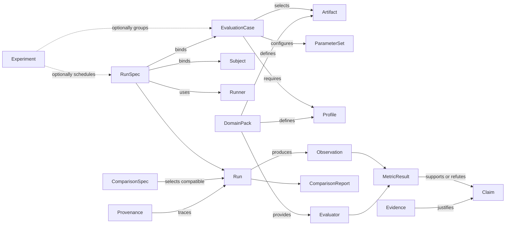
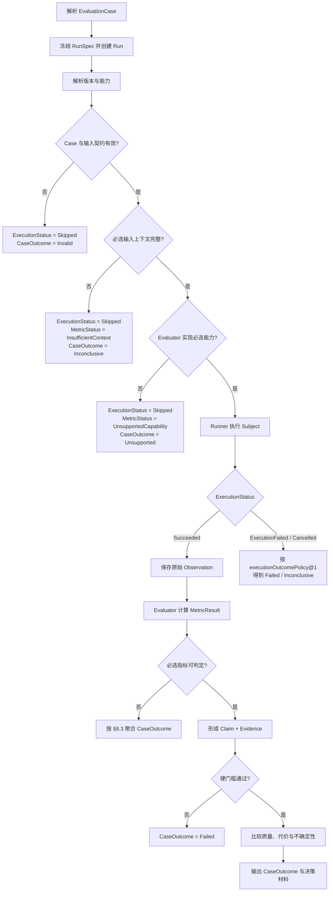

# Axiom 通用评估框架规范

> 文档类型：平台核心规范  
> 规范对象：`Axiom Core`  
> 状态：Draft / 契约闭合版 v0.5
> 上位文档：[项目规划蓝图](CNC%20算法效果评估与智能优化平台——项目规划蓝图.md)  
> 首个实现域：[有序离散点领域包规范](有序离散点领域包规范.md)

## 1. 文档目的

本规范定义 Axiom 在不同算法、数学模型、仿真系统和真实设备之间保持稳定的最小内核。它回答：

- 什么东西正在被评估；
- 在什么条件和参数下运行；
- 系统观察到了什么；
- 哪个评估器据此提出了什么声明；
- 声明由什么证据支持；
- 结果是否足以进入比较、推荐或后续执行。

本规范不定义五轴公式、设备协议、模型结构或优化算法。那些内容属于领域包或后续阶段规范。

## 2. 核心判断

Axiom 不是固定的“输入 → 总分”流水线，也不是以 CNC 术语为中心的语义评估器。

它是一个**评估、实验与证据框架**：

1. 用通用对象记录输入、上下文、执行和观察；
2. 用领域包逐级补充语义、约束和指标；
3. 用声明与证据表达结论的适用范围和可信度；
4. 在同一追溯链上逐步接入数学模型、物理模型、真实设备和学习模型；
5. 只有通过明确阶段门，评估结果才可进入参数推荐或受控执行。

因此，**语义是可增加的能力，不是使用平台的前置条件**。只要某个领域包声明了最低输入契约，即使输入只有有序离散点，也可以进行当前信息允许的评估。

## 3. 架构形态：外部逐级定义，内部有类型图

对使用者，能力呈逐级增加的层次：

| 层级 | 已知信息 | 能做的事 |
|---|---|---|
| `L0 Artifact` | 原始数据及其结构 | 解析、结构校验、有限性和确定性检查 |
| `L1 Semantic` | 单位、坐标系、顺序、字段含义 | 计算域内的内在指标，解释阈值 |
| `L2 Reference` | 参考对象、对应或投影策略 | 计算误差、距离、gap 与相对质量 |
| `L3 Execution` | 参数、时间、算法和运行环境 | 评价运行结果、约束、性能与回归 |
| `L4 Physical` | 设备配置、遥测、测量和对齐关系 | 评价仿真/实机效果和模型—现实偏差 |
| `L5 Learning & Decision` | 稳定数据集、预测不确定性和安全策略 | 训练残差/代理模型，生成受约束建议 |

这是一条**能力路径**，不是要求所有数据都继承同一套类。内部数据关系必须是有类型的有向图：



核心关系至少包括：`consumes`、`produces`、`derived_from`、`evaluated_by`、`supports`、`refutes`、`constrains`、`instantiates` 和 `compatible_with`。领域包可以增加节点和关系，但不能改变这些关系的含义。

## 4. 核心角色

| 角色 | 职责 | 明确禁止 |
|---|---|---|
| `Subject` | 被评估对象，可以是算法、求解器、控制器、设备、模型或完整流水线 | 自己决定最终是否通过 |
| `Runner` | 把标准化 `RunSpec` 适配到 Subject，并捕获输出、日志、耗时和失败 | 隐式修改输入或丢弃失败 |
| `Evaluator` | 基于声明的规则，把 Artifact/Observation 转为指标和声明 | 在缺失语义时猜测单位、顺序或参考关系 |
| `ReferenceModel` | 提供参考结果、界、证书或可交叉验证基线 | 把一般数值结果无条件称为真值 |
| `PhysicalModel` | 表达设备、驱动、机构或过程的物理响应 | 反向改写数学参考结果 |
| `SurrogateModel` | 在声明的数据域内预测结果、残差或代价，并报告不确定性 | 代替硬约束验证器或证据生产器 |
| `Optimizer` | 在合法参数域内提出候选参数 | 绕过独立 Evaluator、自行批准候选参数 |
| `DecisionPolicy` | 根据声明、证据和风险决定接受、拒绝、保持观察或升级验证 | 把单一总分当成无条件决策 |

角色可以由同一进程实现，但其输入、输出和责任必须可区分、可单独测试。

## 5. 核心信息对象

### 5.1 定义

| 对象 | 含义 | 最低要求 |
|---|---|---|
| `DomainPack` | 某一领域的类型、语义、验证器、指标和适配器集合 | 稳定 ID、版本、依赖和兼容性声明 |
| `Artifact` | 可被输入、输出、引用或派生的数据对象 | 类型、内容标识、模式版本、来源 |
| `Profile` | 可复用的坐标、单位、约束、机器或环境配置 | 类型、版本、适用域 |
| `EvaluationCase` | 一次可复现评估所需的声明式条件 | 输入、所需能力、必选/可选指标集合、接受策略 |
| `ScenarioSpec` | 多主体、时间事件或环境交互的可选组合对象 | 仅在 Case 无法清楚表达交互时使用 |
| `Experiment` | 为回答一个问题而组织的一组 Case/Run 及比较协议 | 假设、变量、对照、重复策略、停止条件 |
| `ParameterSet` | Subject 或 Model 的显式参数 | 稳定 ID、`parameterSchemaId`、模式版本、值、单位、合法域或来源 |
| `RunSpec` | 把 Case、Subject、Runner、参数和环境冻结为一次执行请求 | 所有引用对象的精确版本或内容标识 |
| `Run` | 一次实际执行及其状态 | 唯一 ID、开始/结束、状态、RunSpec 指纹 |
| `ComparisonSpec` | 冻结待比较 Run/Subject 与版本化比较策略 | 操作数、策略 ID、内容标识 |
| `ComparisonReport` | 记录兼容性判定及允许产生的差异 | 原始 Run 引用、结构化冲突、逐指标差值、内容标识 |
| `Observation` | 执行产生的原始或对齐后观测 | 来源、时间/索引语义、质量标记 |
| `MetricDefinition` | 一个指标的数学含义和适用条件 | ID、版本、单位、方向、前置能力 |
| `MetricResult` | 指标在一次评估中的值或不可计算原因 | 值/区间/分布、状态、定义版本 |
| `Claim` | 对有效性、质量、约束或比较关系的明确陈述 | 命题、适用域、结论状态 |
| `Evidence` | 支持或反驳 Claim 的证明、界、交叉验证或观测 | 等级、方法、来源、适用条件 |
| `Provenance` | 从结果回溯输入、版本、环境和派生过程的链 | 不可变引用和变换记录 |
| `Recommendation` | Optimizer 提出的候选参数及理由 | 目标、约束、预测、不确定性、风险 |
| `AcceptanceRecord` | 人或策略对 Recommendation 的独立处置 | 接受/拒绝/试验、责任方、证据快照 |

#### 5.1.1 首个可执行 Experiment 契约

v0.3 的有序离散点实现把 `Experiment` 落为恰好两个不同 Arm 的本地确定性执行切片；这是首个领域实现边界，不限制 Core 将来表达重复试验、参数扫描或多臂实验。每个 Arm 必须引用带版本的 Subject 与 Runner，且共享输入 Artifact 和 `ParameterSet` 的内容身份。

`ParameterSet.parameterSchemaId` 不得省略，Runner 必须在执行前确认它与 Subject 声明完全匹配。首个 `python-call@1` Runner 只解析静态注册的 Subject，不接受任意命令、模块名或用户代码。Subject 抛出异常或返回错误 Artifact 类型时，Arm 记录版本化结构化失败；v0.3 不为该失败补造 Observation、Run 或成功 RunBundle。

### 5.2 Case 是必需的，Scenario 不是

所有运行都需要 `EvaluationCase`，需要系统比较、重复试验或参数扫描时由 `Experiment` 组织；但不是所有评估都需要“场景”。例如，评价一条有序离散点序列的步长分布不需要虚构道路、机床或事件。

只有出现下列情况时才引入 `ScenarioSpec`：

- 多个主体相互作用；
- 环境状态随时间变化；
- 事件顺序本身决定结果；
- 需要从功能描述逐步实例化为具体试验。

这避免平台被某一种场景本体绑死，同时为更复杂真实世界保留组合空间。

### 5.3 比较是独立派生，不改写 Run

比较器必须是由 `ComparisonSpec` 和所引用 Run 决定的确定性派生过程。它先按版本化策略生成兼容性报告，再决定能否计算差值或偏好；不得为完成比较而改写原始 Run、补猜单位或转换 Artifact。

`ComparisonReport` 必须保留双方 Run 或其不可变内容引用，并区分：

- `error`：直接比较不成立；报告结构化冲突字段，且不得输出指标差值、综合分数差值或优胜方；
- `finding`：上下文存在可审计差异，但当前策略仍允许比较；差异必须随报告保存；
- `compatible = true`：只表示比较上下文满足策略，不表示双方 Run 都通过 Case，也不自动产生偏好方向。

内容身份与兼容身份不得混用。原始 Request/Observation 的内容标识必须保留“字段未提供”和“明确声明未知”的差异；比较策略只能对规范已声明为语义等价的默认字段做规范化，并必须把该规则纳入策略版本。

`Provenance.requestHash` 标识规范化后的请求内容；`EvaluationReport.contentHash` 标识报告本体，两者不得复用。报告内容标识定义为：按字段别名序列化报告、删除值为 `null` 的可选字段和自引用字段 `contentHash`，再对键排序后的紧凑 JSON 计算 SHA-256。进入 `RunBundle` 后，`Run.reportContentHash` 和所有 Claim 的 `reportContentHash` 必须与 `EvaluationReport.contentHash` 完全相同；完整性校验必须同时检查三处引用以及 bundle 自身内容标识。裸 `evaluate` 与 `evaluate_run`/`Experiment` 可以因后者绑定了更完整的运行 provenance 而得到不同报告哈希；统一的是身份公式，不是不同报告 payload 的哈希值。

## 6. Domain Pack 契约

一个领域包至少必须声明：

1. 接受和产生的 `ArtifactType`；
2. 每种 Artifact 的最低结构要求和可选语义；
3. 可使用的 `ProfileType`；
4. 提供的 `Evaluator`、`MetricDefinition` 和前置能力；
5. 能产生的 Claim 及对应证据方法；
6. 与其他领域包之间的显式 Adapter；
7. 版本兼容规则和已知适用边界；
8. 确定性、数值容差和失败分类要求。
9. 机器可读的能力清单，以及每项指标的 `requires` / `optional` 依赖；
10. 从领域失败码到公共状态轴的确定映射。
11. 若存在导入式 Runner，使用 `importRunnerIds` 明确声明其 Observation 来源语义；该集合必须是已支持 Runner 的子集。

领域包不得：

- 向核心枚举中塞入只属于本领域的术语；
- 以缺省值偷偷补齐关键语义；
- 将不兼容的数据强制转换后继续运行；
- 用一个综合分数覆盖硬约束失败；
- 声称另一个领域包的 Artifact 与自己的类型天然等价。

### 6.1 描述符、运行绑定与 Artifact Adapter

`DomainPack` 描述符是可序列化、可哈希的机器契约；Evaluator 的 callable、进程资源或网络连接不是描述符内容。可执行实现必须另行注册同 ID 的 `DomainRuntimeBinding`，至少提供：

1. `parse_request`：把 Core 保存的领域中立 Request/Artifact envelope 严格校验为领域请求；
2. `evaluate`：只消费已经校验的领域请求并返回公共 `EvaluationReport`；
3. 与描述符一致的 DomainPack ID、Evaluator 版本和 Artifact 类型/schema 支持范围。

一个 DomainPack 可以声明多个 `ArtifactTypeDescriptor`。每个描述符至少冻结 `artifactType`、允许的 `schemaVersion` 和领域内角色；同一 `(artifactType, schemaVersion, role)` 不得重复。兼容已有单类型描述符时，`artifactType` / `artifactSchemaVersions` 表示默认类型，但不得被解释为排斥同一包已声明的其他类型。

Runner 的“导入”或“执行”语义不得由 ID 名称猜测。内建 `artifact-import@1` 为兼容既有契约保持导入语义；领域新增的导入 Runner 必须同时出现在 `runnerIds` 与 `importRunnerIds`。Core 据此把 Observation 来源冻结为 `ImportedArtifact`，其他 Runner 记为 `ExecutedSubject`。领域包不得要求 Core 按领域 ID 编写分支。

一次 `RunSpec` 和 `Observation` 仍只携带一个主 Artifact。Core 对该主 Artifact 只执行 `(artifactType, schemaVersion)` 成员校验；它不解释领域角色，也不要求一个 DomainPack 的所有 Run 使用同一 Artifact 类型。领域层之间的派生必须通过不可变 Run、内容标识和 provenance 串联，不能把多个层压进无类型 payload 来绕过描述符。

Binding 直接产出的 `EvaluationReport.contentHash` 也必须遵守 §5.3 的报告身份公式。Core 在补齐 Runner、Subject、Experiment 等 provenance 后必须重新封存报告身份，这是对跨绑定一致性的防御性校正；它不能被解释为允许领域 Evaluator 自定义另一套哈希语义。

Core 的调度只能按注册 ID 解析绑定，不得按某个领域的 Artifact 字段或 ID 编写条件分支。只有描述符而没有 binding 时必须得到 `DomainPackEvaluatorUnavailable`；解析失败必须保留领域错误路径，不能回退到其他 Evaluator。

Core 用领域中立 Artifact envelope 保存任意领域载荷。envelope 至少强制 `artifactType` 和 `schemaVersion`，并逐字段保留领域 JSON；它不负责声明未知字段在领域内合法。强类型领域模型与 profile 仍由 `parse_request` 验证。这样做只保证 Core 可承载第二个领域，不表示两个 Artifact 语义相同。

跨领域转换必须注册版本化 `ArtifactAdapter`。一次转换至少保存：Adapter ID、源/目标 Artifact 类型、源/结果内容标识、父 provenance、明确保留的语义和明确丢弃的语义。转换结果是新 Artifact，不得沿用源内容标识。按数组形状、维数或字段巧合进行隐式转换属于契约错误。

首版 registry 只需支持进程内静态注册与冲突检测，不要求动态模块发现、任意代码加载或 RPC。Runner/Reference Solver/SUT 的传输机制由使用它们的领域阶段另行冻结，不能扩大本节的含义。

### 6.2 能力协商

能力 ID 必须稳定、带命名空间并显式携带主版本，格式为：

```text
<domain>.<capability>@<major-version>
```

其机器校验正则为 `^[a-z][a-z0-9-]*(\.[a-z][a-z0-9-]*)+@[1-9][0-9]*$`，例如 `ordered-point.reference.bound@1`。ID 区分大小写且规范形式只允许小写；同名不同主版本不兼容。兼容的小版本变化由 DomainPack 版本和兼容性清单表达，不能静默降级。

每个 `MetricDefinition` 必须声明 `requires` 和可选的 `optional`。`requires` 中任一能力缺失，该指标不得执行；`optional` 缺失只能关闭已声明的增强路径，不能改变基础定义。例如：

```text
metric: reference.deviation.rms
requires:
  - ordered-point.sequence.ordered@1
  - ordered-point.coordinate.euclidean@1
  - ordered-point.reference.bound@1
  - ordered-point.correspondence.policy-bound@1
```

`MetricDefinition` 还必须以机器可读字段声明数值比较容差；涉及差分、端点、滤波、插值、对应或重建的指标，还必须保存对应的版本化策略 ID。实现内部采用某个库函数不能替代这项声明。

若一个指标直接支撑领域标准 Claim，`MetricDefinition` 必须机器可读绑定 `claimDefinitionId` 与 predicate。该 Claim ID 必须属于 DomainPack 已声明的 `claimDefinitionIds`；Core 只能按这个通用投影生成 `Supported` / `Refuted` / `Inconclusive`，不得按领域 metric ID 写分支。只有状态为 `Computed` 的布尔结果可以形成正向或反向 Claim，其余状态只能形成 `Inconclusive`。

能力解析必须记录每项能力来自 Artifact、Profile、Adapter 还是 Evaluator 实现，并使用下列唯一规则：

| 情况 | `MetricStatus` | 对必选指标的影响 |
|---|---|---|
| 指标在该 Artifact/Case 的数学定义域外 | `NotApplicable` | Case 规范无效，`CaseOutcome = Invalid` |
| 指标适用，但缺少单位、参考、时间等输入上下文 | `InsufficientContext` | `CaseOutcome = Inconclusive` |
| 输入上下文具备，但当前 Evaluator 未实现所需能力 | `UnsupportedCapability` | `CaseOutcome = Unsupported` |
| 观测违反指标前置条件 | `InvalidObservation` | `CaseOutcome = Inconclusive` |
| 数值过程无法产生可信结果 | `NumericalFailure` | `CaseOutcome = Inconclusive` |

可选指标的上述状态必须保留，但不单独改变 `CaseOutcome`。`NotApplicable` 不能用来表示“实现没做”，`UnsupportedCapability` 也不能用来表示“输入没提供”。

## 7. 标准评估流程



标准顺序不可颠倒：

1. 先判断输入和运行是否合法；
2. 再判断硬约束是否满足；
3. 只有合法候选之间才比较质量、性能和偏好；
4. 推荐或控制决策必须引用所依据的 Claim 与 Evidence。

## 8. 结果状态与失败语义

### 8.1 `ExecutionStatus`：执行状态

该状态只描述 Runner/Subject 的执行生命周期，不表达输入是否合法、实现是否支持某指标或最终是否通过：

- `Pending`：已创建但尚未开始；
- `Running`：正在执行；
- `Succeeded`：执行完成且产出符合输出契约；
- `ExecutionFailed`：Subject 或 Runner 执行失败；
- `Cancelled`：执行被明确取消；
- `Skipped`：因预检结论无需或不能启动执行。

输入无效、能力不支持和评估数值失败不得写入 `ExecutionStatus`。它们分别由 `CaseOutcome`、`MetricStatus` 和领域失败明细表达。

`ExecutionFailed`、`Cancelled` 和 `Skipped` 必须携带版本化原因码。需要执行的 Case 默认绑定 `axiom.core.execution-outcome.default@1`：

| 终态/原因 | `CaseOutcome` |
|---|---|
| `ExecutionFailed` + `SubjectFailure` / `OutputContractViolation` / `CaseLimitExceeded` | `Failed` |
| `ExecutionFailed` + `RunnerFailure` / `EnvironmentFailure` | `Inconclusive` |
| `Cancelled` + 已冻结 DecisionPolicy 的硬停止条件 | `Failed` |
| `Cancelled` + `UserCancelled` / `EnvironmentFailure` | `Inconclusive` |
| `Skipped` | 按预检原因映射为 `Invalid`、`Unsupported` 或 `Inconclusive` |

其他映射必须由 Case 显式绑定不同版本的 `executionOutcomePolicy`；不得由实现自行决定。`Pending` 和 `Running` 不是终态，此时不得写最终 `CaseOutcome`。

### 8.2 `MetricStatus`：指标状态

- `Computed`：指标已按声明的方法计算；
- `NotApplicable`：该指标在当前 Artifact/Case 上没有定义；
- `InsufficientContext`：缺少单位、参考、时间或其他必要信息；
- `UnsupportedCapability`：输入条件满足，但当前 Evaluator 未实现所需能力；
- `InvalidObservation`：观测不满足指标前置条件；
- `NumericalFailure`：计算过程未得到可信结果。

“无结果”和“结果为零”必须始终可区分。

### 8.3 `CaseOutcome`：Case 结论

- `Passed`：全部必选指标可判定，且接受策略和硬门槛全部通过；
- `Failed`：必选执行/输出契约失败，或至少一个已判定的必选硬门槛被反驳；
- `Inconclusive`：没有已判定的硬失败，但至少一个必选指标因上下文、观测或数值问题无法完成；
- `Unsupported`：没有已判定的硬失败，但当前实现缺少至少一个必选能力；
- `Invalid`：Artifact、Case 或必选指标组合违反契约。

聚合时使用确定优先级：`Invalid` 最高；否则 `executionOutcomePolicy` 或任何已判定的必选硬门槛得到 `Failed` 时，结果为 `Failed`；否则依次为 `Unsupported`、`Inconclusive`、`Passed`。可选指标不参与该聚合。

### 8.4 `ClaimStatus`：声明结论

- `Supported`；
- `Refuted`；
- `Inconclusive`。

Claim 不是日志字符串。它必须指向明确命题、适用域、指标结果和证据。

## 9. 证据模型

数值可信度与优化程度是两条独立轴。

### 9.1 证据等级

| 等级 | 含义 | 使用边界 |
|---|---|---|
| `Exact` | 解析解、符号恒等式或可证明精确构造 | 仅用于确实满足精确定义的结论 |
| `Certified` | 通过区间包含、形式证明或严格残差界证明真实结果位于给定集合 | 必须保存证书或可复核的严格界 |
| `Validated` | 独立算法或更高精度实现交叉一致，但没有严格包含证明 | 必须记录交叉验证方法与容差 |
| `Observed` | 仿真、实测、历史基线或随机试验结果 | 只能证明声明条件下观察到的事实 |

证据等级不表示业务重要性，也不能把 `Observed` 自动升级为数学真值。

### 9.2 最优性状态

| 状态 | 含义 |
|---|---|
| `ProvenOptimal` | 已证明达到全局或声明域内最优 |
| `Bounded` | 已知下界和可行上界，并报告 optimality gap |
| `FeasibleOnly` | 只证明可行，不声明距离最优有多远 |
| `NotApplicable` | 结果不是优化问题 |

`Bounded` 的上下界仍需分别携带证据等级。最优性状态不能替代证据等级。

## 10. 指标与决策原则

核心不规定统一指标清单，但规定以下分类和组合原则：

- `Validity`：输入、输出及硬约束是否合法；
- `Quality / Gap`：相对参考、目标或其他候选的质量；
- `Cost`：时间、内存、能耗、资源或试验成本；
- `Robustness`：对扰动、参数变化和域偏移的敏感性；
- `Safety`：由领域包定义且不可被平均分抵消的安全约束。

默认不生成“万能总分”。如果业务确实需要排序，必须另外版本化：

- 参与聚合的指标；
- 归一化方法；
- 权重与方向；
- 硬门槛；
- 缺失值策略；
- 适用用户和决策场景。

任何硬门槛失败都不得通过其他高分抵消。

## 11. 模型分层与学习边界

对同一系统可同时存在三类模型：

```text
确定性/数学基线：      y_math = F_math(x, θ, c)
物理或设备结果：        y_real = F_physical(x, θ, c) + ε
残差学习：              r = y_real - align(y_math)
代理预测：              ŷ, u = S(x, θ, c)
```

其中 `u` 表示预测不确定性或适用域风险。三类模型的角色不能互换：

- ReferenceModel 负责定义基线、界或证书；
- PhysicalModel/真实设备负责产生物理响应；
- SurrogateModel 只在训练域内近似结果或残差；
- Evaluator 独立检查候选是否满足硬约束。

首选学习目标是可解释的条件结果或残差，而不是一个失去诊断能力的总分。

## 12. 参数推荐与安全边界

参数推荐的抽象问题为：

```text
在 θ ∈ Θ_safe 内，寻找使 L(θ; x, c) 更小的候选，
同时满足所有硬约束 g_i(θ; x, c) ≤ 0。
```

在 Axiom 中，`Optimizer` 只产生 `Recommendation`。候选成为可执行参数必须依次经过：

1. 参数域和静态规则检查；
2. 数学/参考模型 gate；
3. 独立 Benchmark gate；
4. 仿真或 shadow gate；
5. 受控设备试验；
6. 人工或明确策略批准并生成 `AcceptanceRecord`。

在 `R6` 之前不得自动写入设备；在 `R7` 即使允许受控写入，也必须有回滚、限幅、停止条件和完整审计链。

## 13. 可复现与追溯要求

每个 Run 至少冻结：

- Artifact、Case、Profile、ParameterSet 的内容标识和模式版本；
- Subject、Runner、Evaluator、DomainPack 的版本；
- 随机种子、数值精度、容差策略和必要环境信息；
- 原始 Observation 与派生结果之间的变换；
- 所有 MetricDefinition、Claim、Evidence 和 DecisionPolicy 的版本。
- 能力解析结果、必选/可选指标集合，以及对应的公共状态轴。
- `executionOutcomePolicy`、执行失败/取消/跳过原因和归因证据。
- Experiment、共享输入和 ParameterSet 的内容标识，以及每个 Arm 的 Subject/Runner 版本。

当领域请求携带不属于主 Artifact 的支持对象时，`Provenance.contextHashes` 应按稳定领域名称分别冻结其 SHA-256；`requestHash` 仍覆盖完整请求，但不能替代支持对象的独立审计身份。未使用支持对象的既有领域可省略该字段，避免改变已有内容身份。

同一 `RunSpec` 在声明为确定性的组件上必须可重放；不能重放的设备或随机过程必须保存足以审计的原始观测和环境快照。

凡以内容标识作为比较前提的严格策略，都必须在比较时重新验证所引用 RunSpec、Observation、Run、Report 与 RunBundle 的内容标识；只比较调用方提供的字符串不构成完整性证据。

## 14. 首版核心边界

`R0` 只需要证明以下能力：

1. 能注册领域包描述符及独立运行绑定，并让至少两个领域通过同一 Core 调度路径执行；
2. 能冻结一个 EvaluationCase、可选 Experiment 和 RunSpec；
3. 能执行或导入一次 Run，并以双臂 Experiment 证明共同输入与参数；
4. 能保存 Observation；
5. 能计算多个独立 MetricResult；
6. 能输出 Claim、Evidence 和不可计算原因；
7. 能比较两个兼容 Run；
8. 能沿 Provenance 回溯全部输入和版本。

首版明确不做：

- 通用场景 DSL；
- 跨领域本体平台；
- 自动定理证明系统；
- 通用工作流编排器；
- 任意命令、模块或用户代码执行器；
- 统一综合评分；
- 训练平台或自动调参；
- 设备参数写入。

## 15. 框架验收标准

满足下列条件时，通用框架才可以进入稳定版本：

- 不修改核心对象即可接入有序离散点和五轴轨迹两个领域包；
- Core 调度不包含有序点或五轴 ID/字段特判；只有描述符、缺少 binding 和领域解析失败均得到唯一、结构化状态；
- 任一跨领域变换都有版本化 Adapter、全新内容标识和可追溯的保留/丢弃语义；
- 同一 Artifact 在补充语义后可以获得更多指标，旧结果仍可解释；
- 缺失上下文时不伪造指标；
- ReferenceModel、Subject、Evaluator、SurrogateModel 的输出可清楚区分；
- 硬约束失败不会被质量或性能分数覆盖；
- 任一结论可回溯到输入、方法、版本和证据；
- 两个兼容 Run 可以重放、比较并解释差异；
- 领域专有概念没有泄漏为核心强制字段。
- 同一 Artifact、Case、Profile、能力清单、策略版本和数值环境交给两个符合规范的实现时，得到相同的 `ExecutionStatus`、各项 `MetricStatus`、`CaseOutcome` 和证据等级；数值允许的差异只能来自 MetricDefinition 已声明的容差。

---

上一篇：[项目规划蓝图](CNC%20算法效果评估与智能优化平台——项目规划蓝图.md)  
下一篇：[有序离散点领域包规范](有序离散点领域包规范.md)  
返回：[文档入口](README.md)
