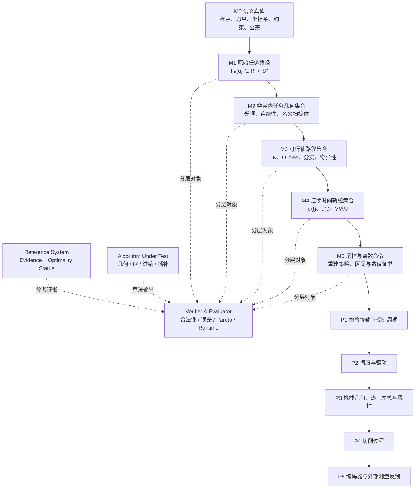

# FiveAxisTrajectoryPack — CNC 五轴数学参考系统全景规范

> 文档类型：领域包规范  
> 领域包：`FiveAxisTrajectoryPack`  
> 状态：Draft v0.4 / F0 已实现
> 依赖：[Axiom 通用评估框架规范](Axiom%20通用评估框架规范.md)  
> 上位路线：[Axiom 项目规划蓝图](CNC%20算法效果评估与智能优化平台——项目规划蓝图.md)  
> 相邻领域包：[有序离散点领域包规范](有序离散点领域包规范.md)

---

## 1. 文档目的

本规范定义一套独立于具体厂商控制器和具体生产算法的 CNC 五轴数学参考系统，并规定它如何作为领域包接入 Axiom Core。它用来回答：

1. 输入程序所表达的加工意图是什么；
2. 几何处理是否仍在给定位置与姿态公差内；
3. 任务空间路径在指定五轴拓扑上是否存在连续、限位内的轴空间实现；
4. 连续轨迹是否满足速度、加速度、Jerk 等约束；
5. 固定周期离散后是否仍满足几何、运动学与数值约束；
6. 待测算法与可证明真值、可行集合或已知最优边界之间相差多少。

系统的北极星不是“再实现一种插补器”，而是：

> **为 CNC 几何、运动学、时间参数化和离散插补算法提供可复现、可解释、带证据的参考基准。**

在 `FiveAxisTrajectoryPack` 内，数学参考系统是 Algorithm Lab 的基础；物理模型、实机评价和智能优化只能后接，不能反过来定义算法数学真值。

本规范不定义 Axiom 的通用 `Artifact / EvaluationCase / Experiment / Run / Observation / Claim / Evidence` 生命周期，也不要求其他领域先实现 M0–M5。平台公共对象与证据语义以 [Axiom 通用评估框架规范](Axiom%20通用评估框架规范.md) 为唯一来源。

---

## 2. 已锁定的顶层决策

| 决策 | 结论 |
|---|---|
| 建设顺序 | 本领域包内部先完备数学模型，再接应用物理模型 |
| 首要产品定位 | 算法研发基座，而非特定厂商控制器仿制品 |
| 五轴范围 | 从第一版开始覆盖连续五轴 |
| 默认任务空间 | 轴对称刀具的 \(\mathbb R^3\times S^2\)：刀尖位置 + 单位刀轴 |
| 完整姿态 | 仅在刀具滚转具有工艺意义时扩展到 \(SO(3)\) 或 \(SE(3)\) |
| 机床拓扑 | 双转台、头转台、双摆头三类同时进入模型 |
| 拓扑实现 | 通用运动链 + 每类一个闭式解析基准；一般配置使用认证数值方法 |
| “完备”口径 | 规范闭合，成熟领域形成完整参考实现，开放问题明确给出边界 |
| 参考实现目标 | 离线、高精度、结果完整、可复现；不承担 1 ms 实时要求 |
| 评价方式 | 先验证合法性，再做独立指标和 Pareto 比较；不设统一综合评分 |
| 平台关系 | 五轴是 DomainPack，不是 Axiom Core 的强制语义 |

---

## 3. “完备”的严格含义

### 3.1 模型完备

每一层必须明确：

- 输入、输出与数学定义域；
- 坐标系、单位、方向与符号约定；
- 允许的多解、不可达、退化和不连续情形；
- 必须保持的不变量；
- 可验证的误差、约束和失败状态；
- 与上一层、下一层的证明义务。

模型完备不等于每个子问题都已有闭式全局最优算法。

### 3.2 证据等级与最优性状态在本领域的应用

`Exact / Certified / Validated / Observed` 证据等级，以及 `ProvenOptimal / Bounded / FeasibleOnly / NotApplicable` 最优性状态，由 [通用评估框架规范 §9](Axiom%20通用评估框架规范.md#9-证据模型) 统一定义。本领域包只规定其典型应用：

| Core 状态 | 五轴领域典型应用 |
|---|---|
| `Exact` | 直线、圆弧、标准姿态曲线、三类标准机床的解析案例 |
| `Certified` | 通用运动链 IK、连续约束复核、严格数值界 |
| `Validated` | 暂无完整认证器的一般数值参考结果 |
| `Observed` | 仿真、实测、历史基线或随机试验结果 |
| `ProvenOptimal` | 已证明达到全局或声明域内最优的规划结果 |
| `Bounded` | 同时给出有证据的下界、可行上界和 optimality gap |
| `FeasibleOnly` | 只证明五轴路径或轨迹可行 |

参考结果必须分别标明“数值结论有多可信”和“优化问题解到了什么程度”。禁止把普通数值求解结果无条件称为真值，也禁止把一个可行解称为最优解。

### 3.3 成熟实现与开放问题

“成熟领域全部实现”指：理论定义稳定、存在多个可交叉验证的方法、适用边界清楚的模块均进入离线参考栈。

开放研究问题也必须出现在规范中，但只能：

- 返回上下界；
- 返回未决区域；
- 返回适用条件；
- 或明确标记 `unsupported/open`。

不得用未经证明的启发式算法填充成伪真值。

---

## 4. 领域包内部架构



下列角色必须保持独立，并映射到 Axiom Core：

| 本规范称谓 | Core 角色 | 职责 |
|---|---|---|
| 数学模型/Reference Solver | `ReferenceModel` | 定义允许集合，生成参考结果、严格界或最优边界 |
| SUT | `Subject` | 被评价的生产算法或实验算法 |
| Verifier & Evaluator | `Evaluator` | 独立检查合法性、不变量、误差和代价 |
| Physical Plant | `PhysicalModel` 或真实设备 | 控制器、伺服、机械与切削过程 |

### 4.1 非规范性产业参照与 Axiom 的取舍

主流 CNC 厂商通常以自身控制软件、虚拟控制器、轨迹分析和机床数据形成闭环。Axiom 借鉴其分层方式，但不把任何一家控制器的输出定义为普适数学真值。

| 产业做法 | Axiom 处理 | 原因 |
|---|---|---|
| 与真实控制软件同源的虚拟 CNC | `adapt`：作为 Controller/Physical Adapter 后接 | 适合复现特定控制器，不适合作为跨厂商数学 oracle |
| 程序验证、轨迹可视化和运行时 trace | `keep`：进入 Algorithm Lab | 对定位算法退化直接有价值 |
| 基于特定机床或控制器的表面质量估计 | `adapt`：作为条件化物理模型 | 结论依赖机床、伺服和参数，不能混入 M0–M5 |
| 私有控制器行为与闭源启发式规则 | 从五轴数学领域包排除 | 无法独立验证，也不能形成公开、稳定的数学定义 |

产业参照包括 [Siemens Run MyVirtual Machine](https://www.siemens.com/en-us/products/sinumerik/run-my-virtual-machine/)、[FANUC CNC Guide 2](https://www.fanucamerica.com/products/software/cnc-guide-2) 和 [HEIDENHAIN virtualTNC/JHIOsim](https://www.heidenhain.com/products/software/virtualtnc-jhiosim)。它们证明“控制同源仿真 + 分层验证”是产业现实，也反衬出 Axiom 的位置：提供厂商无关的数学参考与证据基础设施。

### 4.2 首版能力清单

本领域包必须以完整 ID 发布下列能力，MetricDefinition 和标准 Claim 依赖不得只写自然语言：

| 能力 ID | 成立条件 |
|---|---|
| `five-axis.path-progress.bound@1` | M1–M5 绑定同一版本化 `PathProgress` 或显式重参数化 provenance |
| `five-axis.regularity.certified@1` | 各段连续阶次、单侧导数和结点事件可机器判定 |
| `five-axis.correspondence.policy-bound@1` | 已绑定 §11.2 的版本化策略及全部输入 |
| `five-axis.collision-context.complete@1` | 刀具组件、工件/毛坯、夹具、机床几何、接触策略和裕量完整 |
| `five-axis.process-state.bound@1` | 工序事件绑定版本化 stock snapshot/update 策略和唯一状态链 |
| `five-axis.machine-profile.bound@1` | 机床拓扑、运动链、轴约束和几何版本完整 |
| `five-axis.task-geometry.collision.checked@1` | M2 名义扫掠、允许接触、禁止接触与过切已按声明方法覆盖连续区间 |
| `five-axis.configuration.collision.checked@1` | M3 选定配置路径的机器部件间隙已按声明方法覆盖连续区间 |
| `five-axis.time-law.bound@1` | M4 时间律、边界状态和连续约束完整 |
| `five-axis.reconstruction.policy-bound@1` | M5 离散命令绑定 §10.1 的重建与终点策略 |

标准 Claim 的最小能力依赖为：

| Claim | `requires` |
|---|---|
| `GeometryValid` | `path-progress.bound`、`regularity.certified`、`correspondence.policy-bound` |
| `TaskGeometryCollisionFree` | `collision-context.complete`、`process-state.bound`、`path-progress.bound`、`task-geometry.collision.checked` |
| `KinematicallyFeasible` | `path-progress.bound`、`regularity.certified`、`machine-profile.bound` |
| `ConfigurationCollisionFree` | `collision-context.complete`、`machine-profile.bound`、`configuration.collision.checked` |
| `ModelCollisionFree` | `TaskGeometryCollisionFree` 与 `ConfigurationCollisionFree` 的证据；离散候选还需要重建区间碰撞证据 |
| `ContinuouslyFeasible` | `regularity.certified`、`time-law.bound`；请求 Jerk 时每个移动段还必须达到 C3 |
| `IntervalCertified` | `time-law.bound`、`reconstruction.policy-bound`，以及 Case 请求的全部区间验证能力 |

表中的短名只为排版；机器可读 manifest 必须写完整 `five-axis.*@1` ID，并使用通用规范 §6.2 的状态决议规则。

---

## 5. M0：语义真值层

### 5.1 数学对象

M0 将源程序及其上下文解释为规范化加工事件序列：

\[
\mathcal I = \operatorname{Interpret}(Program, ModalState_0, ToolAssembly, Frames, Constraints, CollisionContext)
\]

规范事件至少携带：

- 源程序位置与事件来源；
- 长度、角度、时间单位；
- 工件、机床、刀具及局部坐标架关系；
- 刀尖定义、刀长及补偿状态；
- 几何运动原语与进给语义；
- 位置公差、姿态公差和轴约束引用；
- 模态状态变化轨迹。

当 Case 请求碰撞、干涉、过切或“模型内无碰撞”声明时，`CollisionContext` 也是必选输入，并至少冻结：

- 刀具切削体、非切削刀具部分、刀柄/主轴组件的实体或保守包络及版本；
- 目标工件、初始/阶段性毛坯、夹具和机床部件的几何及坐标变换；
- 允许接触、预期切削接触、禁止接触和最小安全间隙规则；
- 几何离散误差、包络膨胀量和碰撞求解器容差；
- 机器配置、装夹状态和工序阶段标识；
- 版本化 `ProcessStateTimeline`：每个事件绑定输入毛坯状态、允许去除域、接触策略和 stock 更新策略。

`ProcessStateTimeline` 不允许隐式更新。Case 必须绑定以下策略之一：

| 策略 ID | 唯一语义 |
|---|---|
| `five-axis.stock-update.explicit-snapshot@1` | 每个工序事件直接引用提交者冻结的 `StockState[j]` 内容标识；Evaluator 不推导下一状态 |
| `five-axis.stock-update.nominal-sweep@1` | Evaluator 按下述 M2 公式从已通过的上一事件确定性推导 `StockState[j+1]` |

两种策略不能在一次 Case 中混用。几何布尔内核、正则化规则和容差属于策略配置并进入内容标识。

上述上下文缺失不使普通几何 Case 自动无效，但任何碰撞相关必选指标必须返回 `InsufficientContext`，且不得产生正向安全声明。

### 5.2 参考边界

数学内核以无歧义的规范化 IR 为权威输入。G-code、CLDATA、STEP-NC 或厂商方言是语义前端，不直接污染后续几何公式。

首轮语义实现应覆盖标准、可验证的核心运动语义；厂商宏程序、PLC 行为和未公开控制器语义通过独立 Adapter 扩展。

### 5.3 证明义务

- 相同输入与初始模态状态产生确定性事件流；
- 每个事件可追溯到源程序；
- 所有隐式单位和坐标变换显式化；
- 碰撞 Case 中的几何体、接触策略、装夹状态和保守裕量全部可追溯；
- 不支持或存在方言歧义的语句必须失败并定位，不得猜测。

---

## 6. M1：原始五轴任务路径

### 6.1 默认表示

对轴对称铣削刀具：

\[
\Gamma_0(u)=\bigl(p_0(u),o_0(u)\bigr)\in\mathbb R^3\times S^2
\]

其中：

- \(p_0(u)\) 是约定刀尖点；
- \(o_0(u)\) 是单位刀轴方向，\(\|o_0(u)\|=1\)；
- \(u\) 是段内参数，不等同于弧长 \(s\) 或时间 \(t\)。

若非轴对称刀具、定向刀刃或受控主轴角使滚转有意义，才提升为完整旋转或位姿对象；该扩展增加了受控自由度，不能默认由普通五轴机床完整实现。

### 6.2 `PathProgress` 与正则性契约

M1–M5 统一使用抽象路径进度 \(\sigma\)，而不是把位置弧长、段内参数或时间混称为 \(s\)：

\[
\sigma\in[0,1],\qquad \Gamma(\sigma)=\bigl(p(\sigma),o(\sigma)\bigr)
\]

`PathProgress` 必须包含：

- 有序源段 ID 及每段的全局区间 \([\sigma_i,\sigma_{i+1}]\)；
- 段内参数 \(u_i\) 与 \(\sigma\) 的单调映射、方向和端点包含规则；
- 位置弧长 \(s_p\)（若存在）与 \(\sigma\) 的映射；
- 姿态变化但刀尖静止、退化段和零进度事件的显式语义；
- 唯一 ID、版本和派生 provenance。

\(\sigma\) 不是物理长度，也不是时间。它允许“位置停止但姿态继续变化”的段继续前进；真正的 dwell 在 M4 中表现为 \(\dot\sigma=0\)。

每一层的路径 Artifact 都必须携带该层自己的 `RegularityCertificate`：M1/M2 分别声明 \(p(\sigma)\)、\(o(\sigma)\) 的连续阶次，M3 再声明 \(q(\sigma)\) 的连续阶次；证书包含 `C0`–`C3`、单侧导数及验证方法。连接点必须携带 `NodeEvent`，其类型至少包括 `ordinary-junction`、`mandatory-stop`、`dwell`、`branch-change`、`wrap`、`singularity-boundary`、`collision-boundary`、`collision-violation` 和 `degenerate-segment`。`collision-boundary` 表示到达 \(Q_{free}\) 或间隙阈值边界；`collision-violation` 表示进入禁止集合并终止该可行分支。`CollisionUnchecked` 是评估状态明细，不是 NodeEvent。不得从“分段光滑”推断跨结点三阶可导。

### 6.3 成熟参考能力

- 直线、圆弧、螺旋线；
- Bézier、B-spline、NURBS；
- 分段曲线的高精度求值与一至三阶导数；
- 弧长积分、弧长反解和曲率计算；
- 球面测地线、球面 Bézier 或等价的刀轴方向插值；
- 端点、方向、连续阶次和退化段检测。

### 6.4 证明义务

- 参数定义域与段拓扑完整；
- 刀轴始终满足单位向量约束；
- 解析曲线与高精度数值求值交叉一致；
- 弧长、曲率和导数结果附带误差预算；
- 零长度段、重复点和对跖姿态等退化情形显式报告。
- `PathProgress` 在所有层保持同一 ID/版本，任何重参数化都形成新对象和 provenance；
- 每段与每个连接点的正则性、单侧导数和 `NodeEvent` 可机器判定。

---

## 7. M2：容差内几何路径集合

### 7.1 数学对象

几何算法不是产生唯一“真值曲线”，而是在原始加工意图的容差管内寻找满足连续性和形状约束的路径：

\[
\mathcal A_\varepsilon(\Gamma_0)
=
\left\{
\Gamma=(p,o)\;\middle|\;
e_p(\Gamma,\Gamma_0)\le\varepsilon_p,
e_o(\Gamma,\Gamma_0)\le\varepsilon_o
\right\}
\]

若请求碰撞或过切验证，还要在声明的 `CollisionContext` 下定义任务几何可行集：

\[
\mathcal G_{free}=\left\{\Gamma\;\middle|\;
Sweep(ToolAssembly,\Gamma)\cap ForbiddenContact(C)=\varnothing,
\;RemovedVolume(CuttingPart,\Gamma)\subseteq AllowedRemoval(C)
\right\}
\]

其中 `ForbiddenContact(C)` 和 `AllowedRemoval(C)` 由当前 `ProcessStateTimeline` 事件给出。刀刃与待切材料的预期接触不能被误报为碰撞；刀柄—工件/夹具接触、非预期刀具接触和超出允许去除域的扫掠体分别作为干涉与名义过切报告。请求该类声明时，M2 候选必须属于 \(\mathcal A_\varepsilon\cap\mathcal G_{free}\)。

对 `nominal-sweep@1`，第 \(j\) 个事件使用且只使用输入 `StockState[j]`：

\[
R_j=\operatorname{Sweep}(CuttingPart,\Gamma_j)\cap StockState[j]
\]

只有在 \(R_j\subseteq AllowedRemoval[j]\) 且该事件全部碰撞义务通过后，才更新：

\[
StockState[j+1]=\operatorname{RegularizedDifference}(StockState[j],R_j)
\]

这里的正则化差集固定定义为：

\[
\operatorname{RegularizedDifference}(A,B)=\overline{\operatorname{int}(A\setminus B)}
\]

它删除只剩边、点等低维碎片；几何内核必须证明其数值结果在策略声明的包络容差内包含该集合，无法给出可信包含关系时返回 `NumericalFailure`，不得继续派生 stock 状态。

若事件失败，标准评估不生成 `StockState[j+1]`，后续依赖该状态的指标使用 `MetricStatus = InvalidObservation` 和领域明细 `UpstreamProcessStateInvalid`；Case 可以为诊断显式提供独立 stock snapshot 后继续检查，但不能用诊断结果恢复整条路径的 `ModelCollisionFree`。这使同一候选在同一工序顺序、策略和布尔容差下得到唯一 stock 状态链。

位置和姿态公差必须分开：

\[
e_p=\|p_a-p_r\|,
\qquad
e_o=\arccos\!\left(\operatorname{clamp}(o_a^\top o_r,-1,1)\right)
\]

不得默认使用“毫米 + 角度 × 任意权重”的综合距离。

上式中的曲线级 \(e_p\) 与 \(e_o\) 取第 11.2 节单调对应关系下的连续区间上确界；点式公式只是对应点残差，不能单独代替曲线误差定义。

### 7.2 成熟参考能力

- 位置与刀轴路径的同步局部光顺；
- 位置 B-spline/NURBS 与球面姿态曲线；
- 给定位置、姿态误差界下的角点过渡；
- 小线段拟合及分段连续性验证；
- \(C^0\) 至 \(C^3\) 连续性和曲率性质检查；
- 光顺前后路径长度、曲率和姿态变化率比较。
- 刀具/刀柄扫掠体、夹具干涉和名义过切的保守几何验证；
- 连续区间最小间隙界，而非仅在采样姿态做碰撞查询。

### 7.3 证明义务

- 最大位置误差不超过 \(\varepsilon_p\)；
- 最大姿态角误差不超过 \(\varepsilon_o\)；
- 声明的连续阶次在段连接处成立；
- 位置与姿态使用共同、单调的路径进度；
- 误差界是连续区间上的结果，而不只是稀疏采样结果。
- 请求碰撞声明时，扫掠体、允许接触、禁止接触、最小间隙及几何近似误差都有证书；
- 缺失完整 `CollisionContext` 时明确输出 `CollisionUnchecked`，不得输出 `TaskGeometryCollisionFree` 或聚合的 `ModelCollisionFree`。

### 7.4 前沿边界

大规模微线段的全局最优光顺、几何—运动学联合光顺及学习型光顺的硬约束保证仍属于活跃研究，不作为唯一参考真值。

---

## 8. M3：五轴机床运动学与路径提升

### 8.1 通用运动链

将机床运动拆为工件侧链和刀具侧链。相对位姿写为：

\[
T_{WT}(q)=T_W(q_W)^{-1}T_T(q_T)T_{tool}
\]

每根轴由关节类型、螺旋坐标、零位、方向、父子顺序和安装侧定义。两根旋转轴的安装侧形成三类拓扑：

| 拓扑 | 工件侧旋转轴 | 刀具侧旋转轴 |
|---|---:|---:|
| 双转台 | 2 | 0 |
| 头转台 | 1 | 1 |
| 双摆头 | 0 | 2 |

### 8.2 正运动学与集合值逆运动学

正运动学是确定映射：

\[
F_m(q)=\bigl(p(q),o(q)\bigr)
\]

逆运动学必须视为集合值映射：

\[
\mathcal K_m(p,o)=\{q^{(1)},q^{(2)},\ldots\}
\]

同一任务姿态可能对应多个解析分支和多个 \(2\pi\) 展开。参考系统必须先枚举可行解，再讨论选择目标。

### 8.3 路径提升

任务路径在机床上的运动学真值先是不考虑碰撞的一组连续提升：

\[
\mathcal L_m^{kin}(\Gamma)=
\left\{
q(\cdot)\;\middle|\;
F_m(q(\sigma))=\Gamma(\sigma),
q(\sigma)\in Q_{limits},
q_i\in C^{r_i}\text{ on }[\sigma_i,\sigma_{i+1}]
\right\}
\]

再令 \(Q_{free}(M,C)\) 为指定 `MachineProfile` 和 `CollisionContext` 下不发生机床自碰撞、部件间干涉或禁止接触的配置集合，完整模型可行提升为：

\[
\mathcal L_m^{free}(\Gamma)=
\left\{q\in\mathcal L_m^{kin}(\Gamma)\;\middle|\;q(\sigma)\in Q_{free}(M,C),\;\forall\sigma\in[0,1]\right\}
\]

其中 \(r_i\) 来自 M3 `RegularityCertificate`。`KinematicallyFeasible` 只断言 \(\mathcal L_m^{kin}\) 非空；`ConfigurationCollisionFree` 才断言选定路径属于 \(\mathcal L_m^{free}\)。参考输出不是未经说明的一条轴轨迹，而是分支图及其证书。图节点表示局部可行分支，边表示可连续延拓；限位、wrap、分支合并、碰撞边界和奇异点必须成为显式 `NodeEvent`。

### 8.4 成熟参考能力

- 基于指数积或等价刚体变换的通用正运动学；
- 双转台、头转台、双摆头三个正交相交轴标准机型的闭式 IK；
- 非正交、带偏置一般配置的高精度数值 IK；
- 给定轴限位内的全部候选解搜索；
- 旋转轴 unwrap、范围过滤和分支连续跟踪；
- 奇异集合检测、条件数或最小奇异值界；
- 任务空间与轴空间回代残差。
- 机床自碰撞、移动部件—固定部件以及刀具组件—夹具/工件的配置空间碰撞检查；
- 沿连续路径的最小配置间隙界和保守扫掠包络。

### 8.5 证明义务

- 正运动学回代满足位置和姿态残差界；
- 每个 IK 解携带分支、wrap 和轴限位信息；
- 数值 IK 说明是否证明了无解、唯一解、多解或仍不确定；
- 路径分支选择不得跨越未声明的不连续；
- 奇异性必须作为模型退化报告，不能作为普通浮点异常吞掉。
- 每个声称 `ConfigurationCollisionFree` 的候选提升全程位于 \(Q_{free}\)，否则明确报告首个未决/碰撞区间；
- M2 任务几何检查和 M3 完整机构检查必须分别留证，不能相互替代。

### 8.6 前沿边界

任意五轴结构在穿越精确奇异点时的连续路径完备认证，以及跨所有分支的全局最优选择，仍不是通用已解问题。

---

## 9. M4：连续时间参数化

### 9.1 数学对象

给定带正则性证书的轴空间路径 \(q(\sigma)\)，时间参数化由路径进度 \(\sigma(t)\) 给出。撇号只表示对 \(\sigma\) 求导，链式法则为：

\[
\dot q=q'\dot \sigma
\]

\[
\ddot q=q''\dot \sigma^2+q'\ddot \sigma
\]

\[
\dddot q=q'''\dot \sigma^3+3q''\dot \sigma\ddot \sigma+q'\dddot \sigma
\]

轴速度、加速度、Jerk、边界状态、进给命令及同步条件都必须转换为对 \(\sigma(t)\) 的约束。\(\sigma(t)\) 在移动区间严格递增，在显式 `dwell` 区间允许保持常数。

上述 Jerk 公式只在 \(q_i\in C^3\) 的开区间成立。连接点必须使用 `NodeEvent` 给出的左右边界状态：未达到所需连续阶次时，要么强制 \(\dot\sigma=0\) 并按独立段重新启动，要么提供可验证的过渡段；禁止跨不连续点直接套用三阶公式。只有覆盖全部移动区间和结点策略的证书才能称为 `jerk-certified`。

### 9.2 成熟参考能力

- 梯形、S 曲线等标准单段运动轮廓；
- 多轴时间同步和边界状态处理；
- 速度/加速度二阶约束下的路径时间参数化；
- 经典相平面方法、凸优化与 TOPP-RA 类算法交叉验证；
- Jerk 有界的可行轨迹生成；
- 前瞻、停止点和短段约束传播的离线参考实现。

### 9.3 证明义务

- \(\sigma(t)\) 单调且满足端点条件；
- 所有轴的连续速度、加速度和 Jerk 约束得到验证；
- 每个结点的停留、停止、重启或过渡行为与 `NodeEvent` 一致；
- 加工时间与可行轨迹绑定；
- 二阶最优问题报告最优性证据；
- 三阶或更高阶问题报告可行上界、理论下界与 gap，或明确不提供全局最优声明。

### 9.4 前沿边界

一般五轴、包含 Jerk、奇异性、分支选择及几何自由度的联合全局最短时间问题仍属开放前沿。

---

## 10. M5：固定周期采样、命令重建与数值证书

### 10.1 数学对象

M5 必须区分两个对象：

1. `SampledTrajectory`：对 M4 连续轨迹的取样，必须引用原 M4 Artifact；
2. `DiscreteCommand`：控制器实际消费的离散命令，只有绑定重建策略后才具有采样间隔内语义。

给定插补周期 \(\Delta t\)，`SampledTrajectory` 为：

\[
q[k]=q(k\Delta t)
\]

两类离散输出必须同时保留：

- 时间戳与周期编号；
- 任务空间位置、刀轴和路径进度；
- 机床各轴位置；
- 解析或参考导数；
- 源段、程序行和分支 provenance；
- 对象类型、数值精度与舍入策略。

`DiscreteCommand` 还必须绑定版本化 `ReconstructionPolicy`，至少记录：

- `policyId`：`zoh`、`foh`、分段多项式、`reference-m4` 或已形式化的 `controller-defined`；
- 每个区间的半开/闭合约定，默认 \([t_k,t_{k+1})\)，以及最终端点的归属；
- 重建所需系数、切向/导数或所引用 M4 段的内容标识；
- `derivativeSource`：解析导数、重建策略导数、显式差分估计或不可用；
- 总时长不整除周期时的剩余时间、端点吸附和最终保持策略。

首版标准策略的区间语义为：

所有公式都作用于 M3 已冻结的连续分支和 unwrapped 轴坐标；旋转轴不得在 M5 重新按模 \(2\pi\) 选择“最短路”。wrap 改变必须来自上游 `NodeEvent` 并形成新的分段边界。

| 策略 ID | \([t_k,t_{k+1})\) 上的定义 | 可形成的连续约束证据 |
|---|---|---|
| `five-axis.reconstruction.zoh@1` | \(q(t)=q[k]\) | 非相等相邻命令在结点跳变；只能验证采样/保持位置，不能给出有限速度、加速度、Jerk 或跳变过程碰撞的正向 Claim |
| `five-axis.reconstruction.foh@1` | \(q(t)=(1-\alpha)q[k]+\alpha q[k+1]\)，\(\alpha=(t-t_k)/(t_{k+1}-t_k)\) | 可验证位置、区间速度和沿线碰撞；加速度/Jerk 必须检查结点左右导数，斜率不连续时不能通过对应连续约束 |
| `five-axis.reconstruction.polynomial@1` | 使用每段冻结的基函数、阶次和系数 | 按解析导数及结点正则性验证至声明阶次 |
| `five-axis.reconstruction.reference-m4@1` | 精确引用原 M4 分段函数在该区间的限制 | 可继承 M4 证书，但必须另证采样/量化没有破坏引用关系 |

所有策略的最终样本 \(q[N]\) 只定义在终点 \(t_N\)；终点之后是否保持必须由单独的 final-hold 字段声明。`controller-defined` 必须使用厂商/Adapter 自己的命名空间和版本，不能冒充上述标准策略。

只有 `q[k]` 而没有上述策略时，只能形成采样点位置类 Claim；该 Claim 仅表示采样点有效，不构成下游准入、执行许可或设备安全声明。所有采样间隔内部的速度、加速度、Jerk、轮廓和碰撞指标必须返回 `InsufficientContext`。`controller-defined` 若没有可复核的形式模型，最多提供 `Validated` 或 `Observed` 证据，不能提供 `Certified` 区间声明。

### 10.2 成熟参考能力

- 直线、圆弧、NURBS/B-spline 固定周期采样；
- 弧长驱动和时间驱动插补；
- 弦误差、径向误差和五轴位置/姿态误差计算；
- 离散点重建连续段后的约束复核；
- 高精度算术与双精度实现的差异分析；
- 端点吸附、剩余时间和最后周期处理。
- ZOH、FOH、分段多项式和 `reference-m4` 策略的确定性重建；

### 10.3 证明义务

- 时间序列严格单调，周期和终点策略明确；
- 采样后的位置与姿态误差分别有界；
- 不使用未经说明的有限差分结果冒充解析速度、加速度或 Jerk；
- 速度、加速度和 Jerk 的验证覆盖采样间隔，而不仅是采样点；
- 每项误差说明来自几何近似、时间离散还是浮点舍入。
- 区间证书绑定确切 `ReconstructionPolicy`、导数来源和终点策略；
- 重建后的连续段仍满足声明的 \(Q_{free}\) 与最小间隙要求，或碰撞状态明确降级为 `CollisionUnchecked`。

### 10.4 前沿边界

从任务几何到轴空间、时间参数化、周期采样及浮点运算的端到端严格误差预算，仍是平台可形成差异化研究能力的方向。

---

## 11. 跨层不变量与误差预算

### 11.1 坐标系和单位

所有对象必须携带：

- 坐标架标识和变换来源；
- 长度、角度、时间及其导数量纲；
- 刀尖、刀轴和旋转中心定义；
- 左右手系、旋转正方向和轴命名映射。

内部可以采用统一 SI 或工程单位，但任何转换必须显式、可追溯。

### 11.2 位置—姿态对应关系

五轴轮廓评价不能只让每个实际位置点独立寻找全局最近参考位置点。每个相关 MetricDefinition 必须绑定版本化 `CorrespondencePolicy`；策略至少声明输入域、可行对应集合、目标函数、确定性并列规则、退化/自交处理、求解容差和证书格式。

本节中的 \(t\) 表示实际对象在 ReferenceBinding 中声明的有序比较参数：M1–M3 默认使用实际 `PathProgress` \(\sigma_a\)，M4/M5 可以使用时间。策略输入必须冻结该选择，评估器不得在时间、索引、弧长和路径进度之间自行切换；\(\phi(t)\) 的值域始终是参考 PathProgress \([0,1]\)。

首版标准策略为：

| 策略 ID | 定义 | 使用边界 |
|---|---|---|
| `five-axis.correspondence.provenance-progress@1` | 实际对象与参考对象共享同一 `PathProgress` ID/版本和源段 lineage 时，直接令 \(\phi(t)=\sigma_a(t)\) | 首选策略；可按进度 provenance 形成 `Exact` 或 `Certified` 对应证据 |
| `five-axis.correspondence.monotone-minimax@1` | 在下述标准可行集内求归一化位置/姿态最大误差最小的单调分段线性对应 | 仅在没有共享进度、但连续对象和容差完整时使用 |

对 `monotone-minimax@1`，实际域的规范结点由段端点和全部 `NodeEvent` 构成；\(\phi\) 在这些结点间分段线性，并满足：

\[
t_1<t_2 \Rightarrow \phi(t_1)\le\phi(t_2),
\qquad
\phi(t_0)=0,\;\phi(t_N)=1
\]

若 ReferenceBinding 明确声明只比较前缀/子区间，端点约束改用该绑定的闭区间。每个实际源段只能映射到 provenance 允许的参考段闭区间；允许区间交集为空时产生 `UndefinedCorrespondence`，对应指标为 `InvalidObservation`。

其主目标为：

\[
J_\infty(\phi)=\sup_t\max\!\left(
\frac{\|p_a(t)-p_r(\phi(t))\|}{\varepsilon_p},
\frac{\arccos(\operatorname{clamp}(o_a(t)^\top o_r(\phi(t)),-1,1))}{\varepsilon_o}
\right)
\]

其中 \(\varepsilon_p>0\)、\(\varepsilon_o>0\) 来自 Case；不适用的分量从最大值中删除，禁止用任意权重混合量纲。多个主目标最优解按以下元组做字典序最小化：

\[
\left(
J_\infty,
\int_{t_0}^{t_N}|\phi(t)-\tau(t)|^2dt,
\phi(t_1),\ldots,\phi(t_{N-1})
\right)
\]

其中 \(\tau(t)=(t-t_0)/(t_N-t_0)\)。这一定义同时固定了自交、多重投影和等距候选的并列行为。求解器必须输出 `CorrespondenceCertificate`，包含策略 ID/版本、规范结点、源段允许区间、选定结点映射、主目标上下界、并列目标值、数值容差和求解器版本。

对应确定后分别评价：

\[
e_p(t)=\|p_a(t)-p_r(\phi(t))\|
\]

\[
e_o(t)=\arccos\!\left(\operatorname{clamp}(o_a(t)^\top o_r(\phi(t)),-1,1)\right)
\]

`clamp` 只用于抵抗单位向量点积的浮点越界；若频繁或超过声明舍入界触发，必须把上游归一化问题另行报告。局部最近点可以作为候选，但必须受到段、进度和单调性约束。

仅在有限采样点上近似 \(\phi\) 或误差上确界时，证据等级最高为 `Validated`。只有覆盖连续区间的严格界或形式证明才能达到 `Certified`；缺少策略返回 `InsufficientContext`，Evaluator 不实现已绑定策略返回 `UnsupportedCapability`。

### 11.3 位置—姿态同步误差

为避免把“同步误差”与时间域伺服相位误差混淆，数学层使用 `PathProgress` 的归一化参考进度 \(\rho\in[0,1]\)。在同一源段和单调性约束下，分别用已绑定的 `CorrespondencePolicy` 得到位置与姿态对应的参考进度 \(\phi_p(t)\) 和 \(\phi_o(t)\)：

\[
e_{sync}(t)=\left|\phi_p(t)-\phi_o(t)\right|
\]

若算法直接输出共同路径进度，则使用 `provenance-progress@1` 验证；若未输出，只有显式绑定 `monotone-minimax@1` 或其他完整策略后才可重建。时间域命令—反馈相位差属于物理链指标，不使用 \(e_{sync}\) 表示。

### 11.4 误差预算分解

误差预算是**按目标量分开的类型化账本**，不是把语义状态、长度、角度、时间和浮点误差直接相加。至少记录：

| 账本项 | 类型/量纲 | 典型来源 |
|---|---|---|
| `SemanticValidity` | 分类状态，无数值量纲 | 解释歧义、未支持方言、坐标语义冲突 |
| `PositionBound` | 长度 | 几何近似、运动学回代、采样、浮点/量化 |
| `OrientationBound` | 角度 | 姿态拟合、IK 回代、采样、浮点/量化 |
| `AxisBound[j]` | 第 j 轴单位 | IK、时间参数化、重建与量化 |
| `TimeBound` | 时间 | 时间参数化、周期量化、时基换算 |
| `ClearanceBound` | 长度 | 几何包络、碰撞求解与模型离散化 |

每个最终 Claim 必须指向一个 `targetQuantity`，并保存各来源界、单位、相关性假设、传播函数及证据等级：

\[
B_y=\operatorname{Propagate}_y(B_1,\ldots,B_n;\,J_y,\text{assumptions})
\]

只有各项已映射为同一目标量、且三角不等式或敏感度界的前提成立时，才允许用求和得到保守总界。语义错误保持分类失败，不能折算成数值误差。物理跟随误差、热误差和切削变形进入物理层自己的账本，不回写数学层真值。

### 11.5 硬门槛与质量指标

先执行硬门槛：

1. 语义是否可解释；
2. 几何是否在容差内；
3. 请求碰撞/过切声明时，M2 名义扫掠体是否满足允许接触和去除域；
4. 是否可达、轴不超限且 M3 全程位于 \(Q_{free}\)；
5. 连续运动约束及结点事件是否满足；
6. M5 的重建策略、区间约束与数值证书是否成立。

只有通过硬门槛，才比较：

- 加工时间；
- 速度利用率；
- 最大值、RMS、P95/P99；
- 平滑性；
- 算法运行时间和资源占用。

不同质量指标形成 Pareto 集，不压缩成统一总分。

### 11.6 标准 Claim 与 R2 安全边界

R2 的标准正向 Claim 为：

| Claim | 精确含义 |
|---|---|
| `GeometryValid` | 在声明的对应策略和连续区间证据下满足位置/姿态容差 |
| `TaskGeometryCollisionFree` | M2 在冻结的刀具、工件/毛坯、夹具、接触策略和保守裕量内无禁止干涉/名义过切 |
| `KinematicallyFeasible` | \(\mathcal L_m^{kin}\) 非空：存在满足回代、分支、限位和正则性的轴路径；该 Claim 本身不包含碰撞结论 |
| `ConfigurationCollisionFree` | M3 的选定轴路径全程位于冻结机器模型的 \(Q_{free}\) |
| `ModelCollisionFree` | 聚合适用层的任务几何、配置空间以及离散重建区间碰撞证据，任何一层未检查都不能成立 |
| `ContinuouslyFeasible` | 绑定的 M4 连续轨迹满足全部声明的连续时间约束 |
| `IntervalCertified` | 绑定的 M5 重建策略在全部采样区间内通过声明的约束验证 |

`CollisionUnchecked` 是碰撞指标的领域明细，不是新的 Core 公共状态，也不是弱化版的 `ModelCollisionFree`。它必须伴随 `MetricStatus = InsufficientContext` 或 `UnsupportedCapability`，以及 `ClaimStatus = Inconclusive`。R2 不得输出 `DeviceSafe`、`ProcessSafe`、`safe-to-run` 或不加限定的“可执行”声明；它最多声明“在已冻结数学模型内可行/无碰撞”。真实装配误差、热漂移、背隙、磨损、切削力、控制器行为和在线停止能力由 R3/R4/R7 的物理与安全链验证。

---

## 12. Reference Solver 与待测算法

待测算法可以作用于不同层，而不是被迫包装成一个黑箱：

| Adapter 类型 | 输入 | 输出 |
|---|---|---|
| Geometry Adapter | M1 | M2 候选路径 |
| Kinematics Adapter | M2 + MachineProfile | M3 候选轴路径 |
| Feedrate Adapter | M3 + 约束 | M4 连续时间轨迹 |
| Interpolator Adapter | M4 + 周期 | M5 离散轨迹 |
| Pipeline Adapter | M0/M1 | M5 完整输出及中间层 |

评价分为三类：

1. `Validity`：输出是否属于允许集合；
2. `Distance/Gap`：与参考界或最优边界相差多少；
3. `Runtime`：生产实现的实时性与资源消耗。

参考求解器可以很慢；SUT 可以近似或启发式，但必须接受相同的数学验证。

---

## 13. 证明型测试语料

每个测试用例必须包含：

- 规范化输入；
- 适用层和机床拓扑；
- 证据等级；若是优化问题，再包含最优性状态；
- 期望证书或边界；
- 退化/失败状态；
- 高精度生成方法和版本。
- `PathProgress`、`CorrespondencePolicy`、`ReconstructionPolicy` 和 `CollisionContext` 中适用项的版本；
- 期望 `MetricStatus`、`CaseOutcome` 和允许产生的标准 Claim。

### 13.1 几何基础族

- 单轴、平面和空间直线；
- 整圆、圆弧、螺旋线；
- 椭圆、S 曲线和曲率连续曲线；
- Bézier、B-spline、NURBS；
- 零长度段、重复点、极短段和极端参数尺度。

### 13.2 五轴姿态族

- 刀尖静止、刀轴旋转；
- 刀尖直线、刀轴匀速球面旋转；
- 位置停止但姿态继续变化；
- 相同刀尖路径、不同刀轴路径；
- 对跖或近对跖刀轴；
- 位置与姿态角点不同步。

### 13.3 PathProgress、正则性与对应族

- 同一位置弧长但不同姿态进度；
- 刀尖静止、刀轴继续旋转；
- `C3` 段在 `C0/C1/C2` 结点相接；
- mandatory stop、dwell、wrap 和 branch-change 事件；
- 自交路径、多重最近点、重复点和等距对应；
- provenance 允许区间互相冲突；
- 解析连续上确界与稀疏采样最大值不同的反例。

### 13.4 三类拓扑与 IK 族

- 双转台、头转台、双摆头标准解析机型；
- 单解、多解、无解和边界可达；
- 旋转轴 \(\pm\pi\) wrap；
- 轴软限位、硬限位和可行分支消失；
- 奇异锥穿越、擦边和近奇异长路径；
- 非正交旋转轴、轴心偏置和长刀具。

### 13.5 碰撞、干涉与名义过切族

- 刀刃与待切材料的允许接触，不得误报为碰撞；
- 刀柄擦碰工件、夹具或主轴组件；
- 刀具扫掠体越过允许去除域形成名义过切；
- 三类机床拓扑的部件自碰撞与最小间隙擦边；
- 采样姿态全部无碰撞但区间内部发生碰撞的反例；
- 同一路径在不同 stock 阶段分别属于允许去除、名义过切或禁止接触；
- 某工序失败后不得派生下一 stock 状态，后续依赖指标得到 `UpstreamProcessStateInvalid`；
- 缺失夹具、毛坯阶段或接触策略时必须得到 `CollisionUnchecked`。

### 13.6 时间参数化族

- 单段启动—恒速—停止；
- 非零初末速度；
- 速度、加速度分别成为活动约束；
- 多轴交替成为瓶颈；
- 大量小线段和短前瞻；
- Jerk 可行但二阶最优解不可直接执行的案例。

### 13.7 离散与数值族

- 周期整除与不整除总时间；
- 最后周期、端点吸附和重复终点；
- 弦误差极限；
- 高曲率与高姿态变化率组合；
- 大坐标加微小增量；
- 双精度与高精度差异；
- 采样点全部合格但区间内部超限的反例。
- 同一 `q[k]` 分别使用 ZOH、FOH 和三次策略时得到不同区间峰值的反例；
- 缺失重建策略、导数来源或最终保持策略时的状态映射。

---

## 14. 成熟度与研究前沿

| 领域 | 纳入完整参考实现 | 活跃或开放边界 |
|---|---|---|
| 语义 | 规范 IR、标准运动语义、坐标与模态展开 | 全部厂商宏程序和私有语义 |
| 几何 | 解析曲线、NURBS、PathProgress、局部五轴同步光顺、名义扫掠体/过切验证 | 大规模全局光顺、学习法硬保证 |
| 运动学 | 通用正运动学、三类解析基准、分支/限位/wrap/奇异和 \(Q_{free}\) 验证 | 任意拓扑连续路径的全局完备提升 |
| 时间参数化 | 标准轮廓、二阶 TOPP、多轴同步、Jerk 可行规划 | 一般三阶及几何耦合全局最优 |
| 离散与数值 | 周期采样、命令重建、区间复核、弦/轮廓/姿态误差、高精度交叉验证 | 全链连续严格误差证书 |
| 评价 | 独立指标、硬门槛、Pareto、回归 | 跨任务的万能综合评分（明确不追求） |

成熟度清单是版本化资产。每次把“前沿”提升为“成熟”时，必须同时增加：

- 独立复现或交叉求解器；
- 反例测试；
- 适用条件；
- 证据等级；
- 回归基线。

---

## 15. FiveAxisTrajectoryPack 内部建设阶段与阶段门

每个阶段门必须由版本化 `MathStageManifest` 验收。Manifest 至少冻结：本阶段能力 ID、必选测试 fixture 内容标识、策略版本、数值环境、期望状态/Claim 和允许容差。未在截止阶段定案的实现选择不能以“待定”通过 gate。

### Math F0：数学宪法

完成 M0–M5 定义、坐标/单位、`PathProgress`、正则性/结点事件、对应、重建、碰撞上下文、类型化误差账本、标准 Claim、证据等级、最优性状态、失败分类和测试格式。

F0 不是仅供阅读的类型清单。退出本阶段还必须同时具备：可由 Core 注册和路由的 `FiveAxisTrajectoryPack` 描述符/运行绑定；对 M0～M5 Artifact、Profile、Policy、Certificate 的严格机器 schema；至少一个内容标识已冻结的 F0 fixture；以及通过显式 Adapter 将 Cartesian 采样位置视图转换为有序离散点的正反例。Core 不得为此增加五轴 ID 或字段分支。

F0 readiness 只有在请求 Artifact 的内容标识属于 Manifest 冻结的 fixture 集合、Artifact 与 Manifest 的 M0～M5 envelope 内容身份逐阶段一致、必需能力完整且声明的有序点导出 Adapter 路由真实注册时，才允许进入 `Computed`。任一身份、阶段覆盖或能力闭合失败都必须产生结构化失败并阻止 `Passed`；不能仅凭 schema 可解析或 Manifest 自报的期望状态放行。

通过 F0 只证明契约可执行。F0 Evaluator 可以验证 schema、Manifest、能力依赖和失败映射，但不得生成本规范 §14 的任一正向数学 Claim；缺少碰撞上下文或重建策略时必须分别保持 `CollisionUnchecked` / `InsufficientContext` / `UnsupportedCapability` 与 `ClaimStatus = Inconclusive`，不能用“schema 已通过”替代连续区间证明。

### Math F1：几何参考栈

完成 M0 核心语义与碰撞上下文、M1 曲线/进度内核、M2 五轴几何与同步光顺、标准对应策略、名义扫掠体/过切验证，以及解析几何测试族。

### Math F2：运动学参考栈

完成通用运动链、三类闭式基准、一般数值 IK、分支图、wrap、限位、\(Q_{free}\)、连续碰撞/间隙和奇异性证书。

### Math F3：时间与离散参考栈

完成二阶 TOPP、Jerk 可行规划、结点事件处理、连续约束验证、固定周期采样、标准命令重建和类型化数值误差账本。

### Math F4：参考系统验收

成熟模块必须满足：

- 至少一种独立交叉验证方式；
- 解析案例达到 `Exact`；
- 一般数值案例至少达到 `Validated`；存在严格方法时达到 `Certified`；优化问题必须标明 `ProvenOptimal`、`Bounded` 或 `FeasibleOnly`；
- 三类拓扑测试全部覆盖；
- `CorrespondencePolicy` 和 `ReconstructionPolicy` 的规范一致性反例全部通过；
- M2/M3/M5 的碰撞与区间内部反例全部通过；
- 结果确定、可复现、可追溯；
- 已知开放问题没有被静默近似。

只有通过 Math F4，`FiveAxisTrajectoryPack` 才能完成 Axiom Roadmap 的 R2 数学领域 gate，并进入正式 Five-Axis Algorithm Lab。面向下游验证/审批的候选还必须同时具有 `GeometryValid`、`ModelCollisionFree`、`KinematicallyFeasible`、`ContinuouslyFeasible` 和 `IntervalCertified`；任一项为 `CollisionUnchecked` 或 `Inconclusive` 时不得进入 R3/R4 的后续 gate。该结论仍不构成设备执行许可。设备、学习与优化的全局阶段顺序由项目蓝图定义，不由本领域规范重复定义。

---

## 16. 本领域包与物理层的接口

对于由 `FiveAxisTrajectoryPack` 生成并准备进入下游验证的新轨迹，物理执行链的入口是具有完整标准 Claim 集和 provenance 的 M5 `DiscreteCommand`：

```text
M5 DiscreteCommand + ReconstructionPolicy + 数学 Claim
  ↓
命令传输、缓存、延迟和周期抖动
  ↓
位置环、速度环、电流/转矩环
  ↓
惯量、摩擦、反向间隙、结构柔性和热误差
  ↓
切削力、颤振、刀具/工件相互作用
  ↓
编码器与外部测量反馈
```

这里的“进入物理链”不等于获准在设备上执行。R3 只读对齐、R4 物理验证和 R7 安全批准仍是独立 gate。物理模型输出的是条件化预测与不确定度，不修改 M0–M5 的数学真值。这样才能区分：

- 算法输出已错误；
- 命令链改变了轨迹；
- 伺服无法跟随；
- 机械或切削过程引入误差。

Axiom Core 也允许只读导入既有设备运行。若历史运行没有可关联的 M5 ReferenceRun，必须标记为未配对观测，不能伪造数学来源。因此“由 M5 进入物理链”是本领域包中新轨迹的接口约束，不是整个平台接收所有设备数据的唯一入口。

---

## 17. 本领域包第一阶段明确不做

- 不以 1 ms 实时性能约束参考求解器；
- 不把某家控制器的行为当作普适数学定义；
- 不承诺支持全部厂商 G-code 方言和宏程序；
- 不把完整 \(SE(3)\) 设为轴对称五轴铣削的默认对象；
- 不用单一权重合并位置和姿态误差；
- 不声称解决一般五轴 Jerk 全局最优；
- 不在数学阶段引入复杂伺服、热、振动、刀具磨损或表面粗糙度模型；
- 不使用机器学习生成参考真值。

---

## 18. 实现选择及最迟决策阶段

下列选择不改变本规范的数学语义，但不得无限期悬置。每项必须在最迟阶段前形成 ADR 或 StageManifest 决策，并满足右侧不变量：

| 实现选择 | 最迟阶段 | 不得改变的不变量 |
|---|---|---|
| 规范化 IR 字段及首个 G-code/CL 前端范围 | Math F1 开始前 | 不支持语义显式失败，单位/坐标/来源可追溯 |
| 三类闭式基准机床的轴序、方向、零位与几何参数 | Math F2 开始前 | MachineProfile 版本化，解析与通用链回代一致 |
| 高精度、区间算法和符号验证技术栈 | 首个 `Certified` Claim 前 | 证书可独立复核，结果不依赖隐藏全局状态 |
| 连续证书容差和自适应细分策略 | Math F1 验收前 | 容差进入 MetricDefinition/Manifest，采样不能冒充连续界 |
| Jerk 可行规划的首批交叉算法 | Math F3 开始前 | 至少两种独立路径或一个严格证书方法 |
| Reference Solver 与 SUT 的进程内、文件或 RPC Adapter | Math F4 集成前 | 输入输出内容标识、版本、失败状态和 provenance 等价 |

### 18.1 Math F1 已冻结实现选择

Math F1 按 [ADR-0008](架构决策记录/ADR-0008-领域包多Artifact声明与单主Artifact运行.md) 与 [ADR-0009](架构决策记录/ADR-0009-F1规范化前端与连续证据边界.md) 冻结以下选择：

- 权威 M0 对象为 `five-axis.normalized-program@1`；首个文本前端为严格的 `axiom-cl-subset@1`，覆盖 `UNITS`、`FROM`、`GOTO`、`FEDRAT`、`DWELL`、`END`，不声称完整 ISO 3592、RS274 或厂商方言兼容；
- M0、M1、M2 是同一 DomainPack 的不同有类型 Artifact；一次 Run 只携带其中一个主 Artifact，层间通过内容身份和 provenance 派生；
- 连续误差的首版数值核使用显式定义域的解析曲线、分段多项式/B-spline 和球面插值；每项结果仍必须记录 Axiom 冻结的导数界、细分容差、求解器版本与数值环境；
- 首版 Certified 任务碰撞只覆盖 Manifest 声明的解析刀具基本体、解析路径和解析/AABB 上下文。一般 mesh/CAD 后端必须另行声明能力，有限查询最高为 `Validated`；
- `five-axis.task-geometry.collision.checked@1` 与 `five-axis.configuration.collision.checked@1` 分层发布，禁止用 F1 的 M2 证据满足 M3 Claim。

---

## 19. 主要研究依据

### 语义与数据模型

- [ISO 6983-1:2009 — NC program format](https://www.iso.org/standard/34608.html)
- [ISO 3592:2000 — CLDATA file structure and language](https://www.iso.org/standard/33798.html)
- [ISO 14649-1:2003 — CNC data model principles](https://www.iso.org/standard/34743.html)
- [NIST RS274NGC Interpreter Version 3](https://www.nist.gov/publications/nist-rs274ngc-interpreter-version-3)

### 五轴几何与插补

- [Local toolpath smoothing for five-axis machine tools, 2015](https://doi.org/10.1016/j.ijmachtools.2015.04.014)
- [Real-time local smoothing with error constraints, 2018](https://doi.org/10.1016/j.ijmachtools.2017.10.001)
- [Analytical decoupled five-axis corner smoothing, 2019](https://doi.org/10.1109/ACCESS.2019.2898703)
- [Five-axis synchronization and nonlinear interpolation errors, 2022](https://doi.org/10.1115/1.4053460)
- [Five-axis kinematic corner smoothing and time synchronization, 2023](https://doi.org/10.1016/j.jmapro.2023.09.048)
- [Accurate five-axis interpolation under kinematic constraints, 2026](https://doi.org/10.1016/j.cjme.2026.100276)
- [Collision-free tool motion planning for 5-axis CNC machining with toroidal cutters, 2024](https://doi.org/10.1016/j.cad.2024.103725)

### 五轴运动学与奇异性

- [Generic five-axis postprocessor, 2006](https://doi.org/10.1016/j.ijmachtools.2006.06.002)
- [Inverse kinematics near singular configurations, 2007](https://doi.org/10.1016/j.ijmachtools.2006.03.011)
- [Generalized kinematics of five-axis serial machines, 2013](https://doi.org/10.1016/j.ijmachtools.2013.09.002)
- [Cause, effect and avoidance of five-axis singularities, 2017](https://doi.org/10.1016/j.ijmachtools.2016.12.002)
- [Continuous-path singularity detection and smooth avoidance, 2024](https://doi.org/10.1016/j.cad.2023.103652)

### 时间参数化与约束规划

- [Bobrow et al. — Time-Optimal Control of Robotic Manipulators Along Specified Paths, 1985](https://doi.org/10.1177/027836498500400301)
- [Shin and McKay — Minimum-Time Control of Robotic Manipulators with Geometric Path Constraints, 1985](https://doi.org/10.1109/TAC.1985.1104009)
- [Convex time-optimal path tracking, 2009](https://doi.org/10.1109/TAC.2009.2028959)
- [TOPP-RA, 2018](https://doi.org/10.1109/TRO.2018.2819195)
- [Jerk-constrained robot trajectory planning, 2019](https://doi.org/10.1109/LRA.2019.2929979)
- [Online constrained multi-axis trajectory generation, 2022](https://doi.org/10.1109/LRA.2022.3183536)
- [Linear-programming time-optimal feedrate planning, 2024](https://doi.org/10.1109/LRA.2024.3359547)

### 数值与误差认证

- [Five-axis contour-error-bounded interpolation, 2019](https://doi.org/10.1007/s00170-019-03586-5)
- [SO(3) rotation metrics, 2009](https://doi.org/10.1007/s10851-009-0161-2)
- [Inverse kinematics using interval analysis](https://doi.org/10.1115/1.2826667)
- [Certified numerical real-root isolation, 2019](https://doi.org/10.1145/3326229.3326237)
- [Encapsulated floating-point error, 2023](https://doi.org/10.1145/3549205)

### 后续物理模型

- [NIST — Building a digital twin for a CNC machine tool](https://www.nist.gov/publications/building-digital-twin-cnc-machine-tool)
- [Machine-tool digital-twin review, 2024](https://doi.org/10.1186/s10033-024-01036-2)

---

## 20. 本规范的成功标准

本规范进入稳定版本时，应使另一名工程师或研究者无需猜测即可回答：

- 一个算法属于 M1–M5 的哪一层；
- 它需要接收和输出什么；
- 哪些条件是硬约束；
- 应使用哪种证据等级和最优性状态评价；
- 哪些结果可以称为已证明；
- 哪些只是可行解、上下界或实验观察；
- 其错误应定位在数学链还是物理链；
- 一个碰撞结论覆盖了哪些几何体、接触策略、区间和保守裕量；
- 一个离散命令在采样间隔内按什么策略重建；
- R2 Claim 为什么不能被解释为真实设备安全。

当这些问题有统一答案时，`FiveAxisTrajectoryPack` 才具备稳定接入 Axiom Benchmark、物理模型和后续智能优化的数学基础；这不再是 Axiom Core 启动 R0/R1 的前置条件。

---

上一篇：[有序离散点领域包规范](有序离散点领域包规范.md)  
上位路线：[Axiom 项目规划蓝图](CNC%20算法效果评估与智能优化平台——项目规划蓝图.md)  
返回：[文档入口](README.md)
