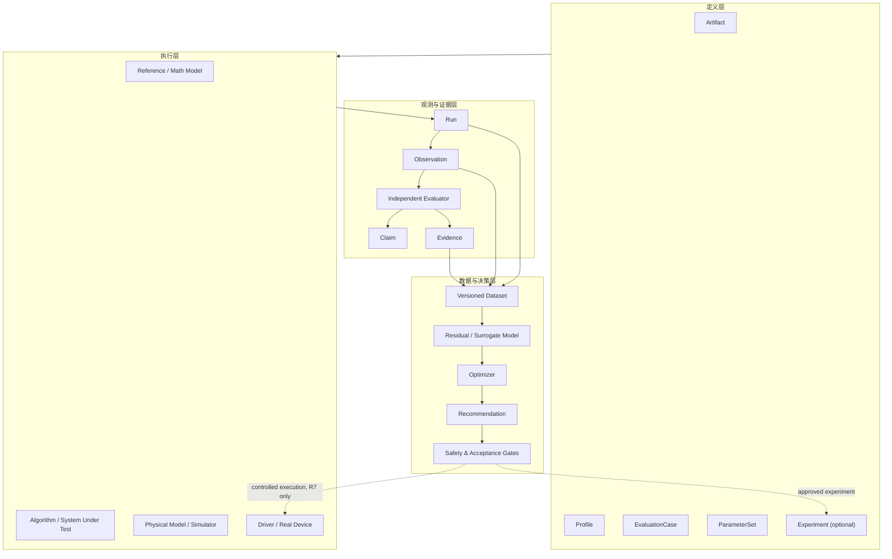
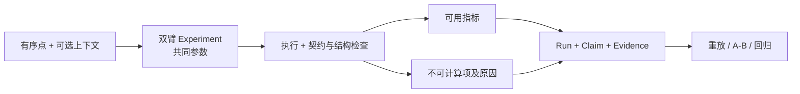
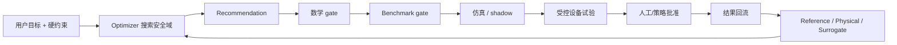
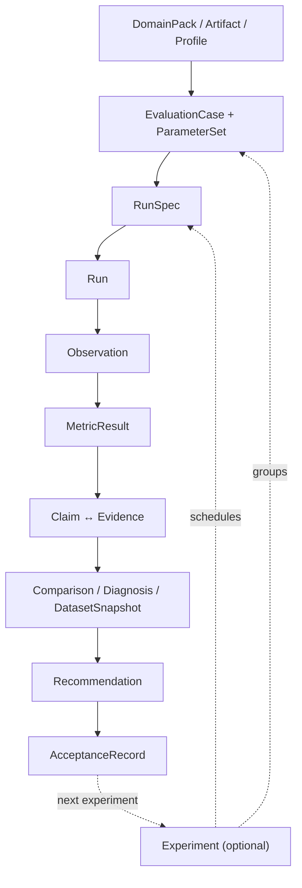

# Axiom 工业算法评估与智能优化平台——项目规划蓝图

> 文档类型：产品总纲与 Roadmap  
> 状态：Draft / 方向重整与契约闭合版 v0.9.0
> 当前阶段：R4.0 Windows synthetic SIL 合同片已实现 / 真实设备 reality gate 保持 Open
> 更新日期：2026-08-12
> 文档入口：[README](README.md)  
> 核心规范：[Axiom 通用评估框架规范](Axiom%20通用评估框架规范.md)

> 文件名暂时沿用原 CNC 蓝图名称，以保留现有链接；Axiom 的产品边界已经扩展为通用工业评估、实验与证据平台，CNC 五轴是重点领域而不是内核边界。

## 1. 这次重整解决什么

旧蓝图把五轴数学参考系统、算法 Benchmark、设备接入、机器学习和参数优化放在同一条产品主链里。内容本身有价值，但容易形成两个误解：

1. Axiom 是一个理解 CNC 语义后给算法打分的专用评估器；
2. 必须先完成完整五轴 M0–M5，平台才有第一个可用闭环。

本蓝图明确改为：

> 先建立通用的评估、实验与证据框架；用有序离散点完成最小闭环；再接入五轴数学领域包；随后接入设备与物理模型；最后在可信数据和硬约束之上训练学习模型、提出参数建议，并逐步形成受控闭环。

五轴数学内容不删除，也不降级。它从“平台内核”调整为第一个高价值、完备建模的领域包。

## 2. 产品定义

### 2.1 一句话定义

Axiom 是一套可逐级增加语义和模型、统一记录运行与证据，并连接算法、数学模型、仿真、设备、学习模型和受约束决策的工业实验平台。

### 2.2 Axiom 不只是 Evaluator

Evaluator 只是平台中的一个角色。完整平台至少包含：

- Artifact 与领域语义；
- 可复现的 EvaluationCase，以及按需使用的 Experiment；
- 算法、模型和设备 Runner；
- 原始 Observation；
- 独立 Evaluator；
- Claim、Evidence 和 Provenance；
- 数据集快照与学习模型；
- Optimizer 产生的候选 Recommendation；
- 独立的安全 gate 与 AcceptanceRecord。

因此产品能力不是“输入数据 → 一个分数”，而是：

```text
定义试验 → 执行/导入结果 → 记录观测 → 独立评价
        → 形成声明与证据 → 比较/诊断 → 推荐下一次试验
```

### 2.3 核心价值

- **可从少量信息开始**：只有离散点，也能做结构和内在几何评价。
- **可逐级增强**：加入单位、参考、时间、机器和测量后，开放更多评价能力。
- **数学与物理分开**：数学合法不等于设备效果好；物理观测不能反过来改写数学真值。
- **结果可追溯**：每个结论都能回到输入、参数、版本、环境和证据。
- **为学习准备，而非先上学习**：先稳定对象、指标和数据谱系，再训练残差或代理模型。
- **建议与执行分开**：模型和优化器提出候选，独立 gate 决定是否进入仿真、shadow 或设备。

## 3. 锁定的架构决策

### 3.1 框架通用，领域能力插件化

平台核心只定义跨领域对象、角色、执行语义和证据规则。离散点、五轴轨迹、设备、测量或其他未来领域通过 DomainPack 接入。

领域包可以定义：

- Artifact 和 Profile；
- 结构/语义验证规则；
- MetricDefinition 和 Evaluator；
- ReferenceModel、PhysicalModel 或 Adapter；
- 领域失败码、证据生产方式和测试族。

领域包不能改变核心对象含义，也不能把自己的术语变成所有领域的强制字段。

### 3.2 外部是渐进层级，内部是组合图

用户看到的是从原始数据到语义、参考、执行、物理和学习的逐级能力；平台内部则用有类型关系组合对象，而不是把一切塞进一条继承链。

这允许：

- 只评价一组离散点；
- 同一结果同时被多个 Evaluator 消费；
- 同一 Case 分别运行数学模型、算法、仿真和设备；
- 一个物理观测关联多个数学基线或模型版本；
- 一个 Claim 由多条 Evidence 支持或反驳。

### 3.3 对每个领域，先数学模型，再物理模型

“先数学、后物理”仍是硬原则，但作用域改为**每个领域包内部**，而不是要求整个平台首先完成所有 CNC 数学。

以五轴为例：

```text
M0–M5 数学语义与离散命令
        ↓ 通过领域 gate
P1–P5 命令、驱动、机构、过程、测量
```

M0–M5 的规范来源只有 [FiveAxisTrajectoryPack — CNC 五轴数学参考系统全景规范](CNC%20数学参考系统全景规范.md)。

### 3.4 硬约束先于质量排序

所有领域遵循：

1. 输入与执行有效性；
2. 安全、数学和物理硬门槛；
3. 合法候选间的质量、代价和鲁棒性比较；
4. 特定业务下的决策策略。

默认不提供跨领域“万能总分”，也不允许高性能或低误差抵消硬约束失败。

### 3.5 学习模型不是真值来源

机器学习优先用于：

- 预测数学模型到实机结果之间的残差；
- 预测给定参数下的条件效果和风险；
- 识别异常、漂移和适用域；
- 缩小昂贵仿真或设备试验的搜索空间。

学习模型必须报告版本、训练域、数据谱系、验证结果和不确定性。它不替代 ReferenceModel、硬约束验证器或最终批准。

### 3.6 数学可行不等于设备安全

R2 可以声明 `GeometryValid`、`ModelCollisionFree`、`KinematicallyFeasible`、`ContinuouslyFeasible` 和 `IntervalCertified`，但这些结论都限定在冻结的数学模型、几何、接触策略、机器配置和重建策略内。

R2 不得输出 `DeviceSafe`、`ProcessSafe` 或不加限定的“可执行”。真实装配误差、控制器行为、伺服跟随、热/摩擦/柔性、刀具磨损、切削过程和在线停止能力分别由 R3/R4/R7 的设备、物理和安全 gate 处理。该边界的正式决策见 [ADR-0004](架构决策记录/ADR-0004-五轴碰撞与安全声明边界.md)。

## 4. 总体架构



### 4.1 五个平面

| 平面 | 稳定职责 | 典型扩展 |
|---|---|---|
| Core Plane | Case、Experiment、Run、Observation、Claim、Evidence、Provenance | 存储、查询、比较、重放 |
| Domain Plane | Artifact、Profile、Evaluator、领域契约 | 离散点、五轴轨迹、测量、设备 |
| Execution Plane | Runner 与环境隔离 | 本地算法、容器、仿真器、控制器、驱动器 |
| Evidence Plane | 指标、证书、对齐、失败与决策材料 | 数学证明、交叉验证、实测、回归 |
| Intelligence Plane | Dataset、Surrogate、Optimizer、Recommendation | 诊断、预测、主动试验、受约束优化 |

这五个平面是责任边界，不要求首版实现成五个服务。

## 5. 最小闭环：有序离散点

### 5.1 为什么它是正确切入点

如果通用框架必须等到五轴、设备或场景模型完备后才能运行，它就不是通用框架。离散点切片可以最早暴露以下架构问题：

- 输入类型和语义是否可分离；
- 缺少上下文时是否能诚实降级；
- 指标能否声明前置能力；
- 结果、声明和证据是否分开；
- A/B 比较是否真的可复现；
- 新领域能否在不修改核心的情况下接入。

### 5.2 首个用户闭环



最低可用体验：

1. 用户提交一组二维或三维有序点；
2. 系统保留原始输入并检查结构；
3. 即使没有物理单位，也在 `coordinate-unit` 下计算点数、范围、相邻重复、`path.length.open`、步长和适用的转角等；
4. 若提供参考和对应策略，则计算明确命名的误差或距离；
5. 若提供时间，则计算声明方法下的运动学离散指标；
6. 对不能计算的指标说明缺失能力，而不是猜测；
7. 选择两个静态注册的 Subject，在共同输入与参数下实际执行；
8. 保存可重放结果与严格比较，并从网页下载 Claim、Evidence 和 Provenance 证据包。

详细定义见 [有序离散点领域包规范](有序离散点领域包规范.md)。

## 6. 五轴数学领域包

FiveAxisTrajectoryPack 是通用框架的第一个复杂领域验证。它承担：

- M0 语义真值；
- M1 原始数学路径、`PathProgress` 与正则性；
- M2 容差内几何路径、名义扫掠体与过切/干涉；
- M3 机器运动学路径、分支、奇异性与配置空间碰撞；
- M4 连续时间参数化；
- M5 固定周期采样、离散命令重建与区间证书；
- 层间不变量、证明义务、证据等级和测试族。

它不承担：

- Axiom Core 的公共对象定义；
- 通用 Experiment/Run 生命周期；
- 设备协议；
- 学习模型训练；
- 参数写入策略。

### 6.1 接入方式

五轴领域包通过显式契约映射到 Core：

| Core 概念 | 五轴领域实例 |
|---|---|
| Artifact | M0–M5 各层规范对象 |
| Profile | 几何、碰撞上下文、运动学、约束、采样和机床配置 |
| EvaluationCase | 解析案例、一般数值案例、退化或失败案例 |
| ReferenceModel | 高精度或带证书的 M0–M5 参考求解器 |
| Subject | 被测几何、IK、时间参数化或插补算法 |
| Evaluator | 层内合法性、对应/重建策略、碰撞、跨层不变量、误差与运行代价 |
| Evidence | Exact / Certified / Validated / Observed |

领域内部阶段门仍由数学规范定义；本蓝图只决定它在平台 Roadmap 中何时进入。

实现上，DomainPack 的可哈希描述符与进程内运行绑定分离；Core 只按 `domainPackId` 解析绑定并保存领域中立 Artifact envelope。任何五轴采样视图与有序点之间的转换都必须经过版本化 Artifact Adapter，产生新的内容标识并记录保留/丢弃语义。FiveAxis F0 以“契约与能力面板”进入网页；F1 则可以呈现已经实际求值的 M0–M2 几何、连续误差、标准对应和任务几何碰撞声明。Math F4 已完成后，界面仍必须标出当前数学阶段和标准 Claim 范围，不能把 F1 的任务几何证据呈现为运动学、整机碰撞或设备可执行性结论。

## 7. 设备与物理世界

设备接入不是“再加一个数据源”，而是引入新的时间、同步、标定、安全和权限边界。

### 7.1 顺序

```text
已通过数学 gate 的输出
  → 设备/仿真适配
  → 命令或只读输入
  → 遥测与测量
  → 时间/坐标对齐
  → 物理指标与残差
  → 新 Evidence
```

### 7.2 首先只读

R3 首个设备能力只允许：

- 读取配置和版本；
- 采集遥测、报警和运行状态；
- 导入已执行结果；
- 记录设备时钟和主机时钟的映射；
- 将 MachineRun 追溯到对应 Benchmark/Reference Run。

不允许：

- 自动写入参数；
- 自动启动加工；
- 绕过设备自身联锁；
- 用平台推断值覆盖原始遥测；
- 在未标定时把控制器坐标直接当作测量真值。

### 7.3 物理模型的职责

PhysicalModel 可以覆盖驱动、伺服、机构、切削或过程、传感与测量中的一个或多个层次。模型必须声明：

- 状态、输入和输出；
- 时间尺度与积分或采样方法；
- 参数来源和标定版本；
- 适用设备、工况和边界；
- 未建模因素；
- 与真实 Observation 的对齐策略。

数学结果、仿真结果和实机结果是不同证据来源，必须并存而不能相互覆盖。

## 8. 数据与学习模型

### 8.1 数据前提

只有以下对象稳定后，数据才适合训练：

- Artifact、Profile、ParameterSet 的版本语义；
- ReferenceRun、BenchmarkRun、SimulationRun、MachineRun 的关联；
- 原始 Observation 和派生指标的分离；
- Case、MetricDefinition、Evidence 和失败分类；
- 时间、坐标和设备标定的对齐记录；
- 数据授权、脱敏、保留和删除策略。

没有这些条件，大量日志只是不可比的数据堆积。

### 8.2 首选学习任务

按优先级：

1. **异常与域外检测**：判断当前样本是否偏离已知运行域；
2. **残差预测**：学习确定性数学或物理基线未解释的部分；
3. **条件效果预测**：输入工况与参数，预测多项结果及不确定性；
4. **试验价值估计**：选择最能减少不确定性的下一批仿真或设备试验；
5. **代理模型**：近似昂贵仿真或设备响应，为约束搜索提供候选。

不优先训练“万能评分模型”，因为它会隐藏问题来源、约束冲突和数据偏移。

### 8.3 数据集是版本化产品

R5-A 当前工作面只先闭合数据集合同片，完整 R5 泛化门仍然保持 Open；权威规范见[数据集与学习模型规范](数据集与学习模型规范.md)与[ADR-0016](架构决策记录/ADR-0016-R5可审计数据集与端侧模型边界.md)。

每个 DatasetSnapshot 至少绑定：

- 查询和筛选规则；
- 所含 Run 和 Artifact 的不可变引用；
- 标签和派生过程；
- 训练、验证、测试的分组策略；
- 设备、工件、算法版本和时间分布；
- 已知偏差与覆盖空洞；
- 许可和敏感性。

训练和测试不得因同一轨迹、同一设备批次或同一加工任务的派生样本而发生泄漏。

### 8.4 为端侧小模型预留正确接口

端侧模型不是把训练代码直接搬到设备。R5-A 应把训练与部署拆开：

- 训练端消费版本化 DatasetSnapshot，保留完整特征和标签谱系；
- 导出端生成固定输入契约、预处理、模型权重、适用域和资源预算组成的 ModelBundle；
- 端侧只执行受控推理，输出预测、不确定性和域外标记；
- 端侧原始观测继续回传为新的 Observation，不在首版进行无审计在线学习；
- 量化、剪枝或蒸馏后的模型必须与原模型在独立测试集和目标设备上重新验证；
- 模型升级、回退和设备兼容性必须版本化。

这样，当前设计既不提前选择具体端侧框架，也不会等到 R5-A 才发现训练特征无法在目标端稳定复现。

## 9. 受约束参数优化

### 9.1 正确的闭环



Optimizer 的目标不是“找到一个分数最高的参数”，而是在声明的安全域内寻找满足硬约束的 Pareto 候选，并说明：

- 预计改善哪些指标；
- 可能牺牲哪些指标；
- 预测不确定性；
- 与训练或验证域的距离；
- 还需要通过哪些 gate；
- 推荐的试验范围、停止条件和回退值。

### 9.2 权限逐级提升

| 级别 | 平台权限 | 允许时机 |
|---|---|---|
| Offline | 离线计算候选 | R6 初期 |
| Advisory | 向用户展示建议 | 通过离线 gate 后 |
| Shadow | 跟随真实运行但不控制 | 仿真与历史回放稳定后 |
| Controlled Trial | 在限定工况、限幅和人工批准下试验 | 设备安全协议完成后 |
| Closed Loop | 在明确控制包线内自动调整 | R7 且具备监控、回滚、审计和法规条件 |

从 Offline 到 Closed Loop 不是界面开关，而是证据和责任边界的升级。

## 10. Roadmap

Roadmap 使用 R0–R7，避免与五轴领域内部的 M0–M5 混淆。阶段按依赖关系推进，不承诺固定日历时间。

| 阶段 | 目标 | 核心交付 | 退出阶段门 |
|---|---|---|---|
| **R0 通用框架宪法** | 锁定跨领域核心 | Core 对象、角色、DomainPack、三状态轴、证据与失败语义 | 离散点和五轴均可映射；相同输入/能力/策略得到相同公共状态；领域概念未泄漏进 Core |
| **R1 有序离散点 MVP** | 完成第一个可运行评估闭环 | 输入、校验、指标、参考比较、带时间 Case、可执行双臂 Experiment、重放、网页报告 | 通过领域包规范 §11 的全部条件及 §10.4 一致性样例；Case D 冻结共同输入与参数 |
| **R2 五轴数学领域包** | 接入完备数学模型 | M0–M5、PathProgress、对应/重建策略、模型碰撞验证、参考求解器、证书和测试族 | 通过数学规范 Math F0–F4；R2 已闭合，面向下游的候选具备完整标准 Claim 且无 `CollisionUnchecked`；无需改写 Core |
| **R3 设备只读接入** | 建立可信数据采集链 | Device/Profile、遥测、时钟或坐标对齐、MachineRun lineage | 数学、算法和设备 Run 可追溯；零自动写入 |
| **R4 物理模型与现实对齐** | 解释模型—设备差异 | PhysicalModel、标定、仿真、残差分解、SIL/HIL 或等价验证 | 同一 Case 可比较数学、仿真和设备证据 |
| **R5 数据集与学习模型** | 形成可信预测能力 | DatasetSnapshot、异常检测、残差或条件效果模型、不确定性、端侧 ModelBundle 候选 | R5-A 可先闭合 syntheticLearningContractStatus；realWorldGeneralizationStatus 保持 Open，直至跨设备/跨工况 holdout 与治理条件到位 |
| **R6 受约束参数推荐** | 反向寻找候选参数 | 目标或约束、代理辅助搜索、Recommendation、离线与 shadow gate | 候选不违反硬约束，建议可解释、可复验、不可自动写入 |
| **R7 受控闭环** | 在控制包线内自动调整 | 权限、限幅、停止、回滚、审计、在线监控 | 安全论证、责任边界和运行证据满足具体部署要求 |

### 10.1 当前工作面

当前只推进：

- R0：稳定文档边界和核心契约；
- R1：有序离散点最小闭环，以及本地 Point Lab 工作台；
- R2：已完成 Math F0–F4 的五轴数学领域包闭环，Reference Solver / SUT 验收现在是已关闭的数学门禁，不再新增驱动器写入或控制器上机许可；
- R3：已完成 Windows JSON capture 的只读参考链，冻结 Device/Profile、raw telemetry、时钟/坐标上下文、paired/unpaired MachineRun lineage、五类 `Observed` 数据 Claim 和 Machine Lab；它不代表真实控制器协议或写能力已经实现；
- R4：首片冻结 Windows 轴空间一阶响应模型、独立 synthetic SIL oracle、校准/holdout 隔离、显式时间/通道对齐和单位分组残差；这只闭合合同片，不能把真实设备 reality gate 标为完成；
- R5：R5-A Windows synthetic learning 合同片已实现，已冻结 DatasetSnapshot、split/lineage/governance、X-only 残差、split conformal 不确定性、JSON ModelBundle、typed API/UI 和禁语边界；这只闭合合同片，不能把真实跨设备泛化门标为完成；
- R6–R7：保持受约束推荐和受控闭环的阶段门清晰，不提前锁定具体驱动器、数据库、训练框架或优化算法。

R4 的首个具体合同见[物理模型与现实对齐规范](物理模型与现实对齐规范.md)：`PhysicalResponseTrace` 是模型执行主 Artifact，数学命令、物理模型、标定、R3 raw observation 与对齐记录保持独立内容身份。首个参考数据来自结构不同于候选模型的 synthetic SIL oracle；阶段报告必须把 `syntheticContractStatus` 与 `realityValidationStatus` 分开。新增真实设备 source 时仍须独立冻结厂商协议、许可、最小权限和环境验收，不从文件回放结果外推。

R5-A 当前实现仍只闭合 synthetic learning 依赖、输出和阶段门，不提前锁定数据库、通用训练框架或优化算法，更不会把在线学习或设备写回写进主线。

### 10.2 依赖原则

- R1 可以在 R2 之前独立完成；
- R2 不能依赖 R3；
- R3 仅把已通过领域 gate、绑定重建策略和完整数学 Claim 的命令作为只读对齐基线；它也可只读导入既有运行，但不向设备发送控制写入；
- R5 依赖稳定的 R3/R4 数据语义，而不是依赖数据量这个单一数字；
- R6 依赖可独立验证的模型和约束；
- R7 不因 R6 的离线效果好而自动开启。

## 11. 阶段性产品形态

| 阶段 | 面向用户的形态 |
|---|---|
| R0–R1 | Point Lab Web Workbench：导入、编辑、执行、评价、比较和下载证据包 |
| R2 | Five-Axis Algorithm Lab：数学参考、算法适配、回归与诊断 |
| R3–R4 | Machine Lab：仿真或设备运行、遥测对齐和差异定位 |
| R5 | Intelligence Lab：数据集、漂移、残差和效果预测 |
| R6 | Optimization Lab：目标或约束定义、候选参数和验证计划 |
| R7 | Controlled Runtime：限定包线内的受控执行和监控 |

这些可以先是同一应用中的工作区，不预设微服务拆分。

## 12. Run 与数据谱系

从 R0 起，所有阶段共享同一条逻辑谱系。`Experiment` 是比较、重复或参数扫描的可选组织对象，不是每个 RunSpec 的必经父节点：



领域可以增加：

- ReferenceRun；
- BenchmarkRun；
- SimulationRun；
- MachineRun；
- TrainingRun；
- OptimizationRun。

这些是 Run 的专业化视图或标签，不应形成互不兼容的数据孤岛。

每次运行至少可回溯：

- 输入内容及模式版本；
- 参数、约束、Profile 和 Case；
- 算法、模型、驱动和 Evaluator 版本；
- 环境、随机种子、数值精度和容差；
- 原始输出与原始遥测；
- 转换、对齐和派生指标；
- Claim、Evidence、决策与批准记录。
- 能力解析、`ExecutionStatus`、各项 `MetricStatus` 和 `CaseOutcome`。

## 13. 评估与报告原则

一份合格报告应分开显示：

1. **事实**：输入、版本、运行环境、原始观测；
2. **有效性**：哪些契约和硬约束通过或失败；
3. **状态**：执行、每项指标和整个 Case 分别为何成功、失败、无结论或不支持；
4. **指标**：独立数值、区间或分布；
5. **声明**：这些指标支持或反驳什么；
6. **证据**：Exact、Certified、Validated 或 Observed；
7. **比较**：与参考、基线或其他候选的差异；
8. **不确定性与适用域**；
9. **建议**：下一步验证或候选参数；
10. **决策**：由谁基于哪些证据接受或拒绝。

报告不应只剩：

- 一个总分；
- 一个“通过或失败”但没有原因；
- 无法定位版本的图；
- 把模型预测画成测量真值；
- 把缺失数据画成零。

## 14. 工业方法的借鉴边界

自动驾驶等行业已经验证了一组有用模式：场景化测试、SIL/HIL/VIL 分层验证、ODD/条件域、shadow 运行、持续回归和数据闭环。Axiom 借鉴的是这些**验证治理方法**，不是照搬自动驾驶的场景本体或仿真器。

在 Axiom 中的对应关系是：

| 工业验证模式 | Axiom 对应 |
|---|---|
| 场景或测试用例库 | EvaluationCase + 可选 ScenarioSpec |
| ODD 或运行条件域 | Profile + applicability/constraints |
| SIL/HIL/VIL | 不同 Runner、Run 类型和 Evidence |
| 安全 gate | Validity/Safety Claim + DecisionPolicy |
| Shadow mode | Recommendation 只观察、不控制 |
| 数据闭环 | Run/Observation/Evidence → Dataset → Model → 新 Experiment |

关键差别：离散点或单个算法评估不必被强行包装成复杂场景。ScenarioSpec 是可选组合工具，不是 Core 的唯一入口。

### 14.1 非规范性研究与标准入口

下列资料用于校准分层验证、条件域、交换格式和物理数字孪生的方向，不直接定义 Axiom 内部数据模型：

- [PEGASUS Method](https://www.pegasusprojekt.de/en/pegasus-method)：场景分层、测试空间和安全论证方法；
- [ASAM OpenSCENARIO DSL](https://publications.pages.asam.net/standards/ASAM_OpenSCENARIO/ASAM_OpenSCENARIO_DSL/latest/index.html)：功能、逻辑、具体场景及可复用场景描述；
- [ASAM OpenODD](https://publications.pages.asam.net/standards/ASAM_OpenODD/ASAM_OpenODD/latest/specification/index.html)：运行条件域的模块化表达；
- [ISO 34502](https://www.iso.org/standard/78951.html)：基于场景的自动驾驶安全评价框架；
- [Assume-guarantee testing](https://doi.org/10.1145/1118537.1123060)：局部契约与组合验证；
- [NIST — Building a digital twin for a CNC machine tool](https://www.nist.gov/publications/building-digital-twin-cnc-machine-tool)：CNC 物理数字孪生实践。

Axiom 借鉴其“分层、契约、逐级证据和受控升级”，但内部 Core 保持领域中立，外部标准通过 Adapter 连接。

## 15. 明确不做

### 当前不做

- 完整五轴算法实现；
- 设备写参数或启动运行；
- 通用场景 DSL；
- 通用知识图谱或本体平台；
- 自动训练和自动部署模型；
- 无约束黑盒调参；
- 跨领域统一总分；
- 为未来可能性预建微服务。

### 长期也不应做

- 用单一模型替代数学证据和设备观测；
- 在数据不兼容时给出伪精确比较；
- 把“系统运行成功”误认为“结果正确”；
- 把“历史上没出问题”误认为安全证明；
- 在没有明确授权、限幅和回滚时自动控制设备；
- 让领域包绕过 Core 的 Provenance 与 Evidence 规则。

## 16. 成功标准

### 16.1 架构成功

- 新领域通过 DomainPack 接入，而非修改核心语义；
- Artifact 在上下文增加后逐级获得能力；
- 数学模型、算法、物理模型、设备和学习模型角色清楚；
- Case、Run、Observation、Claim、Evidence 和 Decision 可完整追溯；
- 内部可以组合为图，外部仍有清楚的阅读和操作层次。

### 16.2 R1 产品成功

- 用户输入有序离散点即可得到有意义且不过度声明的结果；
- 可添加参考、时间或 Profile 获得更高层评价；
- 可重放、A/B、回归并解释差异；
- 可在共同输入和 `ParameterSet` 下实际执行两个 Subject，而不是把两个既有输出冒充实验；
- 失败能定位到输入、执行、评价或上下文不足；
- Case A/B/C/D 和离散点规范的一致性样例在两个实现中产生相同公共状态与约定数值；
- 结果可以自然成为五轴领域包和后续数据链的基础。

### 16.3 长期闭环成功

用户最终可以：

1. 输入目标、工况和允许参数域；
2. 运行数学模型、算法、仿真或设备；
3. 采集对齐后的结果；
4. 获得多维评价、证据和问题定位；
5. 用版本化数据训练残差或代理模型；
6. 得到受约束、带不确定性和验证计划的候选参数；
7. 在仿真、shadow 和受控试验中验证；
8. 由人或明确策略批准；
9. 把结果回流为下一轮更好的模型和决策。

这条链路才是 Axiom 的最终方向。评估器是起点，不是终点。

## 17. 主要风险与控制

| 风险 | 早期信号 | 控制方式 |
|---|---|---|
| 通用内核过度抽象 | R1 需要大量空字段或复杂配置 | 以离散点用例反推最小 Core，删除未使用抽象 |
| 五轴概念泄漏到 Core | 核心对象出现刀具、轴或机床强制字段 | 移回 FiveAxisTrajectoryPack，通过 Adapter 连接 |
| 指标堆积但不能决策 | 页面有大量数字却无 Claim 或 gate | 指标必须绑定用途、前置能力和声明 |
| 数据很多但不可训练 | 版本、坐标、参数或标签无法对齐 | 从 R0 强制 Provenance，R5 前做 Dataset 审计 |
| 学习模型掩盖物理问题 | 预测准但无法解释漂移 | 优先残差或条件模型，保留确定性基线和域外检测 |
| 优化器越权 | 建议直接写入设备 | Recommendation 与 AcceptanceRecord 分离，权限分级 |
| 文档再次重复 | 同一术语在多处被重新定义 | 遵循 README 的唯一所有权和链接规则 |

## 18. 文档演进

当前规范性主体保持为五份，长期架构决策另以 ADR 记录：

1. [文档入口](README.md)；
2. 本项目规划蓝图；
3. [Axiom 通用评估框架规范](Axiom%20通用评估框架规范.md)；
4. [有序离散点领域包规范](有序离散点领域包规范.md)；
5. [FiveAxisTrajectoryPack — CNC 五轴数学参考系统全景规范](CNC%20数学参考系统全景规范.md)。

已生效的架构决策见 [ADR 索引](架构决策记录/README.md)。ADR 只记录跨文档、长期约束实现且存在实质替代方案的决定，不复制规范正文。

当阶段真正启动时再创建：

- R3：设备接入与物理闭环规范；
- R6：受约束优化与安全闭环规范；
- 新增长期且存在替代方案的技术决策时：新增或替代 ADR。

R5 的数据集与学习模型规范已经创建，R5-A Windows synthetic learning 合同片已经实现，不再列入“未来再创建”的空壳队列；真实跨设备/工况的 R5-B 泛化门仍保持 Open。

详细触发条件见 [README](README.md)。这保证现在有清晰边界，又不把尚未验证的想法伪装成稳定规范。

---

下一篇：[Axiom 通用评估框架规范](Axiom%20通用评估框架规范.md)  
返回：[文档入口](README.md)
