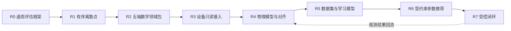

# Axiom 文档入口

> 状态：v0.5 可发布；R0/R1 契约闭合，R2 Math F1 几何参考栈已接入
> 当前里程碑：通用框架 `R0` + 有序离散点 `R1` + Five-Axis Math `F1`
> 更新日期：2026-08-11

Axiom 的目标不是做一个只理解 CNC 术语的“语义化评分器”，而是建立一套可逐级定义、可扩展到真实设备、可沉淀训练数据，并最终支持受约束参数优化的工业评估、实验与证据框架。

首个切入点是**有序离散点序列**。五轴轨迹是建立在通用框架上的第一个高价值数学领域包，而不是平台内核本身。



## 规范主体与决策记录

| 文档 | 唯一职责 | 当前状态 |
|---|---|---|
| [项目规划蓝图](CNC%20算法效果评估与智能优化平台——项目规划蓝图.md) | 产品边界、总体架构、Roadmap、阶段门与非目标 | Draft |
| [通用评估框架规范](Axiom%20通用评估框架规范.md) | 跨领域核心对象、角色、能力协商、三状态轴、证据与执行语义 | Draft v0.5 |
| [有序离散点领域包规范](有序离散点领域包规范.md) | 第一个最小领域包及其输入、指标和验收闭环 | Draft v0.4 |
| [FiveAxisTrajectoryPack — CNC 五轴数学参考系统全景规范](CNC%20数学参考系统全景规范.md) | M0–M5 数学模型、进度/对应/重建契约、模型碰撞边界、证明义务和测试族 | Draft v0.5 / F1 implemented |
| [ADR 索引](架构决策记录/README.md) | 长期架构决策、替代方案与后果的审计历史 | Active |
| 本文档 | 总入口、阅读路径与文档治理 | Active |

除 ADR 行外的五项（含本文档）构成规范性主体；ADR 是决策记录，不复制规范正文。[implementation-notes](implementation-notes.md) 是任务过程记录，不属于正式规范，也不能作为实现依据。

## 推荐阅读路径

- 讨论产品方向：本文档 → 项目规划蓝图。
- 设计平台内核：本文档 → 通用评估框架规范 → 有序离散点领域包规范。
- 研究五轴数学：通用评估框架规范 → FiveAxisTrajectoryPack 全景规范。
- 规划设备、机器学习或优化：项目规划蓝图中的对应阶段 → 通用评估框架规范的角色与安全边界。
- 了解为何选择当前契约：对应规范 → ADR 索引 → 具体 ADR。
- 查看版本变化与升级边界：[CHANGELOG](CHANGELOG.md)。

## 文档所有权规则

1. 一个概念只能有一个规范来源；其他文档只摘要并链接。
2. 蓝图回答“为什么、先后顺序和阶段门”，不重复领域公式。
3. 通用规范只定义跨领域不变量，不吸收五轴、设备或模型训练细节。
4. 领域包定义自己的数据语义、验证器、指标和证据生产方式，但不得改写通用核心。
5. 实现细节只有在接口被实际采用后才进入规范；设想保留在 Roadmap，不提前写成伪稳定接口。
6. 每个重要结论必须区分：输入事实、计算结果、声明、证据和最终决策。
7. ADR 解释“为什么这样决定”；当前规范定义“实现必须遵守什么”。两者不一致时必须先修正文档，不能由实现自行选择。

## 后续文档的创建触发条件

以下文档现在**不创建空壳**，达到触发条件时再从蓝图中拆出：

| 未来文档 | 创建触发条件 |
|---|---|
| `设备接入与物理闭环规范.md` | 选定首个驱动器、控制器或仿真设备，开始定义只读遥测接口 |
| `数据集与学习模型规范.md` | `Run / Observation / Evidence` 模式稳定，并开始积累可训练的成对样本 |
| `受约束优化与安全闭环规范.md` | 参数推荐进入工程验证，需要定义搜索域、硬约束、shadow 与人工批准协议 |
| `架构决策记录/ADR-*` | 每次新增会长期约束实现、且存在实质替代方案的技术决策 |

## 当前最近目标

R1 的离散点最小闭环已经成立。v0.5 在不向 Core 写入五轴分支的前提下，把第二个领域包推进到可执行的 F1 几何参考栈：

> 严格 CL 子集先规范化为 M0，再生成带 `PathProgress`、正则性和来源谱系的 M1；M2 将候选任务几何、标准对应、连续位置/姿态误差界、刀具—工件/夹具上下文和显式过程状态绑定在同一证据链中。

F1 只发布 `GeometryValid` 与 `TaskGeometryCollisionFree` 两类标准声明。后者是任务空间刀具几何结论，不包含 M3 配置空间碰撞、机床部件、IK 分支、轴限位、奇异性、控制器或设备执行许可。下一个数学阶段是 F2 运动学参考栈。

## v0.5 快速开始

v0.5 保留 Point Lab 的单次评估、双臂 `Experiment` 与严格比较，并把 Five-Axis Lab 升级为 F1 Geometry Reference Workbench。三个版本化场景分别证明名义通过、几何超差和夹具碰撞；页面同时展示 CL 输入、M0/M1/M2 谱系、连续对应证书、任务几何碰撞/过程状态、标准声明和冻结身份，并永久标注 `NOT DEVICE SAFE`。

```powershell
python -m venv .venv
.\.venv\Scripts\python.exe -m pip install -e ".[test]"
.\.venv\Scripts\python.exe -m axiom evaluate examples\basic-evaluation.json
.\.venv\Scripts\python.exe -m axiom run <run-spec.json>
.\.venv\Scripts\python.exe -m axiom compare fixtures\cnc_scenarios\comparisons\cnc-contour-ab-pass-vs-fail.json
.\.venv\Scripts\python.exe -m axiom experiment fixtures\cnc_scenarios\experiments\cnc-contour-true-ab.json
.\.venv\Scripts\python.exe -m axiom serve --host 127.0.0.1 --port 8000
.\.venv\Scripts\python.exe -m pytest
```

启动后访问 `http://127.0.0.1:8000`，可在 Point Lab 与 Five-Axis Lab 间切换。发布包已经内置网页资源；从源码修改 UI 时，先在 `web` 目录执行 `pnpm install` 和 `pnpm build`。单次输入契约见 [`examples/basic-evaluation.json`](examples/basic-evaluation.json)，真实双臂实验见 [`cnc-contour-true-ab.json`](fixtures/cnc_scenarios/experiments/cnc-contour-true-ab.json)，Five-Axis F0 的 package fixture 与使用说明仍见 [`fixtures/five_axis_f0`](fixtures/five_axis_f0)。F1 示例由 `axiom.five_axis.f1_scenarios` 生成，网页 API 返回包含 `manifest / scenario / source / artifacts / runSpec` 的完整 envelope。

Python 中可直接执行内建 F0 示例：

```python
from axiom import evaluate_run, f0_example_run_spec

bundle = evaluate_run(f0_example_run_spec())
assert bundle.report.case_outcome.value == "Passed"
```

也可以执行三个 F1 场景，并直接读取标准声明而不是把 Core 的运行完成状态误当成几何结论：

```python
from axiom import evaluate_run, f1_example_run_spec

bundle = evaluate_run(f1_example_run_spec("fixture-collision"))
claims = {claim.claim_definition_id: claim.status.value for claim in bundle.claims}
assert claims["five-axis.geometry-valid-claim@1"] == "Supported"
assert claims["five-axis.task-geometry-collision-free-claim@1"] == "Refuted"
```

CLI 退出码：`evaluate` 与 `run` 的 `0` 表示 `Passed`，`1` 表示 `Failed / Inconclusive / Unsupported`，`2` 表示读取失败或 `Invalid`；`compare` 的 `0` 表示两个导入式 Run 兼容且比较成功，`1` 表示语义不兼容，`2` 表示请求无效；`experiment` 只有在两个 Arm 执行、严格比较和实验硬门槛都通过时返回 `0`，结构化业务失败返回 `1`，请求无效返回 `2`。

`ComparisonSpec` 把两个 Subject 与各自的完整 `EvaluationRequest` 冻结在同一文件中：

```json
{
  "policyId": "ordered-point.run-comparison.strict@1",
  "left": {
    "subjectId": "algorithm-a",
    "request": {
      "artifact": {
        "artifactType": "ordered-point-sequence",
        "schemaVersion": 1,
        "points": [[0, 0], [3, 4]],
        "semantics": {"unit": "mm", "coordinateFrame": "G54-workpiece"}
      },
      "case": {"caseId": "path-ab@1", "requiredMetrics": ["path.length.open"]}
    }
  },
  "right": {
    "subjectId": "algorithm-b",
    "request": {
      "artifact": {
        "artifactType": "ordered-point-sequence",
        "schemaVersion": 1,
        "points": [[0, 0], [0, 6]],
        "semantics": {"unit": "mm", "coordinateFrame": "G54-workpiece"}
      },
      "case": {"caseId": "path-ab@1", "requiredMetrics": ["path.length.open"]}
    }
  }
}
```

首版严格策略要求双方使用相同的领域包、Artifact 类型和 schema、Case、Profile、ReferenceBinding、执行结果策略、MetricDefinition、结果单位与坐标系。`evaluatorVersion` 和数值环境差异会记录为 finding，但不会自动禁止比较。不兼容时不会生成指标差值、综合分数差值或优胜方。

v0.5 沿用单个评估或 Run 请求最多 8 MiB、单个比较或实验文件最多 16 MiB、单个序列最多 100,000 点、非逐点参考比较最多 5,000,000 个距离单元的预算；当前 Fréchet 实现另有更严格的路径存储预算。F1 名义扫掠差集也有确定性的 fragment 上限；超过预算会返回结构化 `Unsupported*` 结果，不会无界分配内存。

按 G1、G2/G3、闭合轮廓、螺旋下刀、采样时间戳和名义—观测偏差构造的 CNC 工程合成数据，见 [`fixtures/cnc_scenarios`](fixtures/cnc_scenarios)。目录内的 `manifest.json` 给出了每个请求的预期状态、指标与 CLI 退出码，可直接批量验收。

v0.5 的执行边界仍是本地、确定性、静态注册。它不会执行任意命令或 Python 模块，也不启动厂商算法、容器或设备。Point Lab 对三维及更高维数据只显示明确标注的 XY 投影，数值评估仍消费全部坐标；Five-Axis Lab 的 F1 碰撞结论只覆盖显式任务几何上下文，不能替代配置空间、机床整机或设备验证。数据库、认证、远程队列、动态插件、持久化历史、机器学习训练和参数回写仍属于后续阶段。
