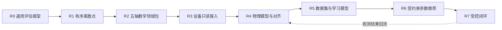

# Axiom 文档入口

> 状态：v0.12.0 Windows 发布版本；R0–R2 已闭合，R3 Windows 只读参考链已闭合，R4.0 synthetic SIL 与 R5-A synthetic learning / R5-B real holdout readiness 合同片已实现，realityValidationStatus / realWorldGeneralizationStatus 保持 Open
> 当前里程碑：通用框架 `R0` + 有序离散点 `R1` + Five-Axis Math `F4` + Machine `R3 v1` + Physical `R4.0 SIL` + Intelligence `R5-A` / `R5-B`
> 更新日期：2026-08-12

Axiom 的目标不是做一个只理解 CNC 术语的“语义化评分器”，而是建立一套可逐级定义、可扩展到真实设备、可沉淀训练数据，并最终支持受约束参数优化的工业评估、实验与证据框架。

首个切入点是**有序离散点序列**。五轴轨迹是建立在通用框架上的第一个高价值数学领域包，而不是平台内核本身。



## 规范主体与决策记录

| 文档 | 唯一职责 | 当前状态 |
|---|---|---|
| [项目规划蓝图](CNC%20算法效果评估与智能优化平台——项目规划蓝图.md) | 产品边界、总体架构、Roadmap、阶段门与非目标 | Draft |
| [通用评估框架规范](Axiom%20通用评估框架规范.md) | 跨领域核心对象、角色、能力协商、三状态轴、证据与执行语义 | Draft v0.5 |
| [有序离散点领域包规范](有序离散点领域包规范.md) | 第一个最小领域包及其输入、指标和验收闭环 | Draft v0.4 |
| [FiveAxisTrajectoryPack — CNC 五轴数学参考系统全景规范](CNC%20数学参考系统全景规范.md) | M0–M5 数学模型、进度/对应/重建契约、模型碰撞边界、证明义务和测试族 | Draft v0.8 / F4 implemented |
| [设备接入与物理闭环规范](设备接入与物理闭环规范.md) | R3 只读设备观测、时间/坐标上下文、MachineRun 谱系和安全边界 | R3 v1 / Windows reference implemented |
| [物理模型与现实对齐规范](物理模型与现实对齐规范.md) | R4 物理响应、校准/holdout、数值对齐、残差与可信度边界 | R4.0 / Windows synthetic SIL implemented; reality validation open |
| [数据集与学习模型规范](数据集与学习模型规范.md) | R5 数据集快照、split/governance/lineage、OOD、ModelBundle、R5-B real holdout readiness 和端侧解释器边界 | R5-A / R5-B Windows contract implemented; real generalization open |
| [ADR 索引](架构决策记录/README.md) | 长期架构决策、替代方案与后果的审计历史 | Active |
| 本文档 | 总入口、阅读路径与文档治理 | Active |

除 ADR 行外的八项（含本文档）构成规范性主体；ADR 是决策记录，不复制规范正文。[implementation-notes](implementation-notes.md) 是任务过程记录，不属于正式规范，也不能作为实现依据。

## 推荐阅读路径

- 讨论产品方向：本文档 → 项目规划蓝图。
- 设计平台内核：本文档 → 通用评估框架规范 → 有序离散点领域包规范。
- 研究五轴数学：通用评估框架规范 → FiveAxisTrajectoryPack 全景规范。
- 研究设备只读观测：项目规划蓝图 R3 → 设备接入与物理闭环规范 → 通用评估框架规范的证据与追溯要求。
- 研究物理模型与现实对齐：项目规划蓝图 R4 → 物理模型与现实对齐规范 → 设备接入与物理闭环规范 → ADR-0015。
- 规划机器学习或优化：项目规划蓝图中的对应阶段 → 数据集与学习模型规范 → ADR-0016 → 通用评估框架规范的角色与安全边界。
- 了解为何选择当前契约：对应规范 → ADR 索引 → 具体 ADR。
- 查看版本变化与升级边界：[CHANGELOG](CHANGELOG.md)。

## 文档所有权规则

1. 一个概念只能有一个规范来源；其他文档只摘要并链接。
2. 蓝图回答“为什么、先后顺序和阶段门”，不重复领域公式。
3. 通用规范只定义跨领域不变量，不吸收五轴、设备或模型训练细节。
4. 领域包定义自己的数据语义、验证器、指标和证据生产方式，但不得改写通用核心。
5. 实现细节只有在接口被实际采用后才进入规范；设想保留在 Roadmap，不提前写成伪稳定接口。
6. 每个重要结论必须区分：输入事实、计算结果、声明、证据和最终决策。
7. ADR 解释“为什么这样决定”；当前规范定义“实现必须遵守什么”。两者不一致时必须先修正文档，不能由实现自行选择。

## 后续文档的创建触发条件

设备只读和首个物理模型接口的创建条件已经满足，[设备接入与物理闭环规范](设备接入与物理闭环规范.md) 与[物理模型与现实对齐规范](物理模型与现实对齐规范.md) 已进入规范主体。以下后续文档仍不创建空壳，达到触发条件时再从蓝图中拆出：

| 未来文档 | 创建触发条件 |
|---|---|
| `受约束优化与安全闭环规范.md` | 参数推荐进入工程验证，需要定义搜索域、硬约束、shadow 与人工批准协议 |
| `架构决策记录/ADR-*` | 每次新增会长期约束实现、且存在实质替代方案的技术决策 |

## 当前最近目标

R1 的离散点最小闭环和 R2 五轴数学参考链已经成立。v0.9.0 进一步用独立领域包闭合 R3 的首个 Windows 只读设备观测参考链：

> F1 的 M0→M2 几何证据链、F2 的 M3 运动学 / `Q_free` 证据，以及 F3 的 M4 连续时间律与 M5 固定周期重建都继续保留。F4 新增 `five-axis.domain-pack@5`、`five-axis.solver-adapter@1`、独立 reference / SUT in-process adapters、三类 canonical solver 拓扑闭环、`adapter-input-hash-mismatch` 与 `interval-interior-collision` 反例、M0–M5 manifest、七个数学 gate claims，以及可被网页工作台消费的 F4 example payload。

F4 只发布 `GeometryValid`、`TaskGeometryCollisionFree`、`KinematicallyFeasible`、`ConfigurationCollisionFree`、`ContinuouslyFeasible`、`IntervalCertified` 和 `ModelCollisionFree` 七个数学 claims，仍然禁止 `DeviceSafe`、`ProcessSafe` 和任何上机许可。R2 保持闭合，不向数学 Artifact 塞入设备语义。

R3 使用 `axiom.windows-file-telemetry-source@1` 读取已经落盘的 JSON capture，并以独立 `machine-observation.domain-pack@1` 保存 raw frames、DeviceProfile、时钟/坐标上下文和 paired/unpaired MachineRun 谱系。`machine-trace-import@1` 在 DomainPack 中显式声明为 import runner，因此 Observation 来源稳定记录为 `ImportedArtifact`。该参考源只证明 Windows 文件导入和数据可信性合同；它不连接真实设备、不轮询控制器、不写参数，也不产生 `DeviceSafe`、`ProcessSafe` 或上机许可。详细契约见[设备接入与物理闭环规范](设备接入与物理闭环规范.md)。

R4.0 已通过 `five-axis.domain-pack@6` 建立首个轴空间物理模型参考链：F4 M5 指令、模型执行后的 `PhysicalResponseTrace` 和 R3-compatible raw observation 分别保留；校准与验证使用不同 command/trace identity；线性轴 `mm` 与旋转轴 `rad` 分开计算；未激励轴明确不可辨识。仓库提供的两级滞后 oracle 只用于 synthetic SIL，候选是一阶 lag + bias，二者结构不同以防自验证。该片可以证明模型合同和验证器可证伪性，但真实设备 reality gate 仍保持 Open。详细契约见[物理模型与现实对齐规范](物理模型与现实对齐规范.md)。

R5-A 已用独立 `intelligence.domain-pack@1` 实现可审计 DatasetSnapshot、前向分组切分、泄漏反例、OOD 弃权、X-only ridge 残差头、split conformal 区间、15 位权重导出和独立纯 Python Windows 目标解释器。`syntheticLearningContractStatus=Passed`，但真实 paired holdout 尚未进入，因此 `realWorldGeneralizationStatus=Open`，也不存在设备写回或在线学习入口。详细契约见[数据集与学习模型规范](数据集与学习模型规范.md)与[ADR-0016](架构决策记录/ADR-0016-R5可审计数据集与端侧模型边界.md)。

R5-B 进一步把真实 holdout 的就绪门拆到独立 `intelligence.domain-pack@2`：`RealPairedHoldoutSet`、`RealHoldoutGovernance`、`RealHoldoutSelectionReceipt` 和 case-scoped `RealHoldoutCaseEvidence` 保持独立内容身份；外部输入必须带 controller-export 或 device-read、owner attestation、评估许可、R3 paired lineage、时钟/坐标对齐、`PhysicalResponseTrace`，并满足至少 2 个 in-domain case 跨 2 台 device、2 个 condition、再加 1 个 OOD case。当前仓库只提供 Open 就绪场景和上传入口，不内置真实正例，也不把 `DeviceSafe`、`ProcessSafe`、writeback 或 online learning 写进主线。

## v0.12.0 快速开始

v0.12.0 保留 Point Lab、Five-Axis F1–F4、Machine Read-only Lab、Physical R4、Intelligence R5-A，并新增 Intelligence R5-B 真实 holdout 就绪工作台。它读取与 Python、HTTP 相同的冻结场景，展示 DatasetSnapshot、分组切分、按轴残差、OOD、区间不确定性、ModelBundle、Claim 与 Evidence；R5-B 的默认示例只展示就绪门和 `Inconclusive` 结果，不内置真实正例。

v0.12.0 的发布与阻断验收基线是 Windows AMD64、CPython 3.12.10，并固定 `OPENBLAS_CORETYPE=Haswell`、OpenBLAS/OMP 单线程和 [`constraints/acceptance.txt`](constraints/acceptance.txt) 依赖版本。R4/R5 runtime 在非 Windows 环境会明确返回 `UnsupportedRuntimePlatform`，不产生通过结论；Ubuntu/Linux/WSL 不属于本阶段支持矩阵。portable Artifact 身份仍与精确环境绑定的 `RunBundle.bundleHash` 分开验证。

F4 最短用法是先取场景 payload，再把 `runSpec` 送回公共执行接口。下面这个例子会返回 `Passed`，并保留 7 个数学 gate claims：

```python
from axiom import evaluate_run
from axiom.five_axis import f4_example_run_spec

bundle = evaluate_run(f4_example_run_spec("canonical-dual-table-solver"))
assert bundle.report.case_outcome.value == "Passed"
assert bundle.run.execution_status.value == "Succeeded"
```

F4 的公开 API 很薄，数据面只暴露三类查询和一个回放入口：

- `GET /api/v1/five-axis/f4/manifest?scenarioId=canonical-dual-table-solver`
- `GET /api/v1/five-axis/f4/scenarios`
- `GET /api/v1/examples/five-axis-f4?scenarioId=canonical-dual-table-solver`
- `POST /api/v1/runs/evaluate`

如果你在浏览器里接一个 F4 工作台，直接消费上面的 example payload 就够了，字段按 `manifest / scenario / source / artifacts / evidence / acceptanceReport` 分块，不要把 `DeviceSafe` 或 `ProcessSafe` 伪装进去。

R3 也走同一条公共 Run 路径。下面的 paired 示例会保留 Windows 文件导入来源和五类 `Observed` 数据证据；它不是设备安全证明：

```python
from axiom import evaluate_run
from axiom.machine import machine_r3_example_run_spec

bundle = evaluate_run(machine_r3_example_run_spec("read-only-paired-pass"))
assert bundle.observation.source == "ImportedArtifact"
assert bundle.report.case_outcome.value == "Passed"
assert all(claim.evidence.level == "Observed" for claim in bundle.claims)
```

R3 的查询面和回放入口为：

- `GET /api/v1/machine/r3/manifest`
- `GET /api/v1/machine/r3/scenarios`
- `GET /api/v1/examples/machine-r3?scenarioId=read-only-paired-pass`
- `POST /api/v1/runs/evaluate`

R4.0 也使用公共 Run 路径。正例会通过模型合同与 holdout 拟合门，但现实验证 Claim 必须保持 `Inconclusive`：

```python
from axiom import evaluate_run
from axiom.physical import validate_r4_example_run_spec

bundle = evaluate_run(validate_r4_example_run_spec("in-domain-synthetic-sil"))
claims = {claim.claim_definition_id: claim.status.value for claim in bundle.claims}
assert bundle.run.case_outcome.value == "Passed"
assert claims["five-axis.physical-model-reality-validated-claim@1"] == "Inconclusive"
```

R4 的查询面为：

- `GET /api/v1/physical/r4/manifest`
- `GET /api/v1/physical/r4/scenarios`
- `GET /api/v1/examples/physical-r4?scenarioId=in-domain-synthetic-sil`
- `POST /api/v1/runs/evaluate`

R5-A 同样走公共 Run 路径。正例只支持 synthetic learning Claim，真实泛化 Claim 必须保持 `Inconclusive`：

```python
from axiom import evaluate_run
from axiom.intelligence import validate_r5_example_run_spec

bundle = evaluate_run(validate_r5_example_run_spec("synthetic-residual-contract"))
claims = {claim.claim_definition_id: claim.status.value for claim in bundle.claims}
assert bundle.run.case_outcome.value == "Passed"
assert claims["intelligence.synthetic-learning-contract-claim@1"] == "Supported"
assert claims["intelligence.real-world-generalization-claim@1"] == "Inconclusive"
```

R5-A 的查询面为：

- `GET /api/v1/intelligence/r5/manifest`
- `GET /api/v1/intelligence/r5/scenarios`
- `GET /api/v1/examples/intelligence-r5?scenarioId=synthetic-residual-contract`
- `POST /api/v1/runs/evaluate`

R5-B 走同一条公共 Run 路径，但默认示例只提供真实 holdout 就绪门，不内置 bundled real capture，所以结果应当是 `Succeeded + Inconclusive + RealPairedHoldoutMissing`：

```python
from axiom import evaluate_run
from axiom.intelligence import validate_r5b_example_run_spec

bundle = evaluate_run(validate_r5b_example_run_spec("real-holdout-readiness-open"))
claims = {claim.claim_definition_id: claim.status.value for claim in bundle.claims}
assert bundle.run.execution_status.value == "Succeeded"
assert bundle.run.case_outcome.value == "Inconclusive"
assert claims["intelligence.real-world-generalization-claim@1"] == "Inconclusive"
assert next(
    claim.reason_code
    for claim in bundle.claims
    if claim.claim_definition_id == "intelligence.real-world-generalization-claim@1"
) == "RealPairedHoldoutMissing"
```

R5-B 的查询面为：

- `GET /api/v1/intelligence/r5b/manifest`
- `GET /api/v1/intelligence/r5b/scenarios`
- `GET /api/v1/examples/intelligence-r5b?scenarioId=real-holdout-readiness-open`
- `POST /api/v1/runs/evaluate`

```powershell
python -m venv .venv
.\.venv\Scripts\python.exe -m pip install --upgrade -c constraints\acceptance.txt pip
.\.venv\Scripts\python.exe -m pip install -c constraints\acceptance.txt -e ".[test]"
.\.venv\Scripts\python.exe -m axiom evaluate examples\basic-evaluation.json
# 准备符合 run-spec@1 的 JSON 后：
.\.venv\Scripts\python.exe -m axiom run .\path\to\run-spec.json
.\.venv\Scripts\python.exe -m axiom compare fixtures\cnc_scenarios\comparisons\cnc-contour-ab-pass-vs-fail.json
.\.venv\Scripts\python.exe -m axiom experiment fixtures\cnc_scenarios\experiments\cnc-contour-true-ab.json
.\.venv\Scripts\python.exe -m axiom serve --host 127.0.0.1 --port 8000
.\.venv\Scripts\python.exe -m pytest
```

启动后访问 `http://127.0.0.1:8000`，可在 Point Lab、Five-Axis F1–F4、Machine R3、Physical R4、Intelligence R5-A 与 Intelligence R5-B 间切换。发布包已经内置网页资源；从源码修改 UI 时，先在 `web` 目录执行 `pnpm install` 和 `pnpm build`。单次输入契约见 [`examples/basic-evaluation.json`](examples/basic-evaluation.json)，真实双臂实验见 [`cnc-contour-true-ab.json`](fixtures/cnc_scenarios/experiments/cnc-contour-true-ab.json)。仓库验收使用的 Five-Axis F2 机床/碰撞参考见 [`fixtures/five_axis_f2`](fixtures/five_axis_f2)，F3 CL 输入、M3/M4/M5 内容身份和 Claim 金值见 [`fixtures/five_axis_f3`](fixtures/five_axis_f3)，F4 三拓扑、Adapter 反例、区间内部碰撞和 Windows 环境金值见 [`fixtures/five_axis_f4`](fixtures/five_axis_f4)，R3 Windows 文件导入与反例见 [`fixtures/machine_r3`](fixtures/machine_r3)，R4 物理响应、内容身份和六类 SIL 场景金值见 [`fixtures/physical_r4`](fixtures/physical_r4)，R5-A portable 数据/模型身份与门禁金值见 [`src/axiom/intelligence/fixtures/manifest.json`](src/axiom/intelligence/fixtures/manifest.json)。安装发布包后，可由 F1/F2/F3/F4/R3/R4/R5/R5-B 示例 API 获取完整 envelope，再交给公共 `POST /api/v1/runs/evaluate` 执行。

Python 中可直接执行内建 F0 示例：

```python
from axiom import evaluate_run, f0_example_run_spec

bundle = evaluate_run(f0_example_run_spec())
assert bundle.report.case_outcome.value == "Passed"
```

也可以执行三个 F1 场景，并直接读取标准声明而不是把 Core 的运行完成状态误当成几何结论：

```python
from axiom import evaluate_run, f1_example_run_spec

bundle = evaluate_run(f1_example_run_spec("fixture-collision"))
claims = {claim.claim_definition_id: claim.status.value for claim in bundle.claims}
assert claims["five-axis.geometry-valid-claim@1"] == "Supported"
assert claims["five-axis.task-geometry-collision-free-claim@1"] == "Refuted"
```

F2 场景通过同一 Core 运行路径执行；配置空间反例会保留成功的运动学 Claim，同时用区间内部见证反驳碰撞自由 Claim：

```python
from axiom import evaluate_run
from axiom.five_axis.f2_scenarios import validate_f2_example_run_spec

bundle = evaluate_run(validate_f2_example_run_spec("configuration-interior-collision"))
claims = {claim.claim_definition_id: claim.status.value for claim in bundle.claims}
assert claims["five-axis.kinematically-feasible-claim@1"] == "Supported"
assert claims["five-axis.configuration-collision-free-claim@1"] == "Refuted"
```

F3 也沿用同一 Core 路径。下面的多项式反例在采样端点看不到违规，但区间重建会反驳 `IntervalCertified`：

```python
from axiom import evaluate_run, validate_f3_example_run_spec

bundle = evaluate_run(validate_f3_example_run_spec("polynomial-interior-violation"))
claims = {claim.claim_definition_id: claim.status.value for claim in bundle.claims}
assert claims["five-axis.continuously-feasible-claim@1"] == "Supported"
assert claims["five-axis.interval-certified-claim@1"] == "Refuted"
```

CLI 退出码：`evaluate` 与 `run` 的 `0` 表示 `Passed`，`1` 表示 `Failed / Inconclusive / Unsupported`，`2` 表示读取失败或 `Invalid`；`compare` 的 `0` 表示两个导入式 Run 兼容且比较成功，`1` 表示语义不兼容，`2` 表示请求无效；`experiment` 只有在两个 Arm 执行、严格比较和实验硬门槛都通过时返回 `0`，结构化业务失败返回 `1`，请求无效返回 `2`。

`ComparisonSpec` 把两个 Subject 与各自的完整 `EvaluationRequest` 冻结在同一文件中：

```json
{
  "policyId": "ordered-point.run-comparison.strict@1",
  "left": {
    "subjectId": "algorithm-a",
    "request": {
      "artifact": {
        "artifactType": "ordered-point-sequence",
        "schemaVersion": 1,
        "points": [[0, 0], [3, 4]],
        "semantics": {"unit": "mm", "coordinateFrame": "G54-workpiece"}
      },
      "case": {"caseId": "path-ab@1", "requiredMetrics": ["path.length.open"]}
    }
  },
  "right": {
    "subjectId": "algorithm-b",
    "request": {
      "artifact": {
        "artifactType": "ordered-point-sequence",
        "schemaVersion": 1,
        "points": [[0, 0], [0, 6]],
        "semantics": {"unit": "mm", "coordinateFrame": "G54-workpiece"}
      },
      "case": {"caseId": "path-ab@1", "requiredMetrics": ["path.length.open"]}
    }
  }
}
```

首版严格策略要求双方使用相同的领域包、Artifact 类型和 schema、Case、Profile、ReferenceBinding、执行结果策略、MetricDefinition、结果单位与坐标系。`evaluatorVersion` 和数值环境差异会记录为 finding，但不会自动禁止比较。不兼容时不会生成指标差值、综合分数差值或优胜方。

v0.12.0 沿用单个评估或 Run 请求最多 8 MiB、单个比较或实验文件最多 16 MiB、单个序列最多 100,000 点、非逐点参考比较最多 5,000,000 个距离单元的预算；当前 Fréchet 实现另有更严格的路径存储预算。F1 名义扫掠差集、F2 连续配置碰撞细分、F3 区间重建和 F4 M5 重建碰撞都有确定性证明边界；超过可证明范围会返回结构化 `Unsupported*` / `Inconclusive`，不会用有限采样伪造正向证书。R3 文件 capture 与 R4 trace 仍受统一 8 MiB CLI/API 请求预算约束，不会静默补齐缺失帧或插值。

按 G1、G2/G3、闭合轮廓、螺旋下刀、采样时间戳和名义—观测偏差构造的 CNC 工程合成数据，见 [`fixtures/cnc_scenarios`](fixtures/cnc_scenarios)。目录内的 `manifest.json` 给出了每个请求的预期状态、指标与 CLI 退出码，可直接批量验收。

v0.12.0 的执行边界仍是本地、确定性、静态注册。它不会执行任意命令或 Python 模块，也不启动厂商算法、容器或设备。Point Lab 对三维及更高维数据只显示明确标注的 XY 投影，数值评估仍消费全部坐标；Five-Axis F1–F4 覆盖数学参考链；Machine R3 只读取已落盘的 Windows JSON capture；Physical R4 仅运行 synthetic SIL 一阶轴模型验证；Intelligence R5-A 只重放冻结的合成数据、离线 X-only 训练和目标解释器；Intelligence R5-B 只接受外部提供的真实 holdout 就绪包并保持 case-scoped，不内置真实 capture，不产生 DeviceSafe / ProcessSafe / writeback / online learning。数据库、认证、远程队列、文件/RPC Solver Adapter、持久化历史、在线设备协议、真实控制器采集、真实设备数据训练、自动部署和参数回写仍属于后续阶段。
