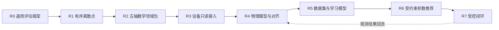

# Axiom 文档入口

> 状态：架构重整中，尚未进入实现  
> 当前里程碑：通用框架 `R0` + 有序离散点 `R1`  
> 更新日期：2026-08-08

Axiom 的目标不是做一个只理解 CNC 术语的“语义化评分器”，而是建立一套可逐级定义、可扩展到真实设备、可沉淀训练数据，并最终支持受约束参数优化的工业评估、实验与证据框架。

首个切入点是**有序离散点序列**。五轴轨迹是建立在通用框架上的第一个高价值数学领域包，而不是平台内核本身。

## 规范主体与决策记录

| 文档 | 唯一职责 | 当前状态 |
|---|---|---|
| [项目规划蓝图](CNC%20算法效果评估与智能优化平台——项目规划蓝图.md) | 产品边界、总体架构、Roadmap、阶段门与非目标 | Draft |
| [通用评估框架规范](Axiom%20通用评估框架规范.md) | 跨领域核心对象、角色、能力协商、三状态轴、证据与执行语义 | Draft v0.2 |
| [有序离散点领域包规范](有序离散点领域包规范.md) | 第一个最小领域包及其输入、指标和验收闭环 | Draft v0.2 |
| [FiveAxisTrajectoryPack — CNC 五轴数学参考系统全景规范](CNC%20数学参考系统全景规范.md) | M0–M5 数学模型、进度/对应/重建契约、模型碰撞边界、证明义务和测试族 | Draft v0.3 |
| [ADR 索引](架构决策记录/README.md) | 长期架构决策、替代方案与后果的审计历史 | Active |
| 本文档 | 总入口、阅读路径与文档治理 | Active |

除 ADR 行外的五项（含本文档）构成规范性主体；ADR 是决策记录，不复制规范正文。`implementation-notes.md` 是任务过程记录，不属于正式规范，也不能作为实现依据。

## 推荐阅读路径

- 讨论产品方向：本文档 → 项目规划蓝图。
- 设计平台内核：本文档 → 通用评估框架规范 → 有序离散点领域包规范。
- 研究五轴数学：通用评估框架规范 → FiveAxisTrajectoryPack 全景规范。
- 规划设备、机器学习或优化：项目规划蓝图中的对应阶段 → 通用评估框架规范的角色与安全边界。
- 了解为何选择当前契约：对应规范 → ADR 索引 → 具体 ADR。

## 文档所有权规则

1. 一个概念只能有一个规范来源；其他文档只摘要并链接。
2. 蓝图回答“为什么、先后顺序和阶段门”，不重复领域公式。
3. 通用规范只定义跨领域不变量，不吸收五轴、设备或模型训练细节。
4. 领域包定义自己的数据语义、验证器、指标和证据生产方式，但不得改写通用核心。
5. 实现细节只有在接口被实际采用后才进入规范；设想保留在 Roadmap，不提前写成伪稳定接口。
6. 每个重要结论必须区分：输入事实、计算结果、声明、证据和最终决策。
7. ADR 解释“为什么这样决定”；当前规范定义“实现必须遵守什么”。两者不一致时必须先修正文档，不能由实现自行选择。

## 后续文档的创建触发条件

以下文档现在**不创建空壳**，达到触发条件时再从蓝图中拆出：

| 未来文档 | 创建触发条件 |
|---|---|
| `设备接入与物理闭环规范.md` | 选定首个驱动器、控制器或仿真设备，开始定义只读遥测接口 |
| `数据集与学习模型规范.md` | `Run / Observation / Evidence` 模式稳定，并开始积累可训练的成对样本 |
| `受约束优化与安全闭环规范.md` | 参数推荐进入工程验证，需要定义搜索域、硬约束、shadow 与人工批准协议 |
| `架构决策记录/ADR-*` | 每次新增会长期约束实现、且存在实质替代方案的技术决策 |

## 当前最近目标

当前不做五轴求解器、设备驱动或机器学习模型。最近目标是证明下面这个最小闭环成立：

> 输入一组有序离散点及可选上下文，系统能够判断输入是否有效；在无物理单位时仍计算 `coordinate-unit` 下的内在几何；按确定规则记录执行、指标与 Case 状态；比较多个结果，并生成可复现、可追溯的评估证据。

这个闭环成立后，再把五轴 M0–M5 作为领域包接入，而不是把通用框架重新改写成 CNC 专用系统。
