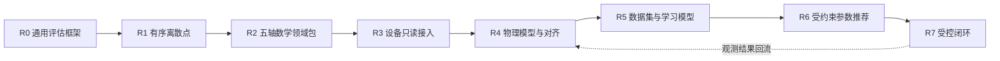

# Axiom 文档入口

> 状态：v0.20.0 Windows 发布版本；R0–R2 已闭合，R3–R6 参考合同片、R7-A–R7-E、R4.1 双运行 reality evaluator、现场验收编排与 Beckhoff 只读见证部署工具包已实现；真实现场证据/受控闭环保持 Open
> 当前里程碑：通用框架 `R0` + 有序离散点 `R1` + Five-Axis Math `F4` + Machine `R3 v1` + Physical `R4.0 SIL / R4.1 Reality` + Intelligence `R5-A / R5-B` + Optimization `R6 v1` + Controlled Runtime `R7-A–R7-E`
> 更新日期：2026-08-13

Axiom 的目标不是做一个只理解 CNC 术语的“语义化评分器”，而是建立一套可逐级定义、可扩展到真实设备、可沉淀训练数据，并最终支持受约束参数优化的工业评估、实验与证据框架。

首个切入点是**有序离散点序列**。五轴轨迹是建立在通用框架上的第一个高价值数学领域包，而不是平台内核本身。



## 规范主体与决策记录

| 文档 | 唯一职责 | 当前状态 |
|---|---|---|
| [项目规划蓝图](CNC%20算法效果评估与智能优化平台——项目规划蓝图.md) | 产品边界、总体架构、Roadmap、阶段门与非目标 | Draft |
| [通用评估框架规范](Axiom%20通用评估框架规范.md) | 跨领域核心对象、角色、能力协商、三状态轴、证据与执行语义 | Draft v0.5 |
| [有序离散点领域包规范](有序离散点领域包规范.md) | 第一个最小领域包及其输入、指标和验收闭环 | Draft v0.4 |
| [FiveAxisTrajectoryPack — CNC 五轴数学参考系统全景规范](CNC%20数学参考系统全景规范.md) | M0–M5 数学模型、进度/对应/重建契约、模型碰撞边界、证明义务和测试族 | Draft v0.8 / F4 implemented |
| [设备接入与物理闭环规范](设备接入与物理闭环规范.md) | R3 文件观测、R7-E 实时只读采集、时间/坐标上下文、MachineRun 谱系和安全边界 | R3 v1 + R7-E Windows contracts implemented; real capture open |
| [物理模型与现实对齐规范](物理模型与现实对齐规范.md) | R4 物理响应、校准/holdout、数值对齐、残差与可信度边界 | R4.0 SIL + R4.1 two-run evaluator implemented; real evidence open |
| [数据集与学习模型规范](数据集与学习模型规范.md) | R5 数据集快照、split/governance/lineage、OOD、ModelBundle、R5-B real holdout readiness 和端侧解释器边界 | R5-A / R5-B Windows contract implemented; real generalization open |
| [受约束优化与安全闭环规范](受约束优化与安全闭环规范.md) | R6 参数域/Recommendation，R7-A Shadow 状态机、R7-B–R7-E 只读部署、传输、厂商与采集门 | R6 v1 + R7-A–R7-E Windows contracts implemented; field/reality gates open |
| [ADR 索引](架构决策记录/README.md) | 长期架构决策、替代方案与后果的审计历史 | Active |
| 本文档 | 总入口、阅读路径与文档治理 | Active |

除 ADR 行外的九项（含本文档）构成规范性主体；ADR 是决策记录，不复制规范正文。[implementation-notes](implementation-notes.md) 是任务过程记录，不属于正式规范，也不能作为实现依据。

## 推荐阅读路径

- 讨论产品方向：本文档 → 项目规划蓝图。
- 设计平台内核：本文档 → 通用评估框架规范 → 有序离散点领域包规范。
- 研究五轴数学：通用评估框架规范 → FiveAxisTrajectoryPack 全景规范 → [F0 fixture 说明](fixtures/five_axis_f0/README.md)。
- 研究设备只读观测：项目规划蓝图 R3 → 设备接入与物理闭环规范 → 通用评估框架规范的证据与追溯要求。
- 研究物理模型与现实对齐：项目规划蓝图 R4 → 物理模型与现实对齐规范 → 设备接入与物理闭环规范 → ADR-0015。
- 研究机器学习：项目规划蓝图 R5 → 数据集与学习模型规范 → ADR-0016 / ADR-0017。
- 研究受约束推荐：项目规划蓝图 R6 → 受约束优化与安全闭环规范 → ADR-0018 → 通用评估框架规范的角色与安全边界。
- 研究真实控制器前置接入：项目规划蓝图 R7 → 受约束优化与安全闭环规范 R7-B–R7-E → ADR-0020–ADR-0025 → 设备接入与物理闭环规范 → [Beckhoff 只读见证部署指南](BECKHOFF-WITNESS-DEPLOYMENT-WINDOWS.md) → [OPC UA Shadow Adapter 使用说明](adapters/opcua-shadow/README.md)。
- 了解为何选择当前契约：对应规范 → ADR 索引 → 具体 ADR。
- 查看版本变化与升级边界：[CHANGELOG](CHANGELOG.md)。

## 文档所有权规则

1. 一个概念只能有一个规范来源；其他文档只摘要并链接。
2. 蓝图回答“为什么、先后顺序和阶段门”，不重复领域公式。
3. 通用规范只定义跨领域不变量，不吸收五轴、设备或模型训练细节。
4. 领域包定义自己的数据语义、验证器、指标和证据生产方式，但不得改写通用核心。
5. 实现细节只有在接口被实际采用后才进入规范；设想保留在 Roadmap，不提前写成伪稳定接口。
6. 每个重要结论必须区分：输入事实、计算结果、声明、证据和最终决策。
7. ADR 解释“为什么这样决定”；当前规范定义“实现必须遵守什么”。两者不一致时必须先修正文档，不能由实现自行选择。

## 后续文档的创建触发条件

设备、物理、学习与首个受约束推荐接口的创建条件已经满足，对应规范均已进入规范主体。以下后续文档仍不创建空壳，达到触发条件时再从蓝图中拆出：

| 未来文档 | 创建触发条件 |
|---|---|
| `架构决策记录/ADR-*` | 每次新增会长期约束实现、且存在实质替代方案的技术决策 |

## 当前最近目标

R1 的离散点最小闭环和 R2 五轴数学参考链已经成立。当前版本继续沿 Roadmap 把设备、物理、学习、推荐与受控运行拆成独立证据层：

> F1 的 M0→M2 几何证据链、F2 的 M3 运动学 / `Q_free` 证据，以及 F3 的 M4 连续时间律与 M5 固定周期重建都继续保留。F4 新增 `five-axis.domain-pack@5`、`five-axis.solver-adapter@1`、独立 reference / SUT in-process adapters、三类 canonical solver 拓扑闭环、`adapter-input-hash-mismatch` 与 `interval-interior-collision` 反例、M0–M5 manifest、七个数学 gate claims，以及可被网页工作台消费的 F4 example payload。

F4 只发布 `GeometryValid`、`TaskGeometryCollisionFree`、`KinematicallyFeasible`、`ConfigurationCollisionFree`、`ContinuouslyFeasible`、`IntervalCertified` 和 `ModelCollisionFree` 七个数学 claims，仍然禁止 `DeviceSafe`、`ProcessSafe` 和任何上机许可。R2 保持闭合，不向数学 Artifact 塞入设备语义。

R3 使用 `axiom.windows-file-telemetry-source@1` 读取已经落盘的 JSON capture，并以独立 `machine-observation.domain-pack@1` 保存 raw frames、DeviceProfile、时钟/坐标上下文和 paired/unpaired MachineRun 谱系。`machine-trace-import@1` 在 DomainPack 中显式声明为 import runner，因此 Observation 来源稳定记录为 `ImportedArtifact`。该参考源只证明 Windows 文件导入和数据可信性合同；它不连接真实设备、不轮询控制器、不写参数，也不产生 `DeviceSafe`、`ProcessSafe` 或上机许可。详细契约见[设备接入与物理闭环规范](设备接入与物理闭环规范.md)。

R4.0 已通过 `five-axis.domain-pack@6` 建立首个轴空间物理模型参考链：F4 M5 指令、模型执行后的 `PhysicalResponseTrace` 和 R3-compatible raw observation 分别保留；校准与验证使用不同 command/trace identity；线性轴 `mm` 与旋转轴 `rad` 分开计算；未激励轴明确不可辨识。仓库提供的两级滞后 oracle 只用于 synthetic SIL，候选是一阶 lag + bias，二者结构不同以防自验证。该片可以证明模型合同和验证器可证伪性，但真实设备 reality gate 仍保持 Open。详细契约见[物理模型与现实对齐规范](物理模型与现实对齐规范.md)。

R5-A 已用独立 `intelligence.domain-pack@1` 实现可审计 DatasetSnapshot、前向分组切分、泄漏反例、OOD 弃权、X-only ridge 残差头、split conformal 区间、15 位权重导出和独立纯 Python Windows 目标解释器。`syntheticLearningContractStatus=Passed`，但真实 paired holdout 尚未进入，因此 `realWorldGeneralizationStatus=Open`，也不存在设备写回或在线学习入口。详细契约见[数据集与学习模型规范](数据集与学习模型规范.md)与[ADR-0016](架构决策记录/ADR-0016-R5可审计数据集与端侧模型边界.md)。

R5-B 进一步把真实 holdout 的就绪门拆到独立 `intelligence.domain-pack@2`：`RealPairedHoldoutSet`、`RealHoldoutGovernance`、`RealHoldoutSelectionReceipt` 和 case-scoped `RealHoldoutCaseEvidence` 保持独立内容身份；外部输入必须带 controller-export 或 device-read、owner attestation、评估许可、R3 paired lineage、时钟/坐标对齐、`PhysicalResponseTrace`，并满足至少 2 个 in-domain case 跨 2 台 device、2 个 condition、再加 1 个 OOD case。当前仓库只提供 Open 就绪场景和上传入口，不内置真实正例，也不把 `DeviceSafe`、`ProcessSafe`、writeback 或 online learning 写进主线。

R6 v1 使用独立 `optimization.domain-pack@1` 建立首个反向推荐闭环：对 `feedOverride={0.70,0.85,1.00}` 与 `samplePeriod={0.04,0.08}s` 做确定性完全枚举；每个候选重新执行 F3 jerk-feasible 规划、F4 M5 重建与区间碰撞，并消费 R4 多采样率 holdout 证据和 R5 OOD 注记。周期、线性跟随误差和样本数保持独立 Pareto 目标，Recommendation 与 AcceptanceRecord 分离，全部结果固定为 Offline、零设备写入、零自动接受。详细契约见[受约束优化与安全闭环规范](受约束优化与安全闭环规范.md)与[ADR-0018](架构决策记录/ADR-0018-R6多目标离线推荐与权限边界.md)。

R7-A 使用独立 `control.domain-pack@1` 实现 Windows Synthetic Shadow 合同：R6 Recommendation 保持不可变，独立 AcceptanceRecord 冻结处置与责任；控制包线覆盖线性误差、OOD 与监控 gap；nominal、越界、缺 deployment evidence、Controlled Trial 越权和设备写请求五个场景均可重放。越界只会停止 shadow 并证明离线基线未被修改，所有 receipt 都明确记录没有设备 stop/write/ack/readback。真实 deployment shadow、Controlled Trial、Closed Loop 和标准符合性继续为 Open/NotAssessed。详细边界见[ADR-0019](架构决策记录/ADR-0019-R7A-Shadow受控运行与设备安全边界.md)。

R7-B 使用独立 `control.domain-pack@2` 冻结真实 deployment shadow 的前置证据门：控制器 Profile、控制器端只读权限、raw capture、Adapter Receipt、时钟/信号映射和外部 provenance 保持独立内容身份，并由七项检查统一验收。默认无证据场景返回 `Open + Inconclusive`；仓库合同夹具固定 `declaredReal=false`，会被阻止计入现实证据。网页只允许导入 JSON 做证据校验，不连接或写入设备。具体 Siemens、FANUC、HEIDENHAIN 等厂商 Adapter 仍须在选定控制器和可验收环境后实现，现实门继续为 Open。详细边界见[ADR-0020](架构决策记录/ADR-0020-R7B-部署影子就绪性与厂商边界.md)。

R7-C 新增隔离的 Windows `.NET 8` OPC UA Shadow Adapter 和 `control.domain-pack@3`：生产 Adapter 只建立证书固定的 `SignAndEncrypt` 会话，以非匿名只读主体订阅 X/Y/Z/B/C 五轴位置，不包含 OPC UA Write 或 Method Call 路径。独立 localhost 虚拟服务端验收会验证应用证书互信、未知客户端证书拒绝、只读节点拒绝写入、通知序号/时间/丢包和跨语言内容哈希。该结果最多把 `virtualTransportStatus` 标为 `Passed`；`vendorAdapterStatus` 与 `realityValidationStatus` 永远保持 `Open`，设备/工艺安全保持 `NotAssessed`。详细边界见[ADR-0021](架构决策记录/ADR-0021-R7C-Windows虚拟OPC-UA传输验收边界.md)。

R7-D 选择 Beckhoff TwinCAT 3 Build 4026+ / TF6100 作为首个具体厂商路径，并新增 `control.domain-pack@4`、版本化 Vendor Profile、Windows `tcpkg`/二进制预检、标准 BuildInfo、TF6100 许可证结果、五轴节点访问级别与独立非执行 canary 拒写证据。生产 Adapter 继续零 Write/Call；权限验证器是单独程序集，只有部署责任人明确授权专用 canary 时才允许执行一次同值 Write。当前开发机没有 TwinCAT/TF6100，因此默认只证明 Profile 合同并返回 `vendorRuntimeStatus=Open`；现实与安全 gate 不升级。详细边界见[ADR-0022](架构决策记录/ADR-0022-R7D-Beckhoff-TwinCAT厂商验收边界.md)。

R7-E 新增 `control.domain-pack@5` 与 `.NET` Beckhoff Shadow Witness：只订阅控制器端 `sampleIndex`，每个新索引触发一次 command hash、sample index、X/Y/Z/B/C 七节点 batch Read；M5 索引必须完整连续，不插值，Write/Call 固定为 0。R4.1 使用 `five-axis.domain-pack@7` 消费两个不同授权、不同时间窗的 R7-E calibration/validation pair，冻结参数后在 holdout 上分别验证线性 `mm` 与旋转 `rad` 残差。v0.19.0 增加统一现场验收编排；v0.20.0 再补可导入的 `FB_AxiomShadowWitness.TcPOU`、窗口 sentinel/索引最后发布协议、七 NodeId 只读属性检查和离线绑定评估。仓库只提供 Open 场景和合同 conformance，不内置伪真实正例；详细边界见[Beckhoff 只读见证部署指南](BECKHOFF-WITNESS-DEPLOYMENT-WINDOWS.md)、[Windows 现场证据验收指南](FIELD-EVIDENCE-WINDOWS.md)与[ADR-0025](架构决策记录/ADR-0025-Beckhoff见证采用控制器锁存与离线部署预检.md)。

## v0.20.0 快速开始

v0.20.0 的 Field Evidence 工作台可先下载 TwinCAT 见证模板并导入部署绑定请求，再分别导入 calibration 与 validation 两份 R7-E payload，由统一服务端编排器重验 Case、内容身份、独立性和 R4.1 holdout gate；页面不提供 PLC 连接、写入、启动或控制入口。

v0.20.0 的发布与阻断验收基线是 Windows AMD64、CPython 3.12.10 和由 [`global.json`](global.json) 精确冻结的 .NET SDK 8.0.424，并固定 `OPENBLAS_CORETYPE=Haswell`、OpenBLAS/OMP 单线程、[`constraints/acceptance.txt`](constraints/acceptance.txt) 以及 OPC Foundation 官方协议栈 `1.5.378.156`。R4–R7 runtime 在非 Windows 环境会明确返回 `UnsupportedRuntimePlatform`，不产生通过结论；Ubuntu/Linux/WSL 不属于本阶段支持矩阵。portable Artifact 身份仍与精确环境绑定的 `RunBundle.bundleHash` 分开验证。

F4 最短用法是先取场景 payload，再把 `runSpec` 送回公共执行接口。下面这个例子会返回 `Passed`，并保留 7 个数学 gate claims：

```python
from axiom import evaluate_run
from axiom.five_axis import f4_example_run_spec

bundle = evaluate_run(f4_example_run_spec("canonical-dual-table-solver"))
assert bundle.report.case_outcome.value == "Passed"
assert bundle.run.execution_status.value == "Succeeded"
```

F4 的公开 API 很薄，数据面只暴露三类查询和一个回放入口：

- `GET /api/v1/five-axis/f4/manifest?scenarioId=canonical-dual-table-solver`
- `GET /api/v1/five-axis/f4/scenarios`
- `GET /api/v1/examples/five-axis-f4?scenarioId=canonical-dual-table-solver`
- `POST /api/v1/runs/evaluate`

如果你在浏览器里接一个 F4 工作台，直接消费上面的 example payload 就够了，字段按 `manifest / scenario / source / artifacts / evidence / acceptanceReport` 分块，不要把 `DeviceSafe` 或 `ProcessSafe` 伪装进去。

R3 也走同一条公共 Run 路径。下面的 paired 示例会保留 Windows 文件导入来源和五类 `Observed` 数据证据；它不是设备安全证明：

```python
from axiom import evaluate_run
from axiom.machine import machine_r3_example_run_spec

bundle = evaluate_run(machine_r3_example_run_spec("read-only-paired-pass"))
assert bundle.observation.source == "ImportedArtifact"
assert bundle.report.case_outcome.value == "Passed"
assert all(claim.evidence.level == "Observed" for claim in bundle.claims)
```

R3 的查询面和回放入口为：

- `GET /api/v1/machine/r3/manifest`
- `GET /api/v1/machine/r3/scenarios`
- `GET /api/v1/examples/machine-r3?scenarioId=read-only-paired-pass`
- `POST /api/v1/runs/evaluate`

R4.0 也使用公共 Run 路径。正例会通过模型合同与 holdout 拟合门，但现实验证 Claim 必须保持 `Inconclusive`：

```python
from axiom import evaluate_run
from axiom.physical import validate_r4_example_run_spec

bundle = evaluate_run(validate_r4_example_run_spec("in-domain-synthetic-sil"))
claims = {claim.claim_definition_id: claim.status.value for claim in bundle.claims}
assert bundle.run.case_outcome.value == "Passed"
assert claims["five-axis.physical-model-reality-validated-claim@1"] == "Inconclusive"
```

R4 的查询面为：

- `GET /api/v1/physical/r4/manifest`
- `GET /api/v1/physical/r4/scenarios`
- `GET /api/v1/examples/physical-r4?scenarioId=in-domain-synthetic-sil`
- `POST /api/v1/runs/evaluate`

R4.1 默认不伪造真实 pair，因此公共 Run 必须保持 `Inconclusive`；外部应用可把两个经 R7-E 验收的 pair 送到专用 assess 接口：

```python
from axiom import evaluate_run
from axiom.physical import validate_r41_example_run_spec

bundle = evaluate_run(validate_r41_example_run_spec())
claims = {claim.claim_definition_id: claim.status.value for claim in bundle.claims}
assert bundle.run.case_outcome.value == "Inconclusive"
assert claims["five-axis.physical-model-reality-validated-claim@2"] == "Inconclusive"
```

- `GET /api/v1/physical/r41/manifest`
- `GET /api/v1/physical/r41/scenarios`
- `GET /api/v1/examples/physical-r41`
- `POST /api/v1/physical/r41/assess`
- `POST /api/v1/runs/evaluate`

现场使用不再需要手工拼装两个 pair。把相同显式 `caseId` 的 calibration/validation R7-E 输入放入一个请求，然后运行：

```powershell
axiom field-evidence .\field-evidence-request.json |
  Set-Content -Encoding utf8 .\field-evidence-report.json
$LASTEXITCODE  # 0=Passed, 1=Open/Blocked/Refuted, 2=Malformed
```

对应 HTTP 入口是 `POST /api/v1/field-evidence/assess`。完整字段、现场前置条件和安全边界见 [Windows 现场证据验收指南](FIELD-EVIDENCE-WINDOWS.md)；可执行的 Open 骨架见 [`examples/field-evidence.open-request.json`](examples/field-evidence.open-request.json)。

真实采集前先导入并绑定控制器侧只读见证模板。公开 Open 请求不会伪造 runtime、M5 command 或 NodeId，按设计返回退出码 `1`：

```powershell
axiom beckhoff-witness-deployment .\examples\beckhoff-witness-deployment.open-request.json |
  Set-Content -Encoding utf8 .\beckhoff-witness-deployment-report.json
```

CLI 与 `POST /api/v1/control/r7e/deployment/assess` 同义；模板下载入口为 `GET /api/v1/control/r7e/deployment/template`。七节点运行时属性由 `.NET` `beckhoff-witness-inspect` 只读采集，未附该证据时 NodeId 门保持 `Open`。完整 TwinCAT 导入、实例化、TMC/ACL 与 NodeId 绑定步骤见 [Beckhoff 只读见证部署指南](BECKHOFF-WITNESS-DEPLOYMENT-WINDOWS.md)。

R5-A 同样走公共 Run 路径。正例只支持 synthetic learning Claim，真实泛化 Claim 必须保持 `Inconclusive`：

```python
from axiom import evaluate_run
from axiom.intelligence import validate_r5_example_run_spec

bundle = evaluate_run(validate_r5_example_run_spec("synthetic-residual-contract"))
claims = {claim.claim_definition_id: claim.status.value for claim in bundle.claims}
assert bundle.run.case_outcome.value == "Passed"
assert claims["intelligence.synthetic-learning-contract-claim@1"] == "Supported"
assert claims["intelligence.real-world-generalization-claim@1"] == "Inconclusive"
```

R5-A 的查询面为：

- `GET /api/v1/intelligence/r5/manifest`
- `GET /api/v1/intelligence/r5/scenarios`
- `GET /api/v1/examples/intelligence-r5?scenarioId=synthetic-residual-contract`
- `POST /api/v1/runs/evaluate`

R5-B 走同一条公共 Run 路径，但默认示例只提供真实 holdout 就绪门，不内置 bundled real capture，所以结果应当是 `Succeeded + Inconclusive + RealPairedHoldoutMissing`：

```python
from axiom import evaluate_run
from axiom.intelligence import validate_r5b_example_run_spec

bundle = evaluate_run(validate_r5b_example_run_spec("real-holdout-readiness-open"))
claims = {claim.claim_definition_id: claim.status.value for claim in bundle.claims}
assert bundle.run.execution_status.value == "Succeeded"
assert bundle.run.case_outcome.value == "Inconclusive"
assert claims["intelligence.real-world-generalization-claim@1"] == "Inconclusive"
assert next(
    claim.reason_code
    for claim in bundle.claims
    if claim.claim_definition_id == "intelligence.real-world-generalization-claim@1"
) == "RealPairedHoldoutMissing"
```

R5-B 的查询面为：

- `GET /api/v1/intelligence/r5b/manifest`
- `GET /api/v1/intelligence/r5b/scenarios`
- `GET /api/v1/examples/intelligence-r5b?scenarioId=real-holdout-readiness-open`
- `POST /api/v1/runs/evaluate`

R6 搜索端点负责生成 RecommendationSet，公共 Run 端点负责确定性重放验收：

```python
from axiom import evaluate_run
from axiom.optimization import r6_example_payload, validate_r6_example_run_spec

payload = r6_example_payload()
assert len(payload.recommendation_set.candidates) == 6
assert payload.recommendation_set.device_write_allowed is False

bundle = evaluate_run(validate_r6_example_run_spec())
assert bundle.run.case_outcome.value == "Passed"
```

R6 的查询面为：

- `GET /api/v1/optimization/r6/manifest`
- `GET /api/v1/optimization/r6/scenarios`
- `GET /api/v1/examples/optimization-r6`
- `POST /api/v1/optimization/r6/search`
- `POST /api/v1/runs/evaluate`

R7-A 只重放受控运行合同；默认示例不会连接或写入设备：

```python
from axiom import evaluate_run
from axiom.control import r7_example_payload, validate_r7_example_run_spec

payload = r7_example_payload("synthetic-shadow-limit-breach")
assert payload.runtime_audit.final_state == "RollbackVerified"
assert payload.runtime_audit.stop_receipt.device_stop_command_issued is False

bundle = evaluate_run(validate_r7_example_run_spec())
assert bundle.run.case_outcome.value == "Passed"
```

R7-A 的查询面为：

- `GET /api/v1/control/r7/manifest`
- `GET /api/v1/control/r7/scenarios`
- `GET /api/v1/examples/control-r7?scenarioId=synthetic-shadow-nominal`
- `POST /api/v1/control/r7/replay`
- `POST /api/v1/runs/evaluate`

R7-B 默认只报告真实接入缺口；合同夹具可以验证阻断路径，但不能计入现实证据：

```python
from axiom import evaluate_run
from axiom.control import r7b_example_payload, validate_r7b_example_run_spec

payload = r7b_example_payload("contract-fixture-blocked")
assert payload.readiness_audit.readiness_outcome == "Blocked"
assert payload.readiness_audit.deployment_shadow_status == "Open"

bundle = evaluate_run(validate_r7b_example_run_spec())
assert bundle.run.case_outcome.value == "Inconclusive"
```

R7-B 的查询和证据校验面为：

- `GET /api/v1/control/r7b/manifest`
- `GET /api/v1/control/r7b/scenarios`
- `GET /api/v1/examples/control-r7b?scenarioId=deployment-shadow-readiness-open`
- `POST /api/v1/control/r7b/assess`
- `POST /api/v1/runs/evaluate`

R7-C 默认只显示尚未导入网络证据的开放状态；本地 Windows 虚拟服务端验收和 Adapter 构建方式如下：

```powershell
dotnet restore adapters\opcua-shadow\Axiom.OpcUaShadow.sln --locked-mode
dotnet build adapters\opcua-shadow\Axiom.OpcUaShadow.sln -c Release --no-restore
dotnet run --project adapters\opcua-shadow\tests\Axiom.OpcUaShadow.Conformance -c Release --no-build
```

真实控制器接入前，复制 [`opcua-shadow.windows.example.json`](examples/opcua-shadow.windows.example.json)，由控制器管理员提供 endpoint、节点映射、服务端公钥证书及其 SHA-256，并创建只能 read/subscribe 的主体。密码只从配置中命名的 Windows 进程环境变量读取：

```powershell
$env:AXIOM_OPCUA_SHADOW_PASSWORD = "由部署方注入的只读主体密码"
axiom-opcua-shadow init --config .\opcua-shadow.json
axiom-opcua-shadow capture --config .\opcua-shadow.json --output .\transport-evidence.json
```

`init` 只生成客户端应用证书；控制器管理员必须独立把导出的公钥证书加入服务端信任列表。`capture` 产生的证据再交给网页或 `POST /api/v1/control/r7c/assess` 校验。即使校验通过，也不能把虚拟或未验证厂商的结果解释为真实 deployment shadow。

R7-C 的查询和证据校验面为：

- `GET /api/v1/control/r7c/manifest`
- `GET /api/v1/control/r7c/scenarios`
- `GET /api/v1/examples/control-r7c?scenarioId=opcua-transport-evidence-open`
- `POST /api/v1/control/r7c/assess`
- `POST /api/v1/runs/evaluate`

R7-D 默认 Profile 位于 [`beckhoff-twincat-profile.windows.json`](examples/beckhoff-twincat-profile.windows.json)。它故意不包含部署 node id 或服务器身份。本机只读预检不会安装 TwinCAT，也不会连接设备：

```powershell
dotnet run --project adapters\opcua-shadow\src\Axiom.OpcUaShadow.Adapter `
  -c Release --no-build -- `
  beckhoff-preflight `
  --profile examples\beckhoff-twincat-profile.windows.json `
  --output beckhoff-runtime-evidence.json
```

没有 `tcpkg` 时，输出会明确记录 `TwinCatPackageManagerMissing`，`vendorRuntimeStatus` 仍为 `Open`。在真实环境中，部署管理员必须先建立带精确服务端证书/BuildInfo、TF6100 `FB_CheckLicense` 结果节点、X/Y/Z/B/C 节点和专用非执行 canary 的 `Bound` Profile，再运行只读检查：

```powershell
axiom-opcua-shadow beckhoff-inspect `
  --profile .\beckhoff-bound-profile.json `
  --config .\opcua-shadow.json `
  --transport .\transport-evidence.json `
  --write-receipt .\write-rejection-receipt.json `
  --output .\beckhoff-runtime-evidence.json
```

独立权限 verifier 会对 Profile 中专用 canary 发起恰好一次同值 Write。只有设备责任人已确认该节点不驱动执行机构并明确授权此次验收时才运行；不得把轴位置或控制信号配置为 canary：

```powershell
.\permission-verifier\Axiom.OpcUaShadow.BeckhoffPermissionVerifier.exe `
  --profile .\beckhoff-bound-profile.json `
  --config .\opcua-shadow.json `
  --output .\write-rejection-receipt.json `
  --acknowledge-non-actuating-probe
```

R7-D 的查询和证据校验面为：

- `GET /api/v1/control/r7d/manifest`
- `GET /api/v1/control/r7d/scenarios`
- `GET /api/v1/examples/control-r7d?scenarioId=beckhoff-twincat-runtime-open`
- `POST /api/v1/control/r7d/assess`
- `POST /api/v1/runs/evaluate`

R7-E 需要部署方提供 Bound Witness Profile、同一运行时/控制器的只读 authority、带 `authorizedFrom` / `authorizedUntil` UTC 时间窗的数据所有者 capture authorization，以及要观测的 M5 command。整段 capture receipt 必须落在授权时间窗内；生产程序只订阅 sample index，并按每个索引执行七节点 batch Read：

```powershell
axiom-opcua-shadow beckhoff-shadow-capture `
  --config .\opcua-shadow.json `
  --vendor-profile .\beckhoff-bound-profile.json `
  --runtime-evidence .\beckhoff-runtime-evidence.json `
  --witness-node-evidence .\beckhoff-witness-node-verification.json `
  --witness-profile .\beckhoff-shadow-witness-profile.json `
  --controller-profile .\controller-profile.json `
  --authority .\readonly-authority.json `
  --capture-authorization .\capture-authorization.json `
  --command .\m5-command.json `
  --evidence-id beckhoff.shadow.calibration@1 `
  --output .\beckhoff-shadow-calibration.json
```

需要分别采集 calibration 和 validation，且两次授权、时间窗和 Shadow evidence 内容身份不同。R7-E / R4.1 查询与核验面为：

- `GET /api/v1/control/r7e/manifest`
- `GET /api/v1/control/r7e/scenarios`
- `GET /api/v1/examples/control-r7e`
- `POST /api/v1/control/r7e/assess`
- `GET /api/v1/physical/r41/manifest`
- `GET /api/v1/examples/physical-r41`
- `POST /api/v1/physical/r41/assess`
- `POST /api/v1/runs/evaluate`

```powershell
python -m venv .venv
.\.venv\Scripts\python.exe -m pip install --upgrade -c constraints\acceptance.txt pip
.\.venv\Scripts\python.exe -m pip install -c constraints\acceptance.txt -e ".[test]"
.\.venv\Scripts\python.exe -m axiom evaluate examples\basic-evaluation.json
# 准备符合 run-spec@1 的 JSON 后：
.\.venv\Scripts\python.exe -m axiom run .\path\to\run-spec.json
.\.venv\Scripts\python.exe -m axiom compare fixtures\cnc_scenarios\comparisons\cnc-contour-ab-pass-vs-fail.json
.\.venv\Scripts\python.exe -m axiom experiment fixtures\cnc_scenarios\experiments\cnc-contour-true-ab.json
.\.venv\Scripts\python.exe -m axiom serve --host 127.0.0.1 --port 8000
.\.venv\Scripts\python.exe -m pytest
```

启动后访问 `http://127.0.0.1:8000`，可在 Point Lab、Five-Axis F1–F4、Machine R3、Physical R4、Intelligence R5-A / R5-B、Optimization R6、Controlled Runtime R7-A、Deployment R7-B、OPC UA R7-C、Beckhoff R7-D 与 Field Evidence R7-E/R4.1 间切换。发布包已经内置网页资源；从源码修改 UI 时，先在 `web` 目录执行 `pnpm install` 和 `pnpm build`。单次输入契约见 [`examples/basic-evaluation.json`](examples/basic-evaluation.json)，真实双臂实验见 [`cnc-contour-true-ab.json`](fixtures/cnc_scenarios/experiments/cnc-contour-true-ab.json)。仓库验收使用的 Five-Axis F2 机床/碰撞参考见 [`fixtures/five_axis_f2`](fixtures/five_axis_f2)，F3 CL 输入、M3/M4/M5 内容身份和 Claim 金值见 [`fixtures/five_axis_f3`](fixtures/five_axis_f3)，F4 三拓扑、Adapter 反例、区间内部碰撞和 Windows 环境金值见 [`fixtures/five_axis_f4`](fixtures/five_axis_f4)，R3 Windows 文件导入与反例见 [`fixtures/machine_r3`](fixtures/machine_r3)，R4 物理响应、内容身份和六类 SIL 场景金值见 [`fixtures/physical_r4`](fixtures/physical_r4)，R5-A portable 数据/模型身份与门禁金值见 [`src/axiom/intelligence/fixtures/manifest.json`](src/axiom/intelligence/fixtures/manifest.json)。安装发布包后，可由 F1–F4/R3–R7 示例 API 获取完整 envelope，再交给公共 `POST /api/v1/runs/evaluate` 执行。

Python 中可直接执行内建 F0 示例：

```python
from axiom import evaluate_run, f0_example_run_spec

bundle = evaluate_run(f0_example_run_spec())
assert bundle.report.case_outcome.value == "Passed"
```

也可以执行三个 F1 场景，并直接读取标准声明而不是把 Core 的运行完成状态误当成几何结论：

```python
from axiom import evaluate_run, f1_example_run_spec

bundle = evaluate_run(f1_example_run_spec("fixture-collision"))
claims = {claim.claim_definition_id: claim.status.value for claim in bundle.claims}
assert claims["five-axis.geometry-valid-claim@1"] == "Supported"
assert claims["five-axis.task-geometry-collision-free-claim@1"] == "Refuted"
```

F2 场景通过同一 Core 运行路径执行；配置空间反例会保留成功的运动学 Claim，同时用区间内部见证反驳碰撞自由 Claim：

```python
from axiom import evaluate_run
from axiom.five_axis.f2_scenarios import validate_f2_example_run_spec

bundle = evaluate_run(validate_f2_example_run_spec("configuration-interior-collision"))
claims = {claim.claim_definition_id: claim.status.value for claim in bundle.claims}
assert claims["five-axis.kinematically-feasible-claim@1"] == "Supported"
assert claims["five-axis.configuration-collision-free-claim@1"] == "Refuted"
```

F3 也沿用同一 Core 路径。下面的多项式反例在采样端点看不到违规，但区间重建会反驳 `IntervalCertified`：

```python
from axiom import evaluate_run, validate_f3_example_run_spec

bundle = evaluate_run(validate_f3_example_run_spec("polynomial-interior-violation"))
claims = {claim.claim_definition_id: claim.status.value for claim in bundle.claims}
assert claims["five-axis.continuously-feasible-claim@1"] == "Supported"
assert claims["five-axis.interval-certified-claim@1"] == "Refuted"
```

CLI 退出码：`evaluate` 与 `run` 的 `0` 表示 `Passed`，`1` 表示 `Failed / Inconclusive / Unsupported`，`2` 表示读取失败或 `Invalid`；`compare` 的 `0` 表示两个导入式 Run 兼容且比较成功，`1` 表示语义不兼容，`2` 表示请求无效；`experiment` 只有在两个 Arm 执行、严格比较和实验硬门槛都通过时返回 `0`，结构化业务失败返回 `1`，请求无效返回 `2`。

`ComparisonSpec` 把两个 Subject 与各自的完整 `EvaluationRequest` 冻结在同一文件中：

```json
{
  "policyId": "ordered-point.run-comparison.strict@1",
  "left": {
    "subjectId": "algorithm-a",
    "request": {
      "artifact": {
        "artifactType": "ordered-point-sequence",
        "schemaVersion": 1,
        "points": [[0, 0], [3, 4]],
        "semantics": {"unit": "mm", "coordinateFrame": "G54-workpiece"}
      },
      "case": {"caseId": "path-ab@1", "requiredMetrics": ["path.length.open"]}
    }
  },
  "right": {
    "subjectId": "algorithm-b",
    "request": {
      "artifact": {
        "artifactType": "ordered-point-sequence",
        "schemaVersion": 1,
        "points": [[0, 0], [0, 6]],
        "semantics": {"unit": "mm", "coordinateFrame": "G54-workpiece"}
      },
      "case": {"caseId": "path-ab@1", "requiredMetrics": ["path.length.open"]}
    }
  }
}
```

首版严格策略要求双方使用相同的领域包、Artifact 类型和 schema、Case、Profile、ReferenceBinding、执行结果策略、MetricDefinition、结果单位与坐标系。`evaluatorVersion` 和数值环境差异会记录为 finding，但不会自动禁止比较。不兼容时不会生成指标差值、综合分数差值或优胜方。

v0.20.0 沿用单个评估、Run 或部署绑定请求最多 8 MiB、单个比较、实验或现场证据请求最多 16 MiB、单个序列最多 100,000 点、非逐点参考比较最多 5,000,000 个距离单元的预算；当前 Fréchet 实现另有更严格的路径存储预算。F1 名义扫掠差集、F2 连续配置碰撞细分、F3 区间重建和 F4 M5 重建碰撞都有确定性证明边界；R6 v1 固定为六点完全枚举，R7-A 固定为五个 bounded synthetic shadow 场景，R7-B 固定为两个只读就绪性场景，R7-C 固定为一个开放基线与 Windows localhost 网络验收，R7-D/R7-E 各固定一个 Beckhoff 开放基线和外部证据导入，R4.1 固定为两个独立运行。超过可证明范围会返回结构化 `Unsupported*` / `Inconclusive`，不会用有限采样伪造正向证书。

按 G1、G2/G3、闭合轮廓、螺旋下刀、采样时间戳和名义—观测偏差构造的 CNC 工程合成数据，见 [`fixtures/cnc_scenarios`](fixtures/cnc_scenarios)。目录内的 `manifest.json` 给出了每个请求的预期状态、指标与 CLI 退出码，可直接批量验收。

v0.20.0 的 Python 执行边界仍是本地、确定性、静态注册。它不会执行任意命令或 Python 模块，也不启动厂商算法、容器或设备。R6 只输出 Offline Recommendation；R7-A 只运行 synthetic shadow 状态机；R7-B/R7-D/R7-E、R4.1、部署预检与现场验收包只验证导入证据；R7-C–R7-E 的独立 `.NET` 生产程序只有在部署者显式运行时才建立 OPC UA read/subscribe 网络会话，生产源码没有设备写或方法调用路径。TwinCAT 模板必须由现场责任人手工导入、编译和激活，Axiom 不执行自动部署。R7-D 权限 verifier 仅用于经部署责任人授权的专用非执行 canary，并与生产 Adapter 隔离。数据库、认证、远程队列、文件/RPC Solver Adapter、持久化历史、真实设备数据训练、自动部署、参数回写、真实 deployment Shadow、Controlled Trial 与 Closed Loop 仍属于后续阶段。
